<div align="center">


# 🗃️ Demo DAO JDBC — DAO Pattern with Java + MySQL

**Complete implementation of the DAO (Data Access Object) design pattern in Java,**
**using JDBC for direct communication with a MySQL database.**

<br>

[](README.md)
[](README_PT.md)
[](README_ES.md)

<br>


</div>

---

## 📚 Table of Contents

> Quickly navigate the project sections.

| # | Section |
|:-:|:------|
| 1 | [📖 About the Project](#-about-the-project) |
| 2 | [🏛️ The DAO Pattern](#️-the-dao-pattern) |
| 3 | [✨ Features (CRUD)](#-features-crud) |
| 4 | [🛠️ Tech Stack](#️-tech-stack) |
| 5 | [📦 Architecture & Packages](#-architecture--packages) |
| 6 | [🗃️ Database](#️-database) |
| 7 | [📂 Project Structure](#-project-structure) |
| 8 | [🚀 How to Run](#-how-to-run) |
| 9 | [📋 Requirements & Software Engineering Docs](#-requirements--software-engineering-docs) |
| 10 | [🗺️ Roadmap](#️-roadmap) |
| 11 | [🤝 Contributing](#-contributing) |
| 12 | [👨‍💻 Author](#-author) |
| 13 | [📄 License](#-license) |

---

## 📖 About the Project

> **Demo DAO JDBC** is a practical, complete implementation of the **DAO (Data Access Object)** design pattern in plain Java, using **JDBC** to interact directly with a **MySQL** database — without ORMs such as Hibernate or JPA.

The project consists of a **Seller** and **Department** management system, demonstrating how to organize the data persistence layer in a clean, decoupled, and reusable way, fully separating data access from business logic.

---

## 🏛️ The DAO Pattern

> The **Data Access Object (DAO)** is a structural design pattern that isolates the data access layer from the rest of the application, allowing business logic to be independent of the underlying database.

```
┌─────────────────────────────────────────────────────┐
│                   APPLICATION LAYER                  │
│           Program.java / Demo Classes                │
└──────────────────────┬──────────────────────────────┘
                        │ uses
┌───────────────────────▼──────────────────────────────┐
│                  DAO INTERFACES                       │
│         SellerDao          DepartmentDao              │
└──────────┬────────────────────────┬──────────────────┘
           │ implements             │ implements
┌──────────▼──────────┐  ┌──────────▼──────────────────┐
│  SellerDaoJDBC       │  │  DepartmentDaoJDBC          │
│  (SQL + ResultSet)   │  │  (SQL + ResultSet)          │
└──────────┬───────────┘  └──────────┬──────────────────┘
           │                         │
┌──────────▼─────────────────────────▼──────────────────┐
│                 DB (Utility Class)                     │
│         Manages Connection, PreparedStatement          │
└─────────────────────────┬───────────────────────────────┘
                           │
┌──────────────────────────▼─────────────────────────────┐
│               MySQL Database                            │
│         coursejdbc · seller · department                │
└──────────────────────────────────────────────────────────┘
```

### 🔑 Benefits of the DAO Pattern

| Benefit | Description |
|:----------|:----------|
| 🧩 **Decoupling** | Business logic has no knowledge of SQL or JDBC details. |
| 🔄 **Replaceability** | Swapping MySQL for PostgreSQL only requires changing the DAO implementation. |
| 🧪 **Testability** | DAO interfaces allow mocking database dependencies in tests. |
| 📐 **Single Responsibility** | Each class has one clear, well-defined role. |

---

## ✨ Features (CRUD)

### 👤 Seller

| Operation | Method | Description |
|:---------|:------:|:----------|
| 🔍 **Find by ID** | `findById(Integer id)` | Returns a seller by its unique identifier. |
| 📋 **Find All** | `findAll()` | Returns the complete list of sellers. |
| 🏢 **Find by Department** | `findByDepartment(Department dep)` | Returns all sellers belonging to a given department. |
| ➕ **Insert** | `insert(Seller obj)` | Registers a new seller in the database. |
| ✏️ **Update** | `update(Seller obj)` | Updates an existing seller's data. |
| 🗑️ **Delete** | `deleteById(Integer id)` | Removes a seller by its ID. |

### 🏢 Department

| Operation | Method | Description |
|:---------|:------:|:----------|
| 🔍 **Find by ID** | `findById(Integer id)` | Returns a department by its identifier. |
| 📋 **Find All** | `findAll()` | Returns the complete list of departments. |
| ➕ **Insert** | `insert(Department obj)` | Registers a new department. |
| ✏️ **Update** | `update(Department obj)` | Updates a department's data. |
| 🗑️ **Delete** | `deleteById(Integer id)` | Removes a department by its ID. |

---

## 🛠️ Tech Stack

| Technology | Role in the Project |
|:-----------|:------------------|
| **Java** | Main language — all business logic and design patterns. |
| **JDBC** | Java API for native communication with MySQL (no ORM). |
| **MySQL** | Relational database for persisting Seller and Department data. |
| **MySQL Connector/J** | JDBC driver that establishes the Java ↔ MySQL connection. |
| **Eclipse IDE** | IDE used for development (`.classpath` and `.project` files included). |

---

## 📦 Architecture & Packages

> The project follows a package organization with a clear separation of responsibilities.

| Package | Class | Responsibility |
|:-------|:------:|:-----------------|
| `model.entities` | `Seller.java` | Seller entity: name, email, salary, birth date, and department. |
| `model.entities` | `Department.java` | Department entity: id and name. |
| `model.dao` | `SellerDao.java` | **Interface** defining the CRUD contract for sellers. |
| `model.dao` | `DepartmentDao.java` | **Interface** defining the CRUD contract for departments. |
| `model.dao.impl` | `SellerDaoJDBC.java` | Concrete **implementation** of `SellerDao` using JDBC and SQL. |
| `model.dao.impl` | `DepartmentDaoJDBC.java` | Concrete **implementation** of `DepartmentDao` using JDBC and SQL. |
| `db` | `DB.java` | Utility class to open/close `Connection`, `Statement`, and `ResultSet`. |
| `db` | `DbException.java` | Custom runtime exception for database errors. |
| `db` | `DbIntegrityException.java` | Exception for referential integrity violations (FK constraints). |
| `application` | `DaoFactory.java` | **Factory** that instantiates DAOs — decouples creation from implementations. |
| `application` | `Program.java` | Demo class showcasing every CRUD operation. |

---

## 🗃️ Database

### ⚙️ Configuration — `db.properties`

```properties
# ─────────────────────────────────────────
# MySQL Connection Configuration
# ─────────────────────────────────────────
dburl=jdbc:mysql://localhost:3306/coursejdbc
user=your_user
password=your_password
useSSL=false
```

> ⚠️ **Never** commit `db.properties` with real credentials. Add it to `.gitignore` in production projects.

---

### 📄 SQL Script — `database.sql`

```sql
-- ─────────────────────────────────────────
-- Database Creation
-- ─────────────────────────────────────────
CREATE DATABASE IF NOT EXISTS coursejdbc;
USE coursejdbc;

-- ─────────────────────────────────────────
-- Table: Department
-- ─────────────────────────────────────────
CREATE TABLE department (
    Id   INT         NOT NULL AUTO_INCREMENT,
    Name VARCHAR(60) NULL,
    PRIMARY KEY (Id)
);

-- ─────────────────────────────────────────
-- Table: Seller (references Department)
-- ─────────────────────────────────────────
CREATE TABLE seller (
    Id           INT          NOT NULL AUTO_INCREMENT,
    Name         VARCHAR(60)  NOT NULL,
    Email        VARCHAR(100) NOT NULL,
    BirthDate    DATETIME     NOT NULL,
    BaseSalary   DOUBLE       NOT NULL,
    DepartmentId INT          NOT NULL,
    PRIMARY KEY (Id),
    FOREIGN KEY (DepartmentId) REFERENCES department (Id)
);

-- ─────────────────────────────────────────
-- Sample Data
-- ─────────────────────────────────────────
INSERT INTO department (Name) VALUES
    ('Computers'), ('Electronics'), ('Fashion'), ('Books');

INSERT INTO seller (Name, Email, BirthDate, BaseSalary, DepartmentId) VALUES
    ('Bob Brown',   'bob@gmail.com',   '1998-04-21 00:00:00', 1000.0, 1),
    ('Maria Pink',  'maria@gmail.com', '1979-10-31 00:00:00', 3500.0, 1),
    ('Alex Grey',   'alex@gmail.com',  '1988-01-15 00:00:00', 2200.0, 2),
    ('Ana Lima',    'ana@gmail.com',   '1995-09-13 00:00:00', 1700.5, 4),
    ('John White',  'john@gmail.com',  '1991-11-21 00:00:00', 3000.0, 4);
```

### 📊 Entity Relationship

```
┌──────────────────┐         ┌─────────────────────────────┐
│    department     │         │           seller             │
│───────────────────│         │───────────────────────────────│
│ Id          PK    │◄────────│ DepartmentId       FK         │
│ Name              │  1   N  │ Id                 PK         │
└────────────────────┘         │ Name                          │
                               │ Email                         │
                               │ BirthDate                     │
                               │ BaseSalary                    │
                               └─────────────────────────────────┘
```

---

## 📂 Project Structure

```plaintext
demo_dao_jdbc/
│
├── 📄 database.sql                            # 🗃️  DB creation script + sample data
├── 📄 db.properties                           # ⚙️  MySQL connection credentials ← DO NOT version
├── 📄 .classpath                              # ⚙️  Classpath configuration (Eclipse)
├── 📄 .project                                # ⚙️  Project configuration (Eclipse)
│
└── 📁 src/
    ├── 📁 model/
    │   ├── 📁 entities/
    │   │   ├── 📄 Department.java             # 🏛️  Department entity
    │   │   └── 📄 Seller.java                 # 🏛️  Seller entity
    │   │
    │   └── 📁 dao/
    │       ├── 📄 DepartmentDao.java          # 📋 DAO interface — Department
    │       ├── 📄 SellerDao.java              # 📋 DAO interface — Seller
    │       │
    │       └── 📁 impl/
    │           ├── 📄 DepartmentDaoJDBC.java  # ⚙️  JDBC implementation — Department ← CORE
    │           └── 📄 SellerDaoJDBC.java      # ⚙️  JDBC implementation — Seller ← CORE
    │
    ├── 📁 db/
    │   ├── 📄 DB.java                         # 🔌 JDBC connection utility
    │   ├── 📄 DbException.java                # 🚨 Database exception
    │   └── 📄 DbIntegrityException.java       # 🚨 Referential integrity exception
    │
    └── 📁 application/
        ├── 📄 DaoFactory.java                 # 🏭 DAO instance factory
        └── 📄 Program.java                    # ▶️  Demonstration of all CRUD operations
```

---

## 🚀 How to Run

### 📋 Prerequisites

| Requirement | Detail |
|:----------|:--------|
| **JDK** | Version **11 or higher**, installed and on `PATH`. |
| **MySQL Server** | Version **8.x** running locally (default port `3306`). |
| **MySQL Connector/J** | JDBC driver added to the project's classpath. |
| **Eclipse IDE** | Recommended — configuration files already included in the repository. |
| **Git** | To clone the repository. |

---

### 🔧 Step by Step

**1. Clone the repository:**

```bash
git clone https://github.com/VictorHJesusSantiago/demo_dao_jdbc.git
cd demo_dao_jdbc
```

**2. Create the database and tables:**

```bash
mysql -u root -p < database.sql
```

**3. Configure credentials in `db.properties`:**

```properties
dburl=jdbc:mysql://localhost:3306/coursejdbc
user=root
password=your_password_here
useSSL=false
```

**4. Open in Eclipse IDE:**

```
File → Import → Existing Projects into Workspace
→ Select the 'demo_dao_jdbc' folder
→ Finish
```

**5. Add MySQL Connector/J to the Build Path:**

```
Right-click the project → Build Path → Add External Archives
→ Select the mysql-connector-j-X.X.X.jar file
```

**6. Run the program:**

```
Right-click src/application/Program.java
→ Run As → Java Application
```

---

### 🖥️ Sample Console Output

```
=== TEST 1: findById ===
Seller{id=3, name=Alex Grey, email=alex@gmail.com, ...}

=== TEST 2: findByDepartment ===
Seller{id=1, name=Bob Brown, email=bob@gmail.com, ...}
Seller{id=2, name=Maria Pink, email=maria@gmail.com, ...}

=== TEST 3: findAll ===
[complete list of sellers]

=== TEST 4: Seller insert ===
Inserted! New id = 6

=== TEST 5: Seller update ===
Update completed!

=== TEST 6: Seller delete ===
Done! Deleted!
```

---

## 📋 Requirements & Software Engineering Docs

> Click each item below to expand/collapse. All requirements are scoped to the `demo_dao_jdbc` domain (DAO pattern, Seller/Department persistence over JDBC + MySQL).

### 🎯 Requirements

<details>
<summary><strong>✅ Functional Requirements (FR)</strong></summary>

| ID | Requirement |
|:---|:------------|
| FR-01 | The system shall find a `Seller` by its `id`. |
| FR-02 | The system shall list all `Seller` records, including department data. |
| FR-03 | The system shall list all `Seller` records belonging to a given `Department`. |
| FR-04 | The system shall insert a new `Seller`, returning the auto-generated `id`. |
| FR-05 | The system shall update the data of an existing `Seller`. |
| FR-06 | The system shall delete a `Seller` by its `id`. |
| FR-07 | The system shall find a `Department` by its `id`. |
| FR-08 | The system shall list all `Department` records. |
| FR-09 | The system shall insert a new `Department`. |
| FR-10 | The system shall update the data of an existing `Department`. |
| FR-11 | The system shall delete a `Department` by its `id`. |
| FR-12 | The system shall raise a `DbIntegrityException` when deleting a `Department` referenced by existing `Seller` records. |
| FR-13 | The system shall provide DAO instances through `DaoFactory`, decoupling the application from concrete implementations. |

</details>

<details>
<summary><strong>⚙️ Non-Functional Requirements (NFR)</strong></summary>

| ID | Requirement |
|:---|:------------|
| NFR-01 | **Security:** database credentials live in `db.properties`, externalized from source code and excluded from version control. |
| NFR-02 | **Portability:** runs on any OS with JDK 11+ and a MySQL-compatible driver. |
| NFR-03 | **Maintainability:** the DAO pattern decouples persistence from business logic; switching databases only changes the `*DaoJDBC` classes. |
| NFR-04 | **Reliability:** `DB.java` centralizes opening/closing of `Connection`, `Statement`, and `ResultSet` to avoid resource leaks. |
| NFR-05 | **Performance & Security:** all queries use `PreparedStatement`, preventing SQL injection and enabling statement reuse. |
| NFR-06 | **Testability:** DAO interfaces (`SellerDao`, `DepartmentDao`) allow mocking persistence in unit tests. |
| NFR-07 | **Usability:** entities override `toString()` for human-readable console output. |

</details>

<details>
<summary><strong>📏 Business Rules (BR)</strong></summary>

| ID | Rule |
|:---|:-----|
| BR-01 | Every `Seller` must belong to exactly one `Department` (`DepartmentId` is `NOT NULL` FK). |
| BR-02 | A `Department` cannot be deleted while it has associated `Seller` records (enforced by the FK constraint, surfaced as `DbIntegrityException`). |
| BR-03 | `Seller.Name`, `Email`, `BirthDate`, and `BaseSalary` are mandatory (`NOT NULL`). |
| BR-04 | New `Seller`/`Department` IDs are generated by MySQL `AUTO_INCREMENT` and written back into the Java object after `insert()`. |
| BR-05 | Two `Seller` or `Department` instances are considered equal if and only if their `id` values are equal (`equals`/`hashCode`). |
| BR-06 | A `Connection`, `Statement`, and `ResultSet` must always be closed after a DAO operation, regardless of success or failure. |

</details>

<details>
<summary><strong>🌐 Domain Requirements</strong></summary>

- Belongs to the **Sales / HR management** domain: a company organized into **departments** that employ **sellers**.
- The database schema (`coursejdbc`, tables `department` and `seller`) follows the classic schema used in DAO/JDBC educational courses.
- No ORM (Hibernate/JPA) is used — all SQL statements are written explicitly inside the `*DaoJDBC` classes.
- The project targets **Java SE** console applications (`Program.java` as entry point), suitable as a reusable persistence layer for future UI or web extensions.

</details>

<details>
<summary><strong>🗄️ Data Requirements</strong></summary>

- All persistent entities are stored in **MySQL** relational tables (`department`, `seller`).
- Referential integrity is enforced via `FOREIGN KEY (seller.DepartmentId) REFERENCES department(Id)`.
- `BirthDate` is stored as `DATETIME`; `BaseSalary` as `DOUBLE`.
- Primary keys (`Id`) are `INT AUTO_INCREMENT`.
- Every `ResultSet`, `Statement`, and `Connection` opened by a DAO must be released via `DB.closeResultSet()` / `DB.closeStatement()` / `DB.closeConnection()`.

</details>

<details>
<summary><strong>🖱️ Interface Requirements</strong></summary>

- **Console interface (CLI):** `java.util.Scanner` reads user input (e.g., the ID to delete in `Program.java`).
- **JDBC interface:** `java.sql.Connection` / `PreparedStatement` / `ResultSet` for communication with MySQL.
- **DAO interfaces:** `SellerDao` and `DepartmentDao` define the contract between the application and the persistence layer.
- **Factory interface:** `DaoFactory` is the single entry point for obtaining DAO instances.

</details>

<details>
<summary><strong>🎭 Use Cases</strong></summary>

| ID | Use Case | Primary Actor | Summary |
|:---|:---------|:---------------|:--------|
| UC-01 | Find Seller by ID | User | Retrieve a single seller record by its ID. |
| UC-02 | List All Sellers | User | Retrieve every seller, including department data. |
| UC-03 | List Sellers by Department | User | Retrieve sellers filtered by a given department. |
| UC-04 | Register Seller | User | Insert a new seller and retrieve the generated ID. |
| UC-05 | Update Seller | User | Persist changes to an existing seller. |
| UC-06 | Remove Seller | User | Delete a seller by ID. |
| UC-07 | Find Department by ID | User | Retrieve a single department by its ID. |
| UC-08 | List All Departments | User | Retrieve every department. |
| UC-09 | Register Department | User | Insert a new department. |
| UC-10 | Update Department | User | Persist changes to an existing department. |
| UC-11 | Remove Department | User | Delete a department; blocked if sellers still reference it. |

</details>

<details>
<summary><strong>🔗 Requirements Traceability Matrix</strong></summary>

| Requirement | Use Case | Class / Method | Reference |
|:------------|:---------|:----------------|:----------|
| FR-01 | UC-01 | `SellerDaoJDBC.findById` | `Program.java` — TEST 1 |
| FR-02 | UC-02 | `SellerDaoJDBC.findAll` | `Program.java` — TEST 3 |
| FR-03 | UC-03 | `SellerDaoJDBC.findByDepartment` | `Program.java` — TEST 2 |
| FR-04 | UC-04 | `SellerDaoJDBC.insert` | `Program.java` — TEST 4 |
| FR-05 | UC-05 | `SellerDaoJDBC.update` | `Program.java` — TEST 5 |
| FR-06 | UC-06 | `SellerDaoJDBC.deleteById` | `Program.java` — TEST 6 |
| FR-07 – FR-11 | UC-07 – UC-10 | `DepartmentDaoJDBC.*` | analogous to Seller, exposed via `DepartmentDao` |
| FR-12 | UC-11 | `DepartmentDaoJDBC.deleteById` → `DbIntegrityException` | `db/DbIntegrityException.java` |
| FR-13 | all | `DaoFactory.createSellerDao` / `createDepartmentDao` | `application/DaoFactory.java` |

</details>

<details>
<summary><strong>📄 Software Requirements Specification (SRS) — Summary (IEEE 830-style)</strong></summary>

1. **Introduction** — Purpose: document the functional and non-functional scope of the `demo_dao_jdbc` educational reference project. Audience: students and developers studying the DAO pattern.
2. **Overall Description** — A console Java application demonstrating the DAO design pattern for `Seller`/`Department` persistence via JDBC and MySQL, with no ORM involved.
3. **Specific Requirements** — See the **Functional Requirements (FR)**, **Non-Functional Requirements (NFR)**, and **Business Rules (BR)** items above.
4. **External Interfaces** — See **Interface Requirements** above and the [Database](#️-database) section for the JDBC/MySQL connection contract.
5. **Data Requirements** — See the **Data Architecture** group below (ER diagram, logical/physical models, data dictionary).
6. **Constraints** — MySQL 8.x, Java 11+, MySQL Connector/J on the classpath, no ORM frameworks.
7. **Acceptance Criteria** — Each FR maps to a `TEST n` block in `Program.java` that must run end-to-end against the `coursejdbc` schema without exceptions.

</details>

### 🧩 UML Diagrams

<details>
<summary><strong>🎭 Use Case Diagram</strong></summary>

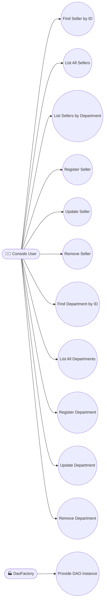

</details>

<details>
<summary><strong>🏛️ Class Diagram</strong></summary>

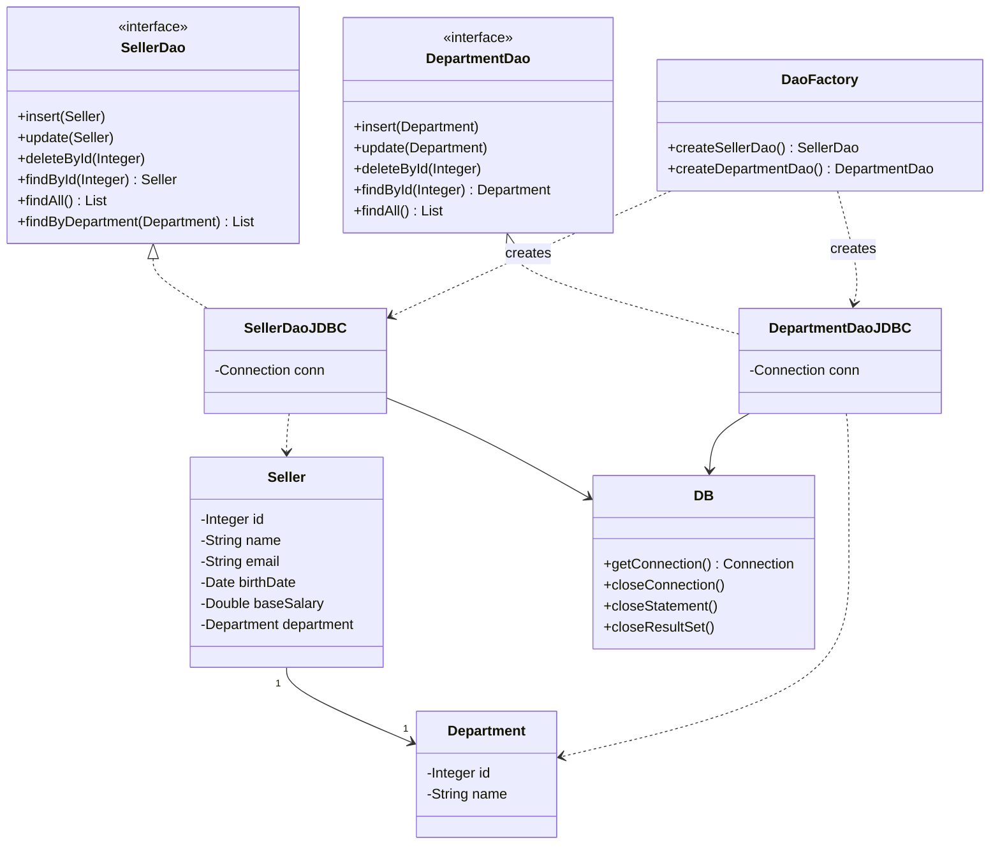

</details>

<details>
<summary><strong>🧱 Object Diagram</strong></summary>

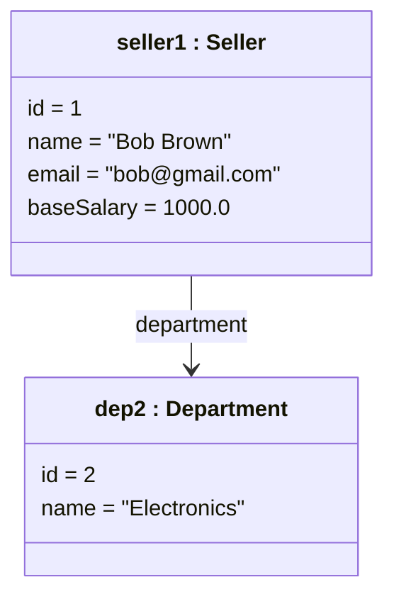

</details>

<details>
<summary><strong>🔄 Sequence Diagram — findById</strong></summary>

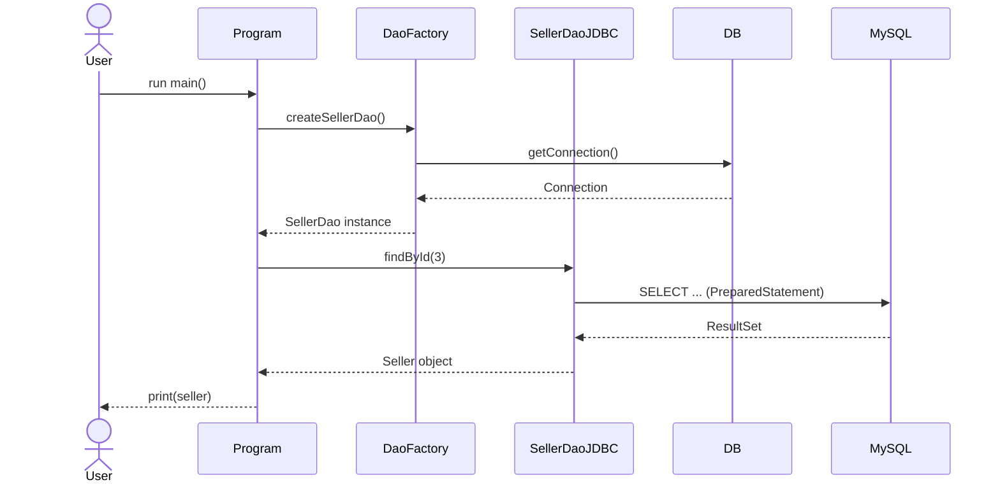

</details>

<details>
<summary><strong>🤝 Communication (Collaboration) Diagram</strong></summary>

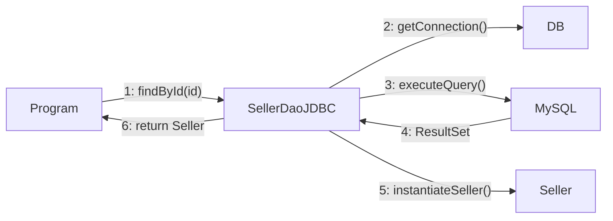

</details>

<details>
<summary><strong>🏃 Activity Diagram — Program Execution</strong></summary>

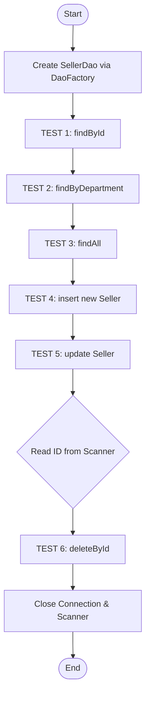

</details>

<details>
<summary><strong>🔁 State Machine Diagram — Connection Lifecycle</strong></summary>

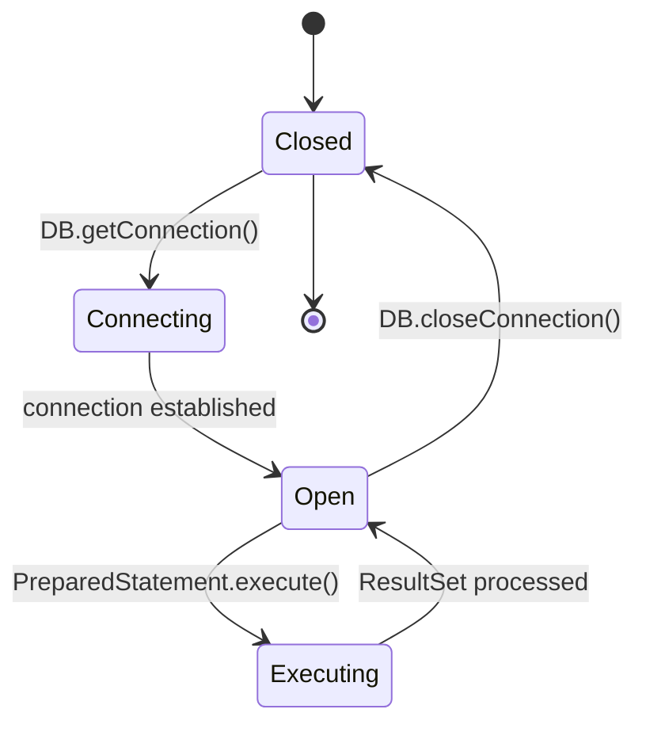

</details>

<details>
<summary><strong>🧩 Component Diagram</strong></summary>

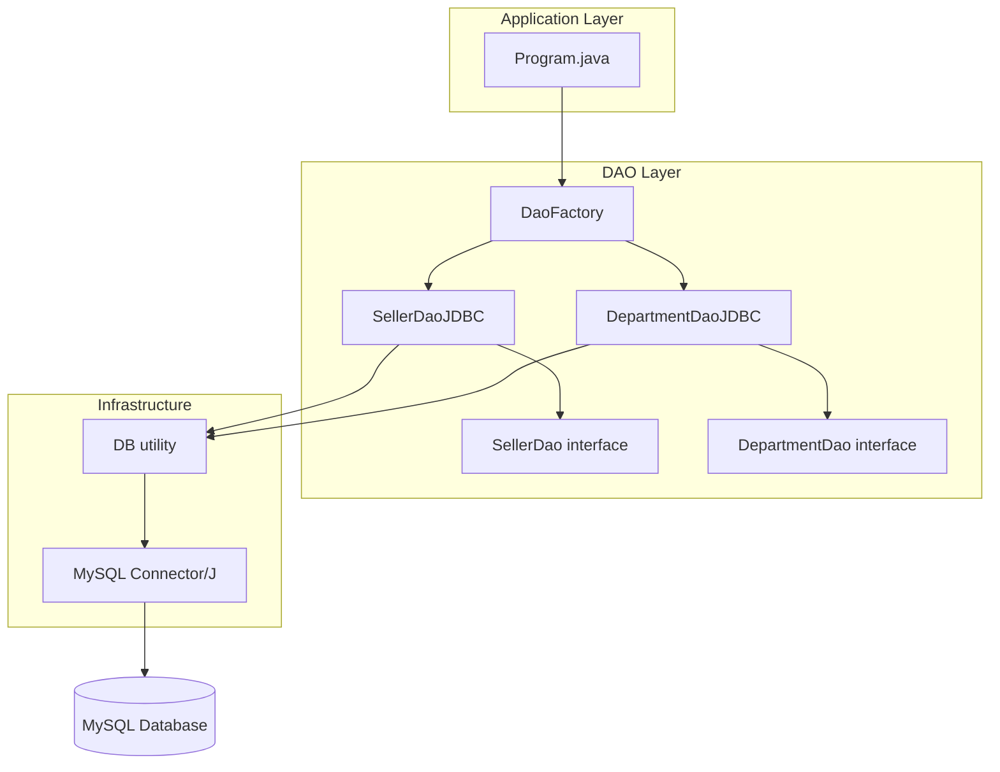

</details>

<details>
<summary><strong>🚀 Deployment Diagram</strong></summary>

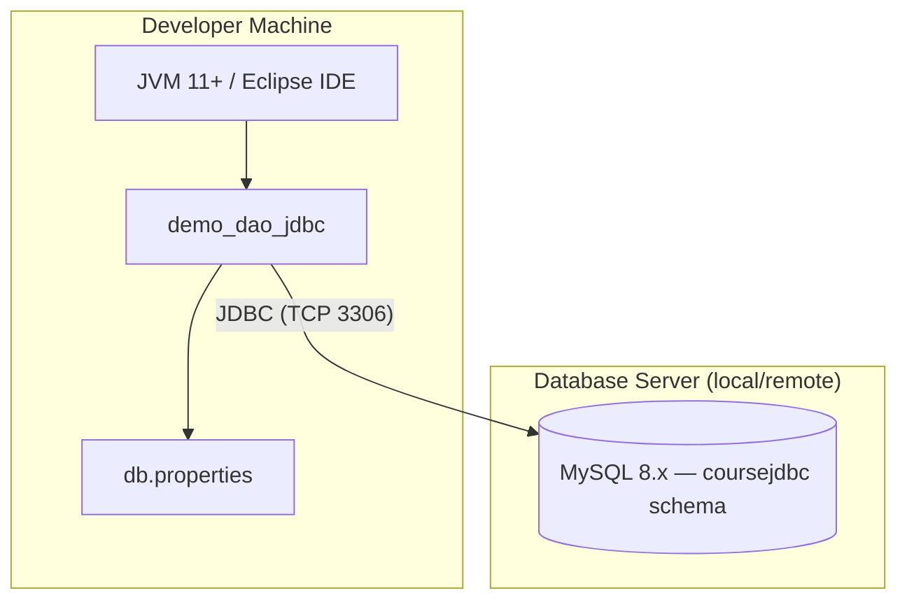

</details>

<details>
<summary><strong>📦 Package Diagram</strong></summary>

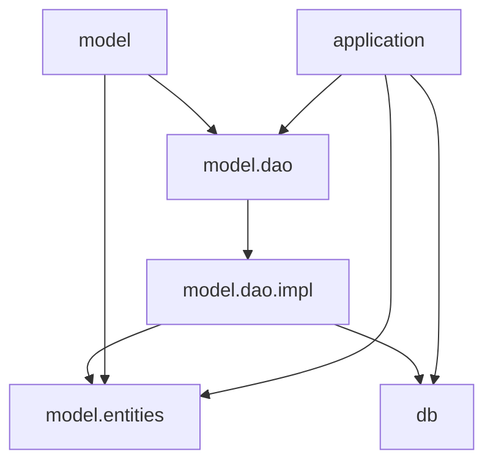

</details>

<details>
<summary><strong>🧬 Composite Structure Diagram — SellerDaoJDBC</strong></summary>

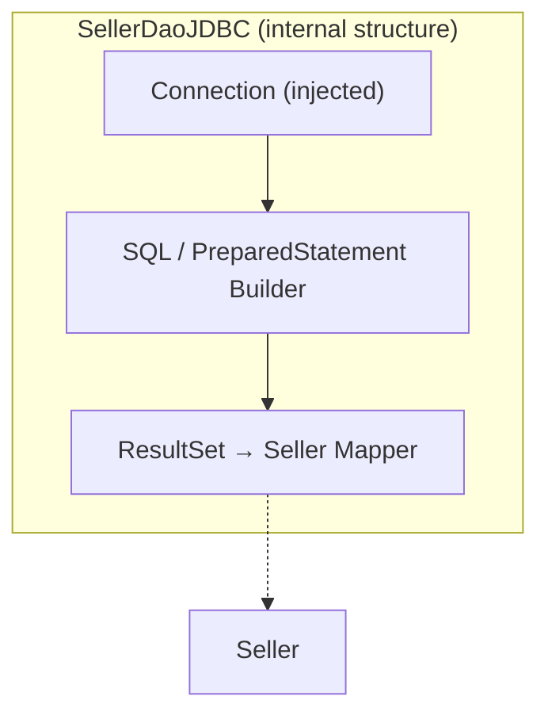

</details>

<details>
<summary><strong>🗺️ Interaction Overview Diagram</strong></summary>

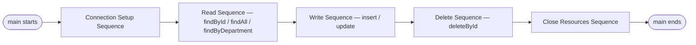

</details>

<details>
<summary><strong>⏱️ Timing Diagram — Connection Lifecycle During Program Execution</strong></summary>

| Time | Connection State | Event |
|:-----|:------------------|:------|
| T + 0 | `Closed` → `Open` | `DaoFactory.createSellerDao()` calls `DB.getConnection()`. |
| T + 1 | `Open` | TESTs 1–5 execute `PreparedStatement`s sequentially on the same connection. |
| T + 2 | `Open` | TEST 6 blocks waiting for `Scanner.nextInt()` (user input). |
| T + 3 | `Open` → `Executing` | `deleteById` executes the `DELETE` statement. |
| T + 4 | `Executing` → `Closed` | Connection and `Scanner` are closed at the end of `main()`. |

</details>

### 🗃️ Data Architecture

<details>
<summary><strong>🔗 ER Diagram (DER)</strong></summary>

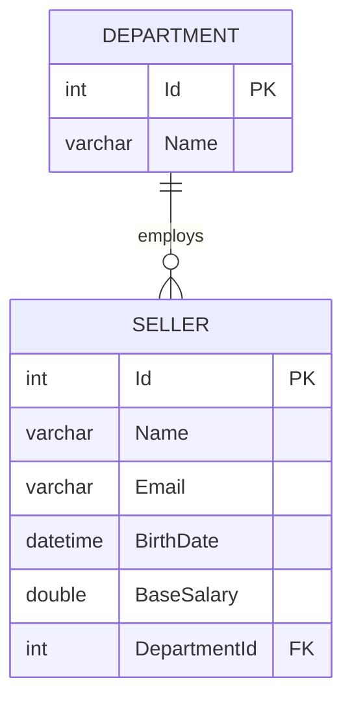

</details>

<details>
<summary><strong>💭 Conceptual Data Model</strong></summary>

High-level entities and relationships, independent of database technology:

- A **Department** groups zero or more **Sellers**.
- A **Seller** belongs to exactly one **Department**.
- Both entities are uniquely identified by a surrogate `Id`.

</details>

<details>
<summary><strong>🧮 Logical Data Model</strong></summary>

| Entity | Key Attributes | Type |
|:-------|:----------------|:-----|
| Department | Id (PK), Name | int, string |
| Seller | Id (PK), Name, Email, BirthDate, BaseSalary, DepartmentId (FK) | int, string, string, datetime, double, int |

</details>

<details>
<summary><strong>💾 Physical Data Model</strong></summary>

```sql
CREATE TABLE department (
    Id   INT         NOT NULL AUTO_INCREMENT,
    Name VARCHAR(60) NULL,
    PRIMARY KEY (Id)
);

CREATE TABLE seller (
    Id           INT          NOT NULL AUTO_INCREMENT,
    Name         VARCHAR(60)  NOT NULL,
    Email        VARCHAR(100) NOT NULL,
    BirthDate    DATETIME     NOT NULL,
    BaseSalary   DOUBLE       NOT NULL,
    DepartmentId INT          NOT NULL,
    PRIMARY KEY (Id),
    FOREIGN KEY (DepartmentId) REFERENCES department (Id)
);
```

> Engine: **MySQL 8.x**. Schema created by `database.sql`.

</details>

<details>
<summary><strong>📖 Data Dictionary</strong></summary>

| Table | Field | Type | Constraints | Description |
|:------|:------|:-----|:------------|:------------|
| department | Id | INT | PK, AUTO_INCREMENT | Unique department identifier. |
| department | Name | VARCHAR(60) | NULL | Department name. |
| seller | Id | INT | PK, AUTO_INCREMENT | Unique seller identifier. |
| seller | Name | VARCHAR(60) | NOT NULL | Seller's full name. |
| seller | Email | VARCHAR(100) | NOT NULL | Seller's e-mail address. |
| seller | BirthDate | DATETIME | NOT NULL | Seller's date of birth. |
| seller | BaseSalary | DOUBLE | NOT NULL | Seller's base salary. |
| seller | DepartmentId | INT | NOT NULL, FK → department.Id | Department the seller belongs to. |

</details>

<details>
<summary><strong>🔄 Data Flow Diagram (DFD)</strong></summary>

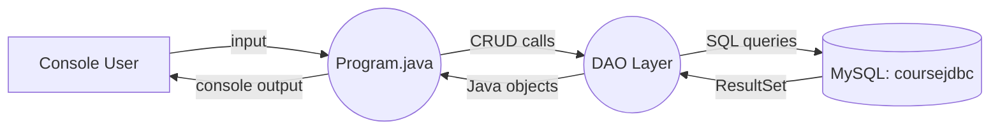

</details>

<details>
<summary><strong>🧬 Data Lineage Diagram</strong></summary>

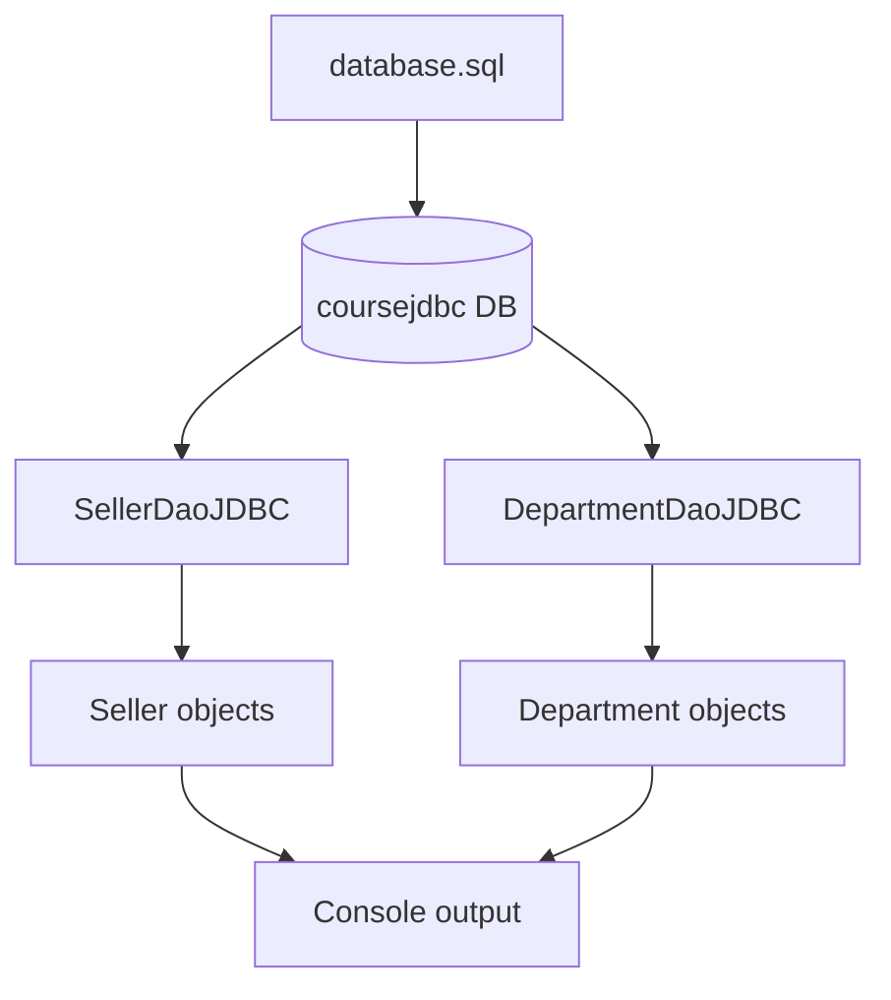

</details>

### 🏗️ Architecture & UX

<details>
<summary><strong>🏛️ Architecture Diagram (Overview)</strong></summary>

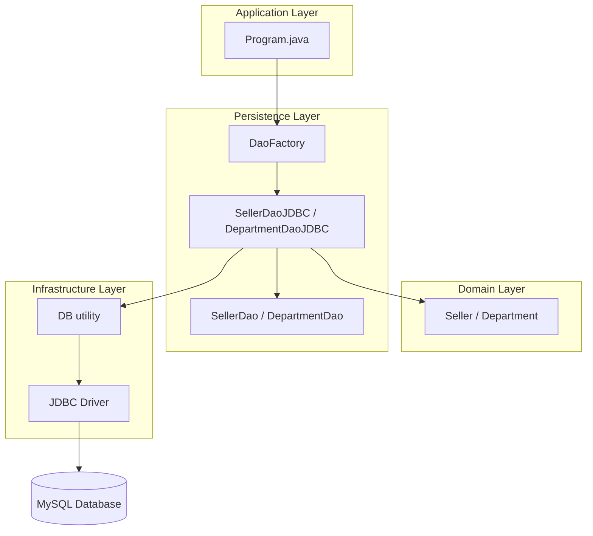

</details>

<details>
<summary><strong>🔀 Flowchart — Program Execution</strong></summary>

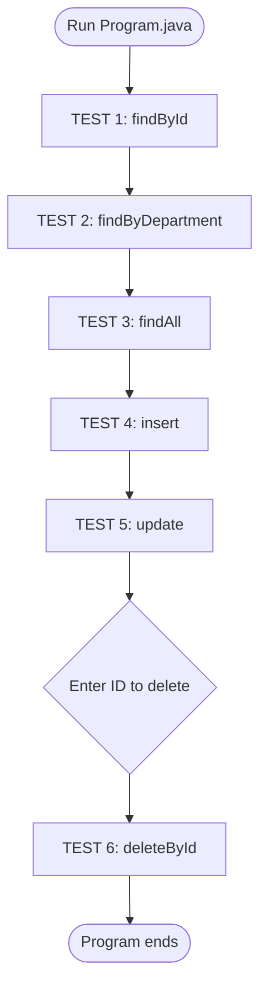

</details>

<details>
<summary><strong>🙋 Personas</strong></summary>

| Persona | Profile | Goals | Pain Points |
|:--------|:--------|:------|:------------|
| 🎓 **Diego, 22 — CS Student** | Learning Java persistence patterns for the first time. | Understand the DAO pattern without ORM "magic" hiding the SQL. | JDBC boilerplate, manual resource management, unclear error handling. |
| 💻 **Camila, 30 — Backend Developer** | Evaluating the DAO pattern for a legacy system migration. | Decouple persistence from business logic in a maintainable way. | Tight coupling to vendor-specific SQL across the codebase. |

</details>

<details>
<summary><strong>🗺️ User Journey Map — "Diego learns the DAO pattern"</strong></summary>

| Stage | Action | Touchpoint | Emotion | Opportunity |
|:------|:-------|:-----------|:--------|:------------|
| Discovery | Clones the repository and reads the README | GitHub | 🙂 Curious | Clear, illustrated setup instructions. |
| Setup | Creates the `coursejdbc` database and configures `db.properties` | MySQL CLI / Eclipse | 😐 Cautious | Provide a ready-to-edit `db.properties` template. |
| Exploration | Runs `Program.java` and reads the numbered TEST output | Eclipse Console | 🙂 Engaged | Numbered `TEST n` sections map directly to FRs. |
| Understanding | Reads `SellerDao` / `SellerDaoJDBC` source code | IDE | 😊 Satisfied | Architecture & class diagrams as a map of the code. |
| Extension | Creates a new entity + DAO following the same pattern | IDE | 😄 Confident | Class diagram and package structure as a reusable template. |

</details>

<details>
<summary><strong>📐 Wireframe — Console Output</strong></summary>

```text
┌─────────────────────────────────────────────────────────┐
│ === TEST 1: findById ===                                  │
│ Seller [id=3, name=Alex Grey, email=alex@gmail.com, ...]  │
│                                                            │
│ === TEST 2: findByDepartment ===                          │
│ Seller [id=1, name=Bob Brown, ...]                        │
│ Seller [id=2, name=Maria Pink, ...]                       │
│                                                            │
│ === TEST 3: findAll ===                                   │
│ Seller [id=1, ...]                                        │
│ Seller [id=2, ...]                                        │
│ ...                                                       │
│                                                            │
│ === TEST 4: Seller insert ===                             │
│ Inserted! New id = 6                                      │
│                                                            │
│ === TEST 5: Seller update ===                             │
│ Update completed!                                         │
│                                                            │
│ === TEST 6: Seller delete ===                             │
│ Enter id for delete test: _                               │
└─────────────────────────────────────────────────────────┘
```

</details>

<details>
<summary><strong>🎨 Mockup — Conceptual Seller Management UI (future extension)</strong></summary>

```text
┌─────────────────────────────────────────────────────┐
│  🗃️ Seller Manager (conceptual UI)                   │
├─────────────────────────────────────────────────────┤
│ Department: [ Electronics ▼ ]        [+ New Seller]  │
│ ┌─────┬────────────┬──────────────────┬────────────┐│
│ │ ID  │ Name        │ Email             │ Salary     ││
│ ├─────┼────────────┼──────────────────┼────────────┤│
│ │ 1   │ Bob Brown   │ bob@gmail.com     │ 1000.00    ││
│ │ 2   │ Maria Pink  │ maria@gmail.com   │ 3500.00    ││
│ └─────┴────────────┴──────────────────┴────────────┘│
│               [Edit]   [Delete]   [Save]             │
└─────────────────────────────────────────────────────┘
```

> 💡 This GUI is **not implemented** — it illustrates how the existing DAO layer could back a future desktop/web front-end without any changes to `model.dao`.

</details>

---

## 🗺️ Roadmap

| Status | Item |
|:------:|:-----|
| 🔲 | Implement `DepartmentDaoJDBC` usage examples in `Program.java`. |
| 🔲 | Add automated tests (JUnit) covering each DAO method. |
| 🔲 | Externalize `db.properties` example as `db.properties.example`. |
| 🔲 | Optional desktop/web UI on top of the existing DAO layer. |

---

## 🤝 Contributing

> Contributions are very welcome! Follow the steps below to collaborate in an organized way.

| Step | Action | Command |
|:-----:|:-----|:--------|
| 1️⃣ | **Fork** | Fork the repository to your account. | — |
| 2️⃣ | **Branch** | Create your feature branch from `main`. | `git checkout -b feature/NewFeature` |
| 3️⃣ | **Commit** | Save changes with a clear, semantic message. | `git commit -m 'feat: Add NewFeature'` |
| 4️⃣ | **Push** | Push the branch to the remote repository. | `git push origin feature/NewFeature` |
| 5️⃣ | **Pull Request** | Open a PR detailing the changes made. | — |

<div align="center">

<br>

**If this project was useful for your studies, leave a star ⭐️ on the repository!**

</div>

---

## 👨‍💻 Author

<div align="center">

<br>

**Victor H. J. Santiago**

<br>

[](https://github.com/VictorHJesusSantiago)
[](https://www.linkedin.com/in/victor-henrique-de-jesus-santiago/)

</div>

---

## 📄 License

<div align="center">

This project is distributed under the **MIT License**.
See the [`LICENSE`](./LICENSE) file in the repository for more information.


</div>

---

<div align="center">

*Made with 🗃️ and Java by **Victor H. J. Santiago***

</div>
