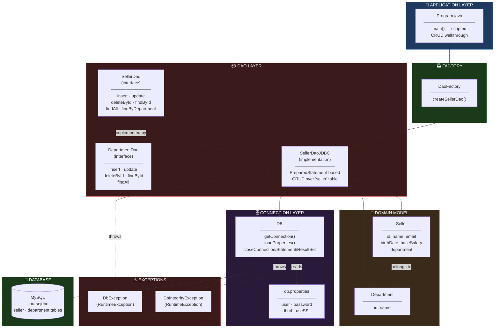
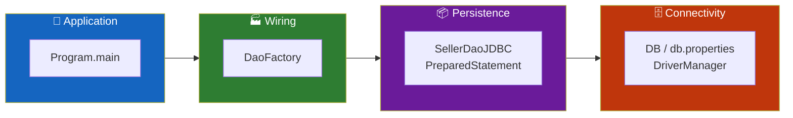
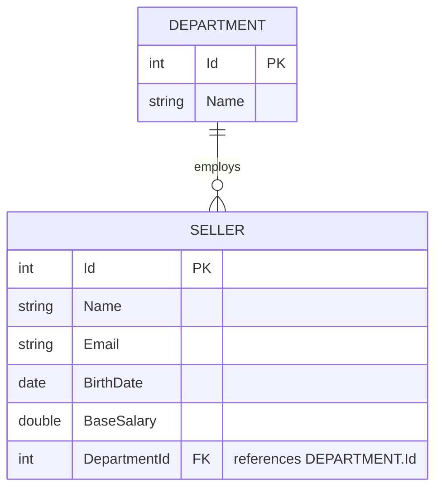
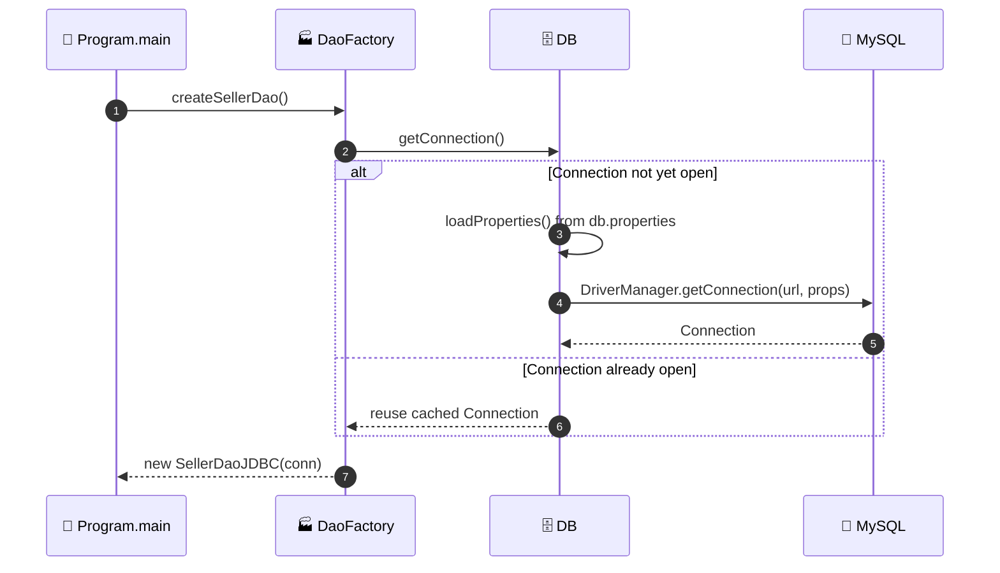
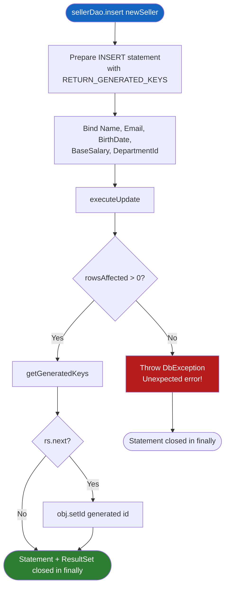
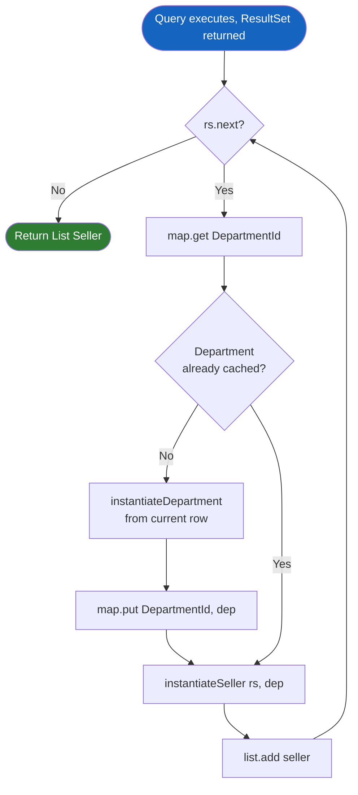
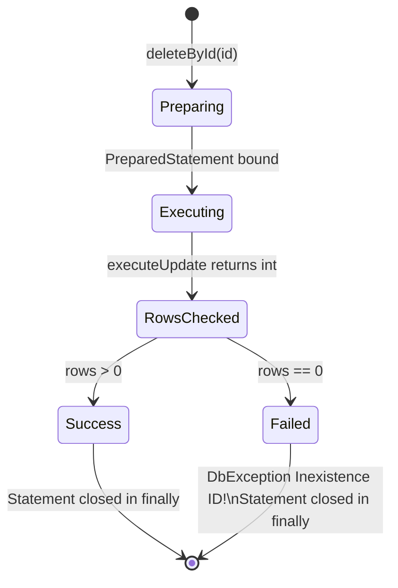
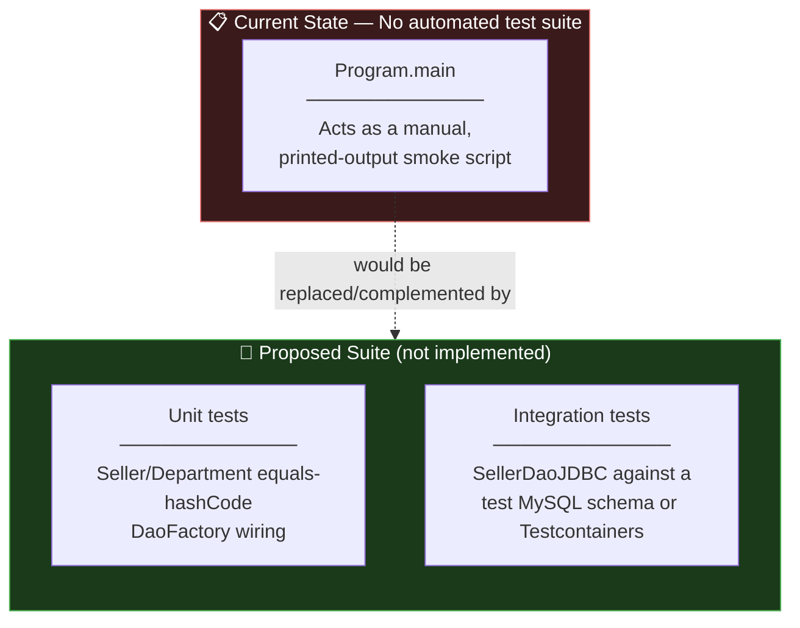

<div align="center">

**🌐 Choose Language / Selecione o Idioma / Elija el Idioma**

[](README.md)&nbsp;&nbsp;&nbsp;[](README_PT.md)&nbsp;&nbsp;&nbsp;[](README_ES.md)

</div>

---

<div align="center">

```
██████╗ ███████╗███╗   ███╗ ██████╗
██╔══██╗██╔════╝████╗ ████║██╔═══██╗
██║  ██║█████╗  ██╔████╔██║██║   ██║
██║  ██║██╔══╝  ██║╚██╔╝██║██║   ██║
██████╔╝███████╗██║ ╚═╝ ██║╚██████╔╝
╚═════╝ ╚══════╝╚═╝     ╚═╝ ╚═════╝
     DAO_JDBC — Plain JDBC Data Access Object Pattern in Java
```

---

[](https://openjdk.org/)
[](https://docs.oracle.com/javase/tutorial/jdbc/)
[](https://dev.mysql.com/downloads/connector/j/)
[](https://www.eclipse.org/)
[]()
[]()

<br/>

> **A minimal, framework-free Java program demonstrating the DAO (Data Access Object) pattern**
> over plain JDBC against a MySQL database, without an ORM in the way.

<br/>


</div>

---

## 📑 Table of Contents

<details>
<summary>▶️ <strong>Click to expand / collapse this section</strong></summary>

<table>
<tr>
<td valign="top" width="50%">

**🏗️ System**
- [Overview](#-overview)
- [System Architecture](#-system-architecture)
- [Technology Stack](#-technology-stack)
- [Design Patterns](#-design-patterns-applied)
- [Project Structure](#-project-structure)

**📦 Modules**
- [Program — Entry Point](#-program--entry-point)
- [DB — Connection Manager](#-db--connection-manager)
- [DaoFactory](#-daofactory)
- [SellerDao / SellerDaoJDBC](#-sellerdao--sellerdaojdbc)
- [DepartmentDao](#-departmentdao)
- [Domain Entities](#-domain-entities)
- [Exceptions](#-exceptions)

</td>
<td valign="top" width="50%">

**💼 Business**
- [Business Rules](#-business-rules)
- [Functional Requirements](#-functional-requirements)
- [Non-Functional Requirements](#-non-functional-requirements)

**📐 Design**
- [Data Model](#-data-model)
- [System Flows](#-system-flows)

**🔐 Security & Ops**
- [Security](#-security)
- [Installation & Execution](#-installation--execution)
- [Automated Tests](#-automated-tests)
- [Metrics & Monitoring](#-metrics--monitoring)
- [Known Limitations](#-known-limitations)

</td>
</tr>
</table>

---

</details>

## 🌟 Overview

<details>
<summary>▶️ <strong>Click to expand / collapse this section</strong></summary>

**demo_dao_jdbc** is a compact, single-purpose Java program built to demonstrate the **DAO (Data Access Object)** design pattern implemented directly against **plain JDBC** (`java.sql`), with no ORM, no framework, and no dependency-injection container in between. It models a classic "sales department" domain: a `Department` has many `Seller`s, and the program exercises the full CRUD lifecycle for sellers against a MySQL database named `coursejdbc`.

The project is deliberately small: nine Java source files under `src/`, a single `Program.java` entry point that runs a scripted sequence of operations (`findById`, `findByDepartment`, `findAll`, `insert`, `update`, `deleteById`) against the `SellerDaoJDBC` implementation, and a `db.properties` file holding the JDBC connection URL and credentials, loaded at runtime rather than hardcoded.

Its purpose is educational: it shows how to hand-write a JDBC connection singleton (`DB`), how a `DaoFactory` decouples callers from concrete implementations, how `PreparedStatement` prevents SQL injection while still allowing `Statement.RETURN_GENERATED_KEYS` for auto-increment retrieval, and how JDBC resources (`Connection`, `Statement`, `ResultSet`) must be defensively closed in `finally` blocks. There is a related but entirely separate project, `CoopVale/`, living in a subdirectory of this repository; it is a full Flask-based credit-union system with its own three-language README set and is not part of this DAO demo.

### 🎯 System Objectives

| Objective | Description |
|-----------|-------------|
| 🧱 **Demonstrate the DAO Pattern** | Separate persistence logic (`SellerDaoJDBC`) from domain entities (`Seller`, `Department`) and from the caller (`Program`) |
| 🔌 **Plain JDBC, No ORM** | Use `java.sql.*` directly to show what an ORM like Hibernate normally hides |
| 🏭 **Factory-Based Wiring** | `DaoFactory.createSellerDao()` centralizes how a `SellerDaoJDBC` is constructed and wired to a `Connection` |
| 🔐 **Injection-Safe Queries** | Every SQL statement uses `PreparedStatement` with `?` placeholders, never string concatenation |
| 🆔 **Auto-Generated Key Retrieval** | `insert()` uses `Statement.RETURN_GENERATED_KEYS` to read back the new `Seller` id |
| 🗺️ **N+1 Avoidance via Caching Map** | `findAll()` and `findByDepartment()` cache already-instantiated `Department` objects in a `Map<Integer, Department>` to avoid duplicate objects for the same join row |
| ♻️ **Deterministic Resource Cleanup** | `DB.closeStatement()` / `DB.closeResultSet()` / `DB.closeConnection()` are called from `finally` blocks around every operation |
| 📚 **Runnable Teaching Script** | `Program.main` reads as a narrated script (`TEST 1`… `TEST 6`) rather than a test suite, intended to be read top to bottom |

---

</details>

## 🏗️ System Architecture

<details>
<summary>▶️ <strong>Click to expand / collapse this section</strong></summary>

### Module Diagram



### Architecture Layers



---

</details>

## 🛠️ Technology Stack

<details>
<summary>▶️ <strong>Click to expand / collapse this section</strong></summary>

<table>
<thead>
<tr>
<th>Layer</th>
<th>Technology</th>
<th>Version</th>
<th>Purpose</th>
</tr>
</thead>
<tbody>
<tr>
<td rowspan="2"><strong>🧠 Language / Runtime</strong></td>
<td>Java</td>
<td>module-info targets JavaSE-10; Eclipse `.classpath` uses the default JRE container</td>
<td>Application source language, compiled as a Java module (`module demo_dao_jdbc`)</td>
</tr>
<tr>
<td>Java Platform Module System</td>
<td>`module-info.java`</td>
<td>Declares `requires java.sql;` — the only module dependency</td>
</tr>
<tr>
<td rowspan="2"><strong>🔌 Data Access</strong></td>
<td>JDBC (`java.sql`)</td>
<td>Standard library</td>
<td>`Connection`, `PreparedStatement`, `ResultSet`, `DriverManager`, `Statement`</td>
</tr>
<tr>
<td>MySQL Connector/J</td>
<td>8.3.0 (per `.classpath`); `classpath.txt` shows an older `MySQLConnector` user library entry</td>
<td>JDBC driver used to reach the MySQL server</td>
</tr>
<tr>
<td><strong>🗄️ Database</strong></td>
<td>MySQL</td>
<td>Database name `coursejdbc` (see `db.properties`)</td>
<td>System of record for `seller` and `department` tables</td>
</tr>
<tr>
<td rowspan="2"><strong>🔧 Build / IDE</strong></td>
<td>Eclipse IDE</td>
<td>`.project`, `.settings/`, `.classpath`</td>
<td>Project is structured as a classic Eclipse Java project, not a Maven/Gradle build</td>
</tr>
<tr>
<td>No build tool</td>
<td>—</td>
<td>No `pom.xml` or `build.gradle` — compiled/run directly via `javac`/`java` or the IDE</td>
</tr>
</tbody>
</table>

---

</details>

## 🎨 Design Patterns Applied

<details>
<summary>▶️ <strong>Click to expand / collapse this section</strong></summary>

| Pattern | Where | Rationale |
|---------|-------|-----------|
| 🧱 **Data Access Object (DAO)** | `SellerDao` (interface) + `SellerDaoJDBC` (implementation) | Isolates SQL/JDBC details from the rest of the application |
| 🏭 **Factory Method** | `DaoFactory.createSellerDao()` | Centralizes how a `SellerDaoJDBC` is instantiated and wired to a `Connection`, so callers never `new` it directly |
| 🔌 **Singleton (connection holder)** | `DB.getConnection()` guarding a private static `Connection conn` | A single JDBC connection is lazily created and reused for the process lifetime |
| 🧭 **Strategy (interface/implementation split)** | `SellerDao` interface vs. `SellerDaoJDBC` | A future `SellerDaoMemory` or `SellerDaoJPA` could substitute the JDBC implementation without touching `Program` |
| 🚧 **Guard Clause / Fail Fast** | `deleteById` throwing `DbException("Inexistence ID!")` when `rows == 0` | Converts a silent no-op delete into an explicit failure |
| 🗺️ **Identity Map (local, per-call)** | `Map<Integer, Department> map` inside `findAll()`/`findByDepartment()` | Avoids constructing a duplicate `Department` object for every `Seller` row sharing the same department |
| 🎁 **Wrapped/Unchecked Exception** | `DbException extends RuntimeException` wrapping `SQLException` | Converts checked `SQLException` into an unchecked exception so DAO method signatures stay clean |
| 🧹 **Try/Finally Resource Cleanup** | Every DAO method: `finally { DB.closeStatement(st); DB.closeResultSet(rs); }` | JDBC resources are pre-try-with-resources style, closed manually and defensively |

---

</details>

## 📁 Project Structure

<details>
<summary>▶️ <strong>Click to expand / collapse this section</strong></summary>

```
demo_dao_jdbc/
│
├── 📄 .classpath                       # Eclipse classpath — JRE container + mysql-connector-j-8.3.0.jar
├── 📄 .project                         # Eclipse project descriptor (name: demo_dao_jdbc, Java nature)
├── 📄 .gitignore                       # Ignores compiled classes, secrets, IDE files, local DB dumps
├── 📄 classpath.txt                    # Legacy/backup copy of the classpath (JavaSE-10 + MySQLConnector lib)
├── 📄 project.txt                      # Legacy/backup copy of the project descriptor
├── 📄 db.properties                    # JDBC connection config: user, password, dburl, useSSL (NOT to be committed with real secrets)
│
├── 📂 src/
│   ├── 📄 module-info.java             # Java module descriptor — requires java.sql
│   │
│   ├── 📂 application/
│   │   └── 📄 Program.java             # ★ Entry point — scripted CRUD walkthrough (TEST 1..6)
│   │
│   ├── 📂 db/
│   │   ├── 📄 DB.java                  # Connection holder: getConnection/closeConnection/closeStatement/closeResultSet
│   │   ├── 📄 DbException.java         # Unchecked wrapper for SQLException and IO errors
│   │   └── 📄 DbIntegrityException.java # Unchecked exception reserved for FK/integrity violations (currently unused)
│   │
│   └── 📂 model/
│       ├── 📂 dao/
│       │   ├── 📄 DaoFactory.java      # Factory Method — builds a wired SellerDaoJDBC
│       │   ├── 📄 SellerDao.java       # DAO interface for Seller CRUD + findByDepartment
│       │   ├── 📄 DepartmentDao.java   # DAO interface for Department CRUD (no implementation present)
│       │   └── 📂 impl/
│       │       └── 📄 SellerDaoJDBC.java # ★ The only concrete DAO — PreparedStatement-based JDBC implementation
│       │
│       └── 📂 entities/
│           ├── 📄 Seller.java          # Domain entity: id, name, email, birthDate, baseSalary, department
│           └── 📄 Department.java      # Domain entity: id, name
│
├── 📂 CoopVale/                        # Unrelated nested project (Flask credit-union system, own 3 READMEs)
│
├── 📄 README.md                        # 🇺🇸 English (primary)
├── 📄 README_PT.md                     # 🇧🇷 Português
└── 📄 README_ES.md                     # 🇪🇸 Español
```

---

</details>

## 📦 Program — Entry Point

<details>
<summary>▶️ <strong>Click to expand / collapse this section</strong></summary>

`application.Program` is the sole `main()` method in the project. It is written as a linear, narrated script rather than an interactive menu or a test harness.

| Step | Label in output | Operation | DAO call |
|------|------------------|-----------|----------|
| 1 | `TEST 1: seller findById` | Look up a single seller by a hardcoded id (`3`) | `sellerDao.findById(3)` |
| 2 | `TEST 2: seller findByDepartment` | List sellers belonging to a department constructed inline (`id=2`) | `sellerDao.findByDepartment(department)` |
| 3 | `TEST 3: seller findAll` | List every seller, joined with department name | `sellerDao.findAll()` |
| 4 | `TEST 4: seller INSERT` | Insert a new seller (`Greg`) and print the generated id | `sellerDao.insert(newSeller)` |
| 5 | `TEST 5: seller update` | Reload seller `1`, rename it, and persist the change | `sellerDao.findById(1)` then `sellerDao.update(seller)` |
| 6 | `TEST 6: seller delete` | Read an id from `System.in` via `Scanner` and delete that row | `sellerDao.deleteById(id)` |

The `Scanner` used for step 6 is explicitly closed at the end of `main`, but the JDBC `Connection` obtained via `DaoFactory`/`DB` is never explicitly closed by `Program` — it relies on process exit (see [Known Limitations](#-known-limitations)).

---

## 🗄️ DB — Connection Manager

`db.DB` is a small static utility class that owns the JDBC connection lifecycle for the whole program.

| Method | Responsibility |
|--------|-----------------|
| `getConnection()` | Lazily creates a single `Connection` via `DriverManager.getConnection(url, props)`, reusing it if already open |
| `closeConnection()` | Closes the held connection if non-null |
| `loadProperties()` (private) | Opens `db.properties` from the working directory via `FileInputStream`, loads it into a `java.util.Properties` |
| `closeStatement(Statement st)` | Null-safe close for any `Statement`/`PreparedStatement` |
| `closeResultSet(ResultSet rs)` | Null-safe close for any `ResultSet` |

Every checked `SQLException` or `IOException` encountered inside `DB` is rethrown as an unchecked `DbException`, so callers never need a `try/catch` around connection setup.

---

## 🏭 DaoFactory

`model.dao.DaoFactory` exposes exactly one static factory method:

```java
public static SellerDao createSellerDao() {
    return new SellerDaoJDBC(DB.getConnection());
}
```

This is the single seam in the codebase where a concrete DAO implementation is chosen and wired to a live `Connection`. There is no equivalent `createDepartmentDao()` method yet, even though `DepartmentDao` exists as an interface (see [Known Limitations](#-known-limitations)).

---

## 🔌 SellerDao / SellerDaoJDBC

`model.dao.SellerDao` declares the contract; `model.dao.impl.SellerDaoJDBC` is the only implementation.

| Method | SQL statement | Notes |
|--------|---------------|-------|
| `insert(Seller obj)` | `INSERT INTO seller (Name, Email, BirthDate, BaseSalary, DepartmentId) VALUES (?, ?, ?, ?, ?)` | Uses `Statement.RETURN_GENERATED_KEYS` and reads the new id back via `getGeneratedKeys()` |
| `update(Seller obj)` | `UPDATE seller SET Name=?, Email=?, BirthDate=?, BaseSalary=?, DepartmentId=? WHERE id=?` | No existence check before update |
| `deleteById(Integer id)` | `DELETE FROM seller WHERE Id = ?` | Throws `DbException("Inexistence ID!")` when `executeUpdate()` reports 0 rows affected |
| `findById(Integer id)` | `SELECT seller.*, department.Name as DepName FROM seller INNER JOIN department ON seller.DepartmentId = department.Id WHERE seller.Id = ?` | Returns `null` when no row matches |
| `findAll()` | Same join, `ORDER BY Name`, no `WHERE` | Uses a local `Map<Integer, Department>` to deduplicate `Department` instances across rows |
| `findByDepartment(Department department)` | Same join filtered `WHERE DepartmentId = ?`, `ORDER BY Name` | Same deduplication map pattern as `findAll()` |

Two private helpers, `instantiateSeller(ResultSet, Department)` and `instantiateDepartment(ResultSet)`, centralize row-to-object mapping and are reused by all three read methods.

---

## 🗂️ DepartmentDao

`model.dao.DepartmentDao` declares a full CRUD contract (`insert`, `update`, `deleteById`, `findById`, `findAll`) mirroring `SellerDao`'s shape, but **no implementing class exists in the codebase** — there is no `DepartmentDaoJDBC`, and `DaoFactory` has no `createDepartmentDao()` method. The interface documents the intended surface for a future implementation; see [Known Limitations](#-known-limitations).

---

## 🧬 Domain Entities

Both entities live in `model.entities` and implement `Serializable`, override `equals()`/`hashCode()` by `id` only, and override `toString()`.

| Entity | Fields | Notes |
|--------|--------|-------|
| `Seller` | `id`, `name`, `email`, `birthDate` (`java.util.Date`), `baseSalary` (`Double`), `department` (`Department`) | Two constructors: no-args and all-args |
| `Department` | `id`, `name` | Two constructors: no-args and all-args |

---

## ⚠️ Exceptions

Both exceptions live in `db` and extend `RuntimeException` directly (unchecked).

| Exception | Thrown by | Purpose |
|-----------|-----------|---------|
| `DbException` | `DB` (SQL/IO failures), `SellerDaoJDBC` (all `SQLException`s, plus the "Inexistence ID!" and "Unexpected error! No rows affected!" business failures) | General-purpose wrapper so DAO callers do not need to catch checked exceptions |
| `DbIntegrityException` | Nowhere in the current code | Declared for future use around referential-integrity violations (e.g. deleting a `Department` that still has `Seller`s), but not yet thrown anywhere |

---

</details>

## 💼 Business Rules

<details>
<summary>▶️ <strong>Click to expand / collapse this section</strong></summary>

### 🧾 Seller Persistence Rules

| # | Rule | Enforcement |
|---|------|-------------|
| BR-01 | A newly inserted seller must receive its database-generated id back on the in-memory object | `insert()` reads `getGeneratedKeys()` and calls `obj.setId(id)` |
| BR-02 | An insert that affects zero rows is treated as an unexpected failure | `insert()` throws `DbException("Unexpected error!No rows affected!")` |
| BR-03 | Deleting a non-existent seller id must fail loudly, not silently | `deleteById()` throws `DbException("Inexistence ID!")` when `rows == 0` |
| BR-04 | Every seller read is always joined with its department name | `findById`, `findAll`, `findByDepartment` all `INNER JOIN department` |
| BR-05 | `findAll()` and `findByDepartment()` results are alphabetically ordered by seller name | `ORDER BY Name` in both queries |
| BR-06 | The same `Department` object is reused for every seller row sharing that department within one call | Local `Map<Integer, Department>` cache in `findAll()`/`findByDepartment()` |

### 🔌 Connectivity Rules

| # | Rule | Enforcement |
|---|------|-------------|
| BR-07 | Database credentials must never be hardcoded in Java source | Loaded at runtime from `db.properties` via `DB.loadProperties()` |
| BR-08 | Only one JDBC `Connection` exists per process | `DB.getConnection()` lazily initializes and reuses a single static `Connection` |
| BR-09 | Every JDBC resource acquired in a DAO method must be released, success or failure | `finally { DB.closeStatement(st); DB.closeResultSet(rs); }` in every method |

---

</details>

## ✅ Functional Requirements

<details>
<summary>▶️ <strong>Click to expand / collapse this section</strong></summary>

| ID | Requirement | Priority | Status |
|----|-------------|----------|--------|
| **RF-01** | The system shall connect to a MySQL database using externally configured credentials | 🔴 High | ✅ Implemented |
| **RF-02** | The system shall find a single seller by id, joined with department name | 🔴 High | ✅ Implemented |
| **RF-03** | The system shall list all sellers belonging to a given department | 🔴 High | ✅ Implemented |
| **RF-04** | The system shall list all sellers in the database, ordered by name | 🔴 High | ✅ Implemented |
| **RF-05** | The system shall insert a new seller and return its generated id | 🔴 High | ✅ Implemented |
| **RF-06** | The system shall update an existing seller's data | 🔴 High | ✅ Implemented |
| **RF-07** | The system shall delete a seller by id and fail if the id does not exist | 🔴 High | ✅ Implemented |
| **RF-08** | The system shall prevent SQL injection on every DAO query | 🔴 High | ✅ Implemented |
| **RF-09** | The system shall avoid duplicate `Department` objects when reading multiple sellers | 🟡 Medium | ✅ Implemented |
| **RF-10** | The system shall expose a `DepartmentDao` interface for department CRUD | 🟡 Medium | ⚠️ Partial (interface only, no `SellerDaoJDBC`-equivalent implementation) |
| **RF-11** | The system shall wire DAO implementations through a factory rather than direct instantiation | 🟡 Medium | ✅ Implemented |
| **RF-12** | The system shall demonstrate every CRUD operation via a runnable script | 🔴 High | ✅ Implemented |
| **RF-13** | The system shall read a delete-target id interactively from standard input | 🟢 Low | ✅ Implemented |
| **RF-14** | The system shall report clear errors for integrity violations (e.g. deleting a department in use) | 🟢 Low | ⬜ Planned (`DbIntegrityException` declared but never thrown) |

---

</details>

## ⚡ Non-Functional Requirements

<details>
<summary>▶️ <strong>Click to expand / collapse this section</strong></summary>

| ID | Category | Requirement | Target |
|----|----------|-------------|--------|
| **RNF-01** | 🔐 Security | SQL statements must be parameterized, never string-concatenated | 100% of DAO queries use `PreparedStatement` with `?` placeholders |
| **RNF-02** | 🔐 Configuration | Credentials must live outside source code | `db.properties`, loaded via `FileInputStream` at runtime |
| **RNF-03** | 🧱 Maintainability | Persistence logic must be isolated behind interfaces | `SellerDao`/`DepartmentDao` interfaces, `impl` sub-package for concrete classes |
| **RNF-04** | 🧹 Resource Management | Every `Statement`/`ResultSet` opened must be closed | `finally` blocks calling `DB.closeStatement`/`DB.closeResultSet` in every DAO method |
| **RNF-05** | 📦 Footprint | No external framework or ORM dependency | Only `java.sql` (JDK standard library) plus the MySQL JDBC driver |
| **RNF-06** | 🧩 Portability | The project must compile as a Java module | `module-info.java` declares `requires java.sql` |
| **RNF-07** | 🎓 Readability | The demo script must be readable top-to-bottom without external documentation | `Program.main` prints a `=== TEST n: ... ===` banner before each step |
| **RNF-08** | 🔁 Idempotent Reads | Repeated `findById`/`findAll`/`findByDepartment` calls must not mutate state | All three are pure `SELECT` queries |

---

</details>

## 🗄️ Data Model

<details>
<summary>▶️ <strong>Click to expand / collapse this section</strong></summary>

### Entity-Relationship Diagram



The Java object graph mirrors this directly: `Seller.department` holds a full `Department` reference (not just an id), populated by `instantiateDepartment(ResultSet)` on every read.

### `seller` Table (Inferred from SQL in `SellerDaoJDBC`)

| Column | Type (inferred) | Notes |
|--------|------------------|-------|
| `Id` | `INT`, primary key, auto-increment | Read back via `Statement.RETURN_GENERATED_KEYS` on insert |
| `Name` | `VARCHAR` | Mapped to `Seller.name` |
| `Email` | `VARCHAR` | Mapped to `Seller.email` |
| `BirthDate` | `DATE` | Mapped to `Seller.birthDate` via `java.sql.Date` |
| `BaseSalary` | `DOUBLE`/`DECIMAL` | Mapped to `Seller.baseSalary` |
| `DepartmentId` | `INT`, foreign key → `department.Id` | Mapped to `Seller.department.id` |

### `department` Table (Inferred from SQL in `SellerDaoJDBC`)

| Column | Type (inferred) | Notes |
|--------|------------------|-------|
| `Id` | `INT`, primary key | Aliased as `DepartmentId` in the seller-join queries |
| `Name` | `VARCHAR` | Aliased as `DepName` in the seller-join queries to avoid collision with `seller.Name` |

### `db.properties` Configuration Keys

| Key | Example value in repo | Purpose |
|-----|------------------------|---------|
| `user` | `root` | MySQL username |
| `password` | `adm2004` | MySQL password (present in the checked-in file — see [Security](#-security)) |
| `dburl` | `jdbc:mysql://localhost:3306/coursejdbc` | Full JDBC connection URL, including the target schema |
| `useSSL` | `false` | Passed through to the driver via `Properties`, disabling SSL for local development |

---

</details>

## 🔄 System Flows

<details>
<summary>▶️ <strong>Click to expand / collapse this section</strong></summary>

### Program Startup and Connection Flow



### Insert Flow



### findAll / findByDepartment Deduplication Flow



### Delete Flow



---

</details>

## 🔐 Security

<details>
<summary>▶️ <strong>Click to expand / collapse this section</strong></summary>

### Implemented Controls

| Control | Implementation | Effect |
|---------|---------------|--------|
| 🛡️ **Parameterized queries everywhere** | Every DAO method uses `PreparedStatement` with `?` placeholders | Eliminates SQL injection on all six DAO operations |
| 🔑 **Credentials externalized** | `db.properties` loaded via `FileInputStream`, not hardcoded in `.java` files | Source code contains no embedded password strings |
| 🧯 **Checked exceptions converted to unchecked** | `DbException` wraps every `SQLException` | Prevents leaking raw JDBC stack traces through method signatures |
| ♻️ **Defensive resource closing** | `finally` blocks around every `Statement`/`ResultSet` | Reduces the chance of connection/cursor leaks under error conditions |

### Known Security Limitations

> [!WARNING]
> This project is a teaching demo, not production-hardened code. The following are real, current gaps.

| Limitation | Risk | Mitigation path |
|------------|------|-----------------|
| 🔓 **`db.properties` is committed with a real-looking password** (`adm2004`) | Anyone with repository access sees a credential that may be reused elsewhere | Move to environment variables or an untracked `.env`-style file; rotate the password if it was ever real |
| 🌐 **`useSSL=false`** | Database traffic (including the password on connect) travels unencrypted | Set `useSSL=true` and configure a trusted certificate for any non-localhost database |
| 🕳️ **No least-privilege database user** | `db.properties` uses `user=root`, granting full instance privileges to a demo app | Create a dedicated MySQL user scoped to `SELECT/INSERT/UPDATE/DELETE` on `coursejdbc` only |
| 🧵 **Single shared `Connection`, no connection pool** | Under concurrent use this is a bottleneck and single point of failure | Introduce a pool (HikariCP, Apache DBCP) if the demo ever needs multi-threaded access |
| 🚫 **No input validation on `Program`'s `Scanner.nextInt()`** | A non-integer input throws an uncaught `InputMismatchException` and crashes the program | Wrap the read in a validated loop or `try/catch` |

---

</details>

## 🚀 Installation & Execution

<details>
<summary>▶️ <strong>Click to expand / collapse this section</strong></summary>

### Prerequisites

```bash
# JDK 10 or newer (module-info.java targets JavaSE-10)
java -version

# A running MySQL server reachable at the URL configured in db.properties
mysql --version

# MySQL Connector/J on the classpath (mysql-connector-j-8.3.0.jar per .classpath)
# Download from https://dev.mysql.com/downloads/connector/j/ if not using Eclipse's managed library
```

Create the `coursejdbc` schema and the `department`/`seller` tables before running the program (columns are inferred in [Data Model](#-data-model); no `.sql` seed script ships in this repository — see [Known Limitations](#-known-limitations)):

```sql
CREATE DATABASE IF NOT EXISTS coursejdbc;
USE coursejdbc;

CREATE TABLE department (
    Id INT AUTO_INCREMENT PRIMARY KEY,
    Name VARCHAR(60) NOT NULL
);

CREATE TABLE seller (
    Id INT AUTO_INCREMENT PRIMARY KEY,
    Name VARCHAR(60) NOT NULL,
    Email VARCHAR(100) NOT NULL,
    BirthDate DATE NOT NULL,
    BaseSalary DOUBLE NOT NULL,
    DepartmentId INT NOT NULL,
    FOREIGN KEY (DepartmentId) REFERENCES department (Id)
);
```

Edit `db.properties` at the project root with real, local credentials:

```properties
user=your_mysql_user
password=your_mysql_password
dburl=jdbc:mysql://localhost:3306/coursejdbc
useSSL=false
```

### Build

```bash
# From the project root, compile every source file into ./bin
javac -d bin --module-path . -m demo_dao_jdbc

# Or, without module resolution (simpler for this small project):
javac -d bin -cp "path/to/mysql-connector-j-8.3.0.jar" $(find src -name "*.java")
```

In Eclipse: import as an existing project (`.project` and `.classpath` are already provided), ensure the `mysql-connector-j-8.3.0.jar` user library resolves, and build automatically via the IDE.

### Execution

```bash
# Run from the project root so db.properties (relative path) is found
java -cp "bin;path/to/mysql-connector-j-8.3.0.jar" application.Program
# On Linux/macOS use a colon separator instead of a semicolon:
# java -cp "bin:path/to/mysql-connector-j-8.3.0.jar" application.Program
```

**Expected interactive step**

When `TEST 6: seller delete` prints, the program blocks on `Scanner.nextInt()` — type a valid seller id from your `seller` table and press Enter to complete the run.

### Program Output Sections

| Section label | What it exercises |
|--------|---------|
| `TEST 1: seller findById` | `findById(3)` |
| `TEST 2: seller findByDepartment` | `findByDepartment(new Department(2, null))` |
| `TEST 3: seller findAll` | `findAll()` |
| `TEST 4: seller INSERT` | `insert(new Seller(...))` for a seller named `Greg` |
| `TEST 5: seller update` | `findById(1)` then `update(seller)`, renaming to `Martha Waine` |
| `TEST 6: seller delete` | Interactive `deleteById(id)` |

### Build Configuration

| Setting | Value | Declared in |
|---------|-------|-------------|
| Project name | `demo_dao_jdbc` | `.project` |
| Java module name | `demo_dao_jdbc` | `src/module-info.java` |
| Module dependency | `java.sql` | `src/module-info.java` |
| Source folder | `src` | `.classpath`, `classpath.txt` |
| Output folder | `bin` | `.classpath`, `classpath.txt` |
| JDBC driver library | `mysql-connector-j-8.3.0.jar` (current), `MySQLConnector` (legacy, per `classpath.txt`) | `.classpath` / `classpath.txt` |

---

</details>

## 🧪 Automated Tests

<details>
<summary>▶️ <strong>Click to expand / collapse this section</strong></summary>

### Test Architecture



There is **no automated test framework** in this repository: no JUnit dependency, no `src/test` directory, and no test runner configuration (there is no `pom.xml`/`build.gradle` to declare one in). Quality assurance today is entirely manual, via `Program.main`'s printed output.

### Running the Existing Verification

```bash
# The only "test" available is running the program itself and reading console output
java -cp "bin;path/to/mysql-connector-j-8.3.0.jar" application.Program
```

### Manual Acceptance Checklist

| # | Scenario | Expected result |
|---|----------|-----------------|
| 1 | Run `Program.main` against a seeded database | All six `TEST` sections print without an uncaught exception |
| 2 | `TEST 1` finds seller id `3` | Console prints a `Seller` with a non-null `department` |
| 3 | `TEST 2` finds sellers of department id `2` | Every printed seller belongs to department `2` |
| 4 | `TEST 3` lists all sellers | List is alphabetically sorted by name |
| 5 | `TEST 4` inserts "Greg" | Console prints `Inserted! New id = <positive integer>` |
| 6 | `TEST 5` renames seller `1` to "Martha Waine" | A subsequent `findById(1)` (outside the script) reflects the new name |
| 7 | `TEST 6` deletes an existing id | Console prints `Delete Completed!` |
| 8 | `TEST 6` deletes a non-existent id | A `DbException("Inexistence ID!")` is thrown and printed as a stack trace |
| 9 | `db.properties` points at an unreachable host | `DB.getConnection()` throws `DbException` with the underlying `SQLException` message |

---

</details>

## 📊 Metrics & Monitoring

<details>
<summary>▶️ <strong>Click to expand / collapse this section</strong></summary>

### Codebase Metrics

| Metric | Value |
|--------|-------|
| Java source files | 9 |
| Domain entity classes | 2 (`Seller`, `Department`) |
| DAO interfaces | 2 (`SellerDao`, `DepartmentDao`) |
| DAO implementations | 1 (`SellerDaoJDBC`) — `DepartmentDao` has none |
| Exception classes | 2 (`DbException`, `DbIntegrityException`) |
| Public DAO methods exercised by `Program` | 6 of 6 declared in `SellerDao` |
| External runtime dependencies | 1 (MySQL Connector/J) |
| Module dependencies (`module-info.java`) | 1 (`java.sql`) |

### Runtime Signals

| Signal | Source | Where to observe |
|--------|--------|-------------------|
| Successful DB connection | `DB.getConnection()` returning without exception | No explicit log — absence of a thrown `DbException` at startup |
| Query/update success | Return values of `executeQuery`/`executeUpdate` | Console output printed by `Program` after each `TEST` section |
| Failure | Any `DbException` propagating out of `main` | Uncaught exception stack trace on stderr |

### Useful Diagnostic Commands

```bash
# Confirm MySQL is listening on the expected port
mysqladmin -h localhost -P 3306 -u root -p ping

# Inspect the seller/department tables directly
mysql -u root -p -e "SELECT * FROM coursejdbc.seller;"
mysql -u root -p -e "SELECT * FROM coursejdbc.department;"

# Watch the JVM's stdout/stderr when running the program
java -cp "bin;mysql-connector-j-8.3.0.jar" application.Program 2>&1 | tee run.log
```

### Standardized Exception Behavior

| Situation | Exception thrown | Message |
|------|----------|---------|
| Connection or IO failure | `DbException` | Underlying `SQLException`/`IOException` message |
| `insert()` affects zero rows | `DbException` | `"Unexpected error!No rows affected!"` |
| `deleteById()` targets a missing id | `DbException` | `"Inexistence ID!"` |
| Any other `SQLException` in a DAO method | `DbException` | Underlying `SQLException` message |
| Referential-integrity violation (reserved, not yet thrown) | `DbIntegrityException` | Not yet used in code |

---

</details>

## ⚠️ Known Limitations

<details>
<summary>▶️ <strong>Click to expand / collapse this section</strong></summary>

> [!IMPORTANT]
> This project is an educational reference for the DAO pattern over JDBC, not a production application. The limitations below are real gaps observed directly in the source.

| Category | Issue | Status |
|----------|-------|--------|
| 🗂️ **No `DepartmentDaoJDBC`** | `DepartmentDao` interface exists but has zero implementations, and `DaoFactory` has no `createDepartmentDao()` | ⚠️ Open |
| ⚠️ **`DbIntegrityException` is dead code** | Declared but never thrown anywhere in `src/` | ⚠️ Open — wire it into `deleteById` for FK-violation `SQLException`s (MySQL error code 1451) |
| 🔓 **Real-looking credentials committed** | `db.properties` ships with `user=root`, `password=adm2004` | ⚠️ Open — see [Security](#-security) |
| 🧵 **Connection never closed by `Program`** | `DB.closeConnection()` exists but is never called from `main` | ⚠️ Open — relies on JVM shutdown to release the socket |
| 🧪 **No automated tests** | No JUnit, no `src/test`, no CI configuration | ⚠️ Open — see [Automated Tests](#-automated-tests) |
| 🚫 **No input validation on delete-id prompt** | `sc.nextInt()` throws uncaught `InputMismatchException` on non-numeric input | ⚠️ Open |
| 🏗️ **No build tool (Maven/Gradle)** | Project relies entirely on Eclipse's `.classpath`/`.project` and manual `javac`/`java` invocations | ➕ Intentional — kept minimal for a teaching demo |
| 📄 **No SQL schema/seed script checked in** | `department`/`seller` table structure must be inferred from the DAO's SQL strings | ⚠️ Open — add a `schema.sql`/`seed.sql` |
| 🔁 **`update()` does not verify the row exists first** | An update targeting a missing id silently succeeds with 0 rows affected, no exception raised | ⚠️ Open — unlike `deleteById`, `update` does not check `executeUpdate()`'s return value |
| 🌱 **Duplicated project descriptors** | `classpath.txt`/`project.txt` are stale duplicates of `.classpath`/`.project` (different JDK/library versions) | ➕ Intentional-looking backup, but drifted — worth removing or resyncing |

> [!TIP]
> The single highest-value improvement is implementing `DepartmentDaoJDBC` and wiring `DaoFactory.createDepartmentDao()`, since the interface, the domain entity, and the join queries that already read department data are all in place — only the CRUD implementation itself is missing.

</details>

---

<div align="center">

---

### 🧱 demo_dao_jdbc

*Plain JDBC, plainly explained.*

[](https://openjdk.org/)
[]()
[](https://www.mysql.com/)
[]()

<br/>

```
"Before the ORM hides the SQL from you,
 write the DAO by hand once — so you know exactly what it hides."
```

</div>
