<div align="center">


# 🗃️ Demo DAO JDBC — Patrón DAO con Java + MySQL

**Implementación completa del patrón de diseño DAO (Data Access Object) en Java,**
**utilizando JDBC para la comunicación directa con una base de datos MySQL.**

<br>

[](README.md)
[](README_PT.md)
[](README_ES.md)

<br>


</div>

---

## 📚 Tabla de Contenidos

> Navega rápidamente por las secciones del proyecto.

| # | Sección |
|:-:|:------|
| 1 | [📖 Acerca del Proyecto](#-acerca-del-proyecto) |
| 2 | [🏛️ El Patrón DAO](#️-el-patrón-dao) |
| 3 | [✨ Funcionalidades (CRUD)](#-funcionalidades-crud) |
| 4 | [🛠️ Stack Tecnológico](#️-stack-tecnológico) |
| 5 | [📦 Arquitectura y Paquetes](#-arquitectura-y-paquetes) |
| 6 | [🗃️ Base de Datos](#️-base-de-datos) |
| 7 | [📂 Estructura del Proyecto](#-estructura-del-proyecto) |
| 8 | [🚀 Cómo Ejecutar](#-cómo-ejecutar) |
| 9 | [📋 Requisitos y Documentación de Ingeniería de Software](#-requisitos-y-documentación-de-ingeniería-de-software) |
| 10 | [🗺️ Roadmap](#️-roadmap) |
| 11 | [🤝 Cómo Contribuir](#-cómo-contribuir) |
| 12 | [👨‍💻 Autor](#-autor) |
| 13 | [📄 Licencia](#-licencia) |

---

## 📖 Acerca del Proyecto

> **Demo DAO JDBC** es una implementación práctica y completa del patrón de diseño **DAO (Data Access Object)** en Java puro, utilizando **JDBC** para interactuar directamente con una base de datos **MySQL** — sin usar ORMs como Hibernate o JPA.

El proyecto consiste en un sistema de gestión de **Vendedores (Seller)** y **Departamentos (Department)**, demostrando cómo organizar la capa de persistencia de datos de forma limpia, desacoplada y reutilizable, separando completamente el acceso a datos de la lógica de negocio.

---

## 🏛️ El Patrón DAO

> El **Data Access Object (DAO)** es un patrón de diseño estructural que aísla la capa de acceso a datos del resto de la aplicación, permitiendo que la lógica de negocio sea independiente de la base de datos utilizada.

```
┌─────────────────────────────────────────────────────┐
│                   APPLICATION LAYER                  │
│           Program.java / Clases Demo                │
└──────────────────────┬──────────────────────────────┘
                        │ usa
┌───────────────────────▼──────────────────────────────┐
│                  DAO INTERFACES                       │
│         SellerDao          DepartmentDao              │
└──────────┬────────────────────────┬──────────────────┘
           │ implementa             │ implementa
┌──────────▼──────────┐  ┌──────────▼──────────────────┐
│  SellerDaoJDBC       │  │  DepartmentDaoJDBC          │
│  (SQL + ResultSet)   │  │  (SQL + ResultSet)          │
└──────────┬───────────┘  └──────────┬──────────────────┘
           │                         │
┌──────────▼─────────────────────────▼──────────────────┐
│                 DB (Utility Class)                     │
│         Gestiona Connection, PreparedStatement         │
└─────────────────────────┬───────────────────────────────┘
                           │
┌──────────────────────────▼─────────────────────────────┐
│               MySQL Database                            │
│         coursejdbc · seller · department                │
└──────────────────────────────────────────────────────────┘
```

### 🔑 Beneficios del Patrón DAO

| Beneficio | Descripción |
|:----------|:----------|
| 🧩 **Desacoplamiento** | La lógica de negocio no conoce los detalles de SQL o JDBC. |
| 🔄 **Sustitución** | Cambiar de MySQL a PostgreSQL solo requiere modificar la implementación DAO. |
| 🧪 **Testabilidad** | Las interfaces DAO permiten simular (mock) las dependencias de base de datos en las pruebas. |
| 📐 **Responsabilidad Única** | Cada clase tiene una función clara y bien definida. |

---

## ✨ Funcionalidades (CRUD)

### 👤 Seller (Vendedor)

| Operación | Método | Descripción |
|:---------|:------:|:----------|
| 🔍 **Buscar por ID** | `findById(Integer id)` | Devuelve un vendedor según su identificador único. |
| 📋 **Buscar Todos** | `findAll()` | Devuelve la lista completa de todos los vendedores. |
| 🏢 **Buscar por Departamento** | `findByDepartment(Department dep)` | Devuelve todos los vendedores de un departamento específico. |
| ➕ **Insertar** | `insert(Seller obj)` | Registra un nuevo vendedor en la base de datos. |
| ✏️ **Actualizar** | `update(Seller obj)` | Actualiza los datos de un vendedor existente. |
| 🗑️ **Eliminar** | `deleteById(Integer id)` | Elimina un vendedor según su ID. |

### 🏢 Department (Departamento)

| Operación | Método | Descripción |
|:---------|:------:|:----------|
| 🔍 **Buscar por ID** | `findById(Integer id)` | Devuelve un departamento según su identificador. |
| 📋 **Buscar Todos** | `findAll()` | Devuelve la lista completa de todos los departamentos. |
| ➕ **Insertar** | `insert(Department obj)` | Registra un nuevo departamento. |
| ✏️ **Actualizar** | `update(Department obj)` | Actualiza los datos de un departamento. |
| 🗑️ **Eliminar** | `deleteById(Integer id)` | Elimina un departamento según su ID. |

---

## 🛠️ Stack Tecnológico

| Tecnología | Función en el Proyecto |
|:-----------|:------------------|
| **Java** | Lenguaje principal — toda la lógica de negocio y los patrones de diseño. |
| **JDBC** | API de Java para comunicación nativa con la base de datos MySQL (sin ORM). |
| **MySQL** | Base de datos relacional para la persistencia de Vendedores y Departamentos. |
| **MySQL Connector/J** | Driver JDBC para establecer la conexión Java ↔ MySQL. |
| **Eclipse IDE** | IDE utilizado en el desarrollo (archivos `.classpath` y `.project` incluidos). |

---

## 📦 Arquitectura y Paquetes

> El proyecto sigue una organización en paquetes con una clara separación de responsabilidades.

| Paquete | Clase | Responsabilidad |
|:-------|:------:|:-----------------|
| `model.entities` | `Seller.java` | Entidad Vendedor con atributos: nombre, email, salario, fecha de nacimiento y departamento. |
| `model.entities` | `Department.java` | Entidad Departamento con atributos: id y nombre. |
| `model.dao` | `SellerDao.java` | **Interfaz** que define el contrato CRUD para Vendedores. |
| `model.dao` | `DepartmentDao.java` | **Interfaz** que define el contrato CRUD para Departamentos. |
| `model.dao.impl` | `SellerDaoJDBC.java` | **Implementación** concreta de SellerDao usando JDBC y SQL. |
| `model.dao.impl` | `DepartmentDaoJDBC.java` | **Implementación** concreta de DepartmentDao usando JDBC y SQL. |
| `db` | `DB.java` | Clase utilitaria para abrir/cerrar `Connection`, `Statement` y `ResultSet`. |
| `db` | `DbException.java` | Excepción personalizada para errores de base de datos (runtime). |
| `db` | `DbIntegrityException.java` | Excepción para violaciones de integridad referencial (restricciones FK). |
| `application` | `DaoFactory.java` | **Factory** para instanciar los DAOs — desacopla la creación de las implementaciones. |
| `application` | `Program.java` | Clase de demostración con ejemplos de uso de todas las operaciones CRUD. |

---

## 🗃️ Base de Datos

### ⚙️ Configuración — `db.properties`

```properties
# ─────────────────────────────────────────
# Configuración de Conexión a MySQL
# ─────────────────────────────────────────
dburl=jdbc:mysql://localhost:3306/coursejdbc
user=tu_usuario
password=tu_contraseña
useSSL=false
```

> ⚠️ **Nunca** subas `db.properties` con credenciales reales al control de versiones. Agrégalo al `.gitignore` en proyectos de producción.

---

### 📄 Script SQL — `database.sql`

```sql
-- ─────────────────────────────────────────
-- Creación de la Base de Datos
-- ─────────────────────────────────────────
CREATE DATABASE IF NOT EXISTS coursejdbc;
USE coursejdbc;

-- ─────────────────────────────────────────
-- Tabla: Department
-- ─────────────────────────────────────────
CREATE TABLE department (
    Id   INT         NOT NULL AUTO_INCREMENT,
    Name VARCHAR(60) NULL,
    PRIMARY KEY (Id)
);

-- ─────────────────────────────────────────
-- Tabla: Seller (referencia a Department)
-- ─────────────────────────────────────────
CREATE TABLE seller (
    Id           INT          NOT NULL AUTO_INCREMENT,
    Name         VARCHAR(60)  NOT NULL,
    Email        VARCHAR(100) NOT NULL,
    BirthDate    DATETIME     NOT NULL,
    BaseSalary   DOUBLE       NOT NULL,
    DepartmentId INT          NOT NULL,
    PRIMARY KEY (Id),
    FOREIGN KEY (DepartmentId) REFERENCES department (Id)
);

-- ─────────────────────────────────────────
-- Datos de Ejemplo
-- ─────────────────────────────────────────
INSERT INTO department (Name) VALUES
    ('Computers'), ('Electronics'), ('Fashion'), ('Books');

INSERT INTO seller (Name, Email, BirthDate, BaseSalary, DepartmentId) VALUES
    ('Bob Brown',   'bob@gmail.com',   '1998-04-21 00:00:00', 1000.0, 1),
    ('Maria Pink',  'maria@gmail.com', '1979-10-31 00:00:00', 3500.0, 1),
    ('Alex Grey',   'alex@gmail.com',  '1988-01-15 00:00:00', 2200.0, 2),
    ('Ana Lima',    'ana@gmail.com',   '1995-09-13 00:00:00', 1700.5, 4),
    ('John White',  'john@gmail.com',  '1991-11-21 00:00:00', 3000.0, 4);
```

### 📊 Relación entre Entidades

```
┌──────────────────┐         ┌─────────────────────────────┐
│    department     │         │           seller             │
│───────────────────│         │───────────────────────────────│
│ Id          PK    │◄────────│ DepartmentId       FK         │
│ Name              │  1   N  │ Id                 PK         │
└────────────────────┘         │ Name                          │
                               │ Email                         │
                               │ BirthDate                     │
                               │ BaseSalary                    │
                               └─────────────────────────────────┘
```

---

## 📂 Estructura del Proyecto

```plaintext
demo_dao_jdbc/
│
├── 📄 database.sql                            # 🗃️  Script de creación de la BD y datos de ejemplo
├── 📄 db.properties                           # ⚙️  Credenciales de conexión MySQL ← NO subir al repo
├── 📄 .classpath                              # ⚙️  Configuración del classpath (Eclipse)
├── 📄 .project                                # ⚙️  Configuración del proyecto (Eclipse)
│
└── 📁 src/
    ├── 📁 model/
    │   ├── 📁 entities/
    │   │   ├── 📄 Department.java             # 🏛️  Entidad Departamento
    │   │   └── 📄 Seller.java                 # 🏛️  Entidad Vendedor
    │   │
    │   └── 📁 dao/
    │       ├── 📄 DepartmentDao.java          # 📋 Interfaz DAO — Departamento
    │       ├── 📄 SellerDao.java              # 📋 Interfaz DAO — Vendedor
    │       │
    │       └── 📁 impl/
    │           ├── 📄 DepartmentDaoJDBC.java  # ⚙️  Implementación JDBC — Departamento ← CORE
    │           └── 📄 SellerDaoJDBC.java      # ⚙️  Implementación JDBC — Vendedor ← CORE
    │
    ├── 📁 db/
    │   ├── 📄 DB.java                         # 🔌 Utilitario de conexión JDBC
    │   ├── 📄 DbException.java                # 🚨 Excepción de base de datos
    │   └── 📄 DbIntegrityException.java       # 🚨 Excepción de integridad referencial
    │
    └── 📁 application/
        ├── 📄 DaoFactory.java                 # 🏭 Factory de instancias DAO
        └── 📄 Program.java                    # ▶️  Demostración de todas las operaciones CRUD
```

---

## 🚀 Cómo Ejecutar

### 📋 Requisitos Previos

| Requisito | Detalle |
|:----------|:--------|
| **JDK** | Versión **11 o superior** instalada y configurada en el `PATH`. |
| **MySQL Server** | Versión **8.x** ejecutándose localmente (puerto predeterminado `3306`). |
| **MySQL Connector/J** | Driver JDBC agregado al classpath del proyecto. |
| **Eclipse IDE** | Recomendado — archivos de configuración ya incluidos en el repositorio. |
| **Git** | Para clonar el repositorio. |

---

### 🔧 Paso a Paso

**1. Clona el repositorio:**

```bash
git clone https://github.com/VictorHJesusSantiago/demo_dao_jdbc.git
cd demo_dao_jdbc
```

**2. Crea la base de datos y las tablas:**

```bash
mysql -u root -p < database.sql
```

**3. Configura las credenciales en `db.properties`:**

```properties
dburl=jdbc:mysql://localhost:3306/coursejdbc
user=root
password=tu_contraseña_aquí
useSSL=false
```

**4. Ábrelo en Eclipse IDE:**

```
File → Import → Existing Projects into Workspace
→ Selecciona la carpeta 'demo_dao_jdbc'
→ Finish
```

**5. Agrega el MySQL Connector/J al Build Path:**

```
Clic derecho en el proyecto → Build Path → Add External Archives
→ Selecciona el archivo mysql-connector-j-X.X.X.jar
```

**6. Ejecuta el programa:**

```
Clic derecho en src/application/Program.java
→ Run As → Java Application
```

---

### 🖥️ Ejemplo de Salida en Consola

```
=== TEST 1: findById ===
Seller{id=3, name=Alex Grey, email=alex@gmail.com, ...}

=== TEST 2: findByDepartment ===
Seller{id=1, name=Bob Brown, email=bob@gmail.com, ...}
Seller{id=2, name=Maria Pink, email=maria@gmail.com, ...}

=== TEST 3: findAll ===
[lista completa de vendedores]

=== TEST 4: Seller insert ===
Inserted! New id = 6

=== TEST 5: Seller update ===
Update completed!

=== TEST 6: Seller delete ===
Done! Deleted!
```

---

## 📋 Requisitos y Documentación de Ingeniería de Software

> Haz clic en cada elemento para expandir/contraer. Todos los requisitos están en el contexto del dominio `demo_dao_jdbc` (patrón DAO, persistencia de Seller/Department vía JDBC + MySQL).

### 🎯 Requisitos

<details>
<summary><strong>✅ Requisitos Funcionales (RF)</strong></summary>

| ID | Requisito |
|:---|:------------|
| RF-01 | El sistema debe buscar un `Seller` por su `id`. |
| RF-02 | El sistema debe listar todos los `Seller`, incluyendo los datos del departamento. |
| RF-03 | El sistema debe listar todos los `Seller` pertenecientes a un `Department` determinado. |
| RF-04 | El sistema debe insertar un nuevo `Seller`, devolviendo el `id` generado automáticamente. |
| RF-05 | El sistema debe actualizar los datos de un `Seller` existente. |
| RF-06 | El sistema debe eliminar un `Seller` según su `id`. |
| RF-07 | El sistema debe buscar un `Department` por su `id`. |
| RF-08 | El sistema debe listar todos los `Department`. |
| RF-09 | El sistema debe insertar un nuevo `Department`. |
| RF-10 | El sistema debe actualizar los datos de un `Department` existente. |
| RF-11 | El sistema debe eliminar un `Department` según su `id`. |
| RF-12 | El sistema debe lanzar `DbIntegrityException` al intentar eliminar un `Department` referenciado por `Seller`s existentes. |
| RF-13 | El sistema debe proporcionar instancias DAO a través de `DaoFactory`, desacoplando la aplicación de las implementaciones concretas. |

</details>

<details>
<summary><strong>⚙️ Requisitos No Funcionales (RNF)</strong></summary>

| ID | Requisito |
|:---|:------------|
| RNF-01 | **Seguridad:** las credenciales de la base de datos se mantienen en `db.properties`, externalizadas del código fuente y fuera del control de versiones. |
| RNF-02 | **Portabilidad:** se ejecuta en cualquier SO con JDK 11+ y un driver compatible con MySQL. |
| RNF-03 | **Mantenibilidad:** el patrón DAO desacopla la persistencia de la lógica de negocio; cambiar de base de datos solo afecta a las clases `*DaoJDBC`. |
| RNF-04 | **Confiabilidad:** `DB.java` centraliza la apertura/cierre de `Connection`, `Statement` y `ResultSet`, evitando fugas de recursos. |
| RNF-05 | **Rendimiento y Seguridad:** todas las consultas usan `PreparedStatement`, previniendo inyección SQL y permitiendo la reutilización de statements. |
| RNF-06 | **Testabilidad:** las interfaces DAO (`SellerDao`, `DepartmentDao`) permiten simular la persistencia en pruebas unitarias. |
| RNF-07 | **Usabilidad:** las entidades sobrescriben `toString()` para una salida legible en consola. |

</details>

<details>
<summary><strong>📏 Reglas de Negocio (RN)</strong></summary>

| ID | Regla |
|:---|:-----|
| RN-01 | Todo `Seller` debe pertenecer exactamente a un `Department` (`DepartmentId` es FK `NOT NULL`). |
| RN-02 | Un `Department` no puede eliminarse mientras tenga `Seller`s asociados (garantizado por la FK, expuesto como `DbIntegrityException`). |
| RN-03 | `Seller.Name`, `Email`, `BirthDate` y `BaseSalary` son obligatorios (`NOT NULL`). |
| RN-04 | Los nuevos `id`s de `Seller`/`Department` se generan mediante `AUTO_INCREMENT` de MySQL y se devuelven al objeto Java tras el `insert()`. |
| RN-05 | Dos instancias de `Seller` o `Department` se consideran iguales si y solo si tienen el mismo `id` (`equals`/`hashCode`). |
| RN-06 | `Connection`, `Statement` y `ResultSet` deben cerrarse siempre después de una operación DAO, con éxito o con fallo. |

</details>

<details>
<summary><strong>🌐 Requisitos de Dominio</strong></summary>

- Pertenece al dominio de **Gestión Comercial / RRHH**: una empresa organizada en **departamentos** que emplean **vendedores**.
- El esquema de la base de datos (`coursejdbc`, tablas `department` y `seller`) sigue el esquema clásico usado en cursos didácticos de DAO/JDBC.
- No se utiliza ningún ORM (Hibernate/JPA) — todas las instrucciones SQL se escriben explícitamente dentro de las clases `*DaoJDBC`.
- El proyecto está orientado a aplicaciones **Java SE** de consola (`Program.java` como punto de entrada), funcionando como una capa de persistencia reutilizable para futuras extensiones de UI o web.

</details>

<details>
<summary><strong>🗄️ Requisitos de Datos</strong></summary>

- Todas las entidades persistentes se almacenan en tablas relacionales de **MySQL** (`department`, `seller`).
- La integridad referencial se garantiza mediante `FOREIGN KEY (seller.DepartmentId) REFERENCES department(Id)`.
- `BirthDate` se almacena como `DATETIME`; `BaseSalary` como `DOUBLE`.
- Las claves primarias (`Id`) son `INT AUTO_INCREMENT`.
- Todo `ResultSet`, `Statement` y `Connection` abierto por un DAO debe liberarse mediante `DB.closeResultSet()` / `DB.closeStatement()` / `DB.closeConnection()`.

</details>

<details>
<summary><strong>🖱️ Requisitos de Interfaz</strong></summary>

- **Interfaz de consola (CLI):** `java.util.Scanner` lee la entrada del usuario (p. ej., el ID a eliminar en `Program.java`).
- **Interfaz JDBC:** `java.sql.Connection` / `PreparedStatement` / `ResultSet` para la comunicación con MySQL.
- **Interfaces DAO:** `SellerDao` y `DepartmentDao` definen el contrato entre la aplicación y la capa de persistencia.
- **Interfaz de Factory:** `DaoFactory` es el punto único para obtener las instancias DAO.

</details>

<details>
<summary><strong>🎭 Casos de Uso</strong></summary>

| ID | Caso de Uso | Actor Principal | Resumen |
|:---|:---------|:---------------|:--------|
| UC-01 | Buscar Vendedor por ID | Usuario | Recupera un único registro de vendedor por su ID. |
| UC-02 | Listar Todos los Vendedores | Usuario | Recupera todos los vendedores, incluyendo los datos del departamento. |
| UC-03 | Listar Vendedores por Departamento | Usuario | Recupera los vendedores filtrados por un departamento. |
| UC-04 | Registrar Vendedor | Usuario | Inserta un nuevo vendedor y recupera el ID generado. |
| UC-05 | Actualizar Vendedor | Usuario | Persiste cambios en un vendedor existente. |
| UC-06 | Eliminar Vendedor | Usuario | Elimina un vendedor por su ID. |
| UC-07 | Buscar Departamento por ID | Usuario | Recupera un único departamento por su ID. |
| UC-08 | Listar Todos los Departamentos | Usuario | Recupera todos los departamentos. |
| UC-09 | Registrar Departamento | Usuario | Inserta un nuevo departamento. |
| UC-10 | Actualizar Departamento | Usuario | Persiste cambios en un departamento existente. |
| UC-11 | Eliminar Departamento | Usuario | Elimina un departamento; bloqueado si aún tiene vendedores vinculados. |

</details>

<details>
<summary><strong>🔗 Matriz de Trazabilidad de Requisitos</strong></summary>

| Requisito | Caso de Uso | Clase / Método | Referencia |
|:------------|:---------|:----------------|:----------|
| RF-01 | UC-01 | `SellerDaoJDBC.findById` | `Program.java` — TEST 1 |
| RF-02 | UC-02 | `SellerDaoJDBC.findAll` | `Program.java` — TEST 3 |
| RF-03 | UC-03 | `SellerDaoJDBC.findByDepartment` | `Program.java` — TEST 2 |
| RF-04 | UC-04 | `SellerDaoJDBC.insert` | `Program.java` — TEST 4 |
| RF-05 | UC-05 | `SellerDaoJDBC.update` | `Program.java` — TEST 5 |
| RF-06 | UC-06 | `SellerDaoJDBC.deleteById` | `Program.java` — TEST 6 |
| RF-07 – RF-11 | UC-07 – UC-10 | `DepartmentDaoJDBC.*` | análogo a Seller, expuesto vía `DepartmentDao` |
| RF-12 | UC-11 | `DepartmentDaoJDBC.deleteById` → `DbIntegrityException` | `db/DbIntegrityException.java` |
| RF-13 | todos | `DaoFactory.createSellerDao` / `createDepartmentDao` | `application/DaoFactory.java` |

</details>

<details>
<summary><strong>📄 Documento de Especificación de Requisitos (SRS) — Resumen (estilo IEEE 830)</strong></summary>

1. **Introducción** — Propósito: documentar el alcance funcional y no funcional del proyecto educativo `demo_dao_jdbc`. Público: estudiantes y desarrolladores que estudian el patrón DAO.
2. **Descripción General** — Aplicación Java de consola que demuestra el patrón de diseño DAO para la persistencia de `Seller`/`Department` vía JDBC y MySQL, sin usar ORM.
3. **Requisitos Específicos** — Ver los elementos **RF**, **RNF** y **RN** anteriores.
4. **Interfaces Externas** — Ver **Requisitos de Interfaz** anteriores y la sección [Base de Datos](#️-base-de-datos) para el contrato de conexión JDBC/MySQL.
5. **Requisitos de Datos** — Ver el grupo **Arquitectura de Datos** a continuación (DER, modelos lógico/físico, diccionario de datos).
6. **Restricciones** — MySQL 8.x, Java 11+, MySQL Connector/J en el classpath, sin frameworks ORM.
7. **Criterios de Aceptación** — Cada RF se mapea a un bloque `TEST n` en `Program.java`, que debe ejecutarse de extremo a extremo sobre el esquema `coursejdbc` sin excepciones.

</details>

### 🧩 Diagramas UML

<details>
<summary><strong>🎭 Diagrama de Casos de Uso</strong></summary>

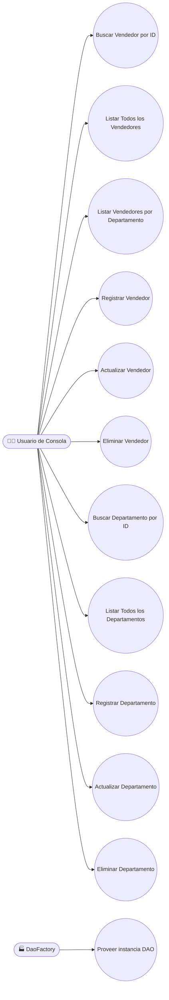

</details>

<details>
<summary><strong>🏛️ Diagrama de Clases</strong></summary>

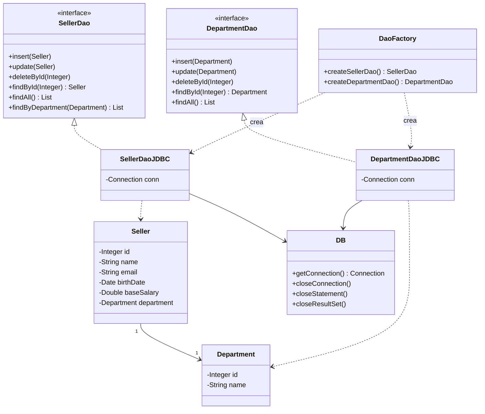

</details>

<details>
<summary><strong>🧱 Diagrama de Objetos</strong></summary>

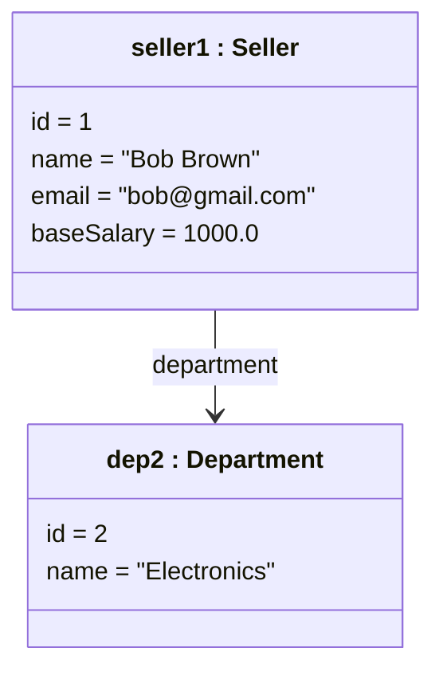

</details>

<details>
<summary><strong>🔄 Diagrama de Secuencia — findById</strong></summary>

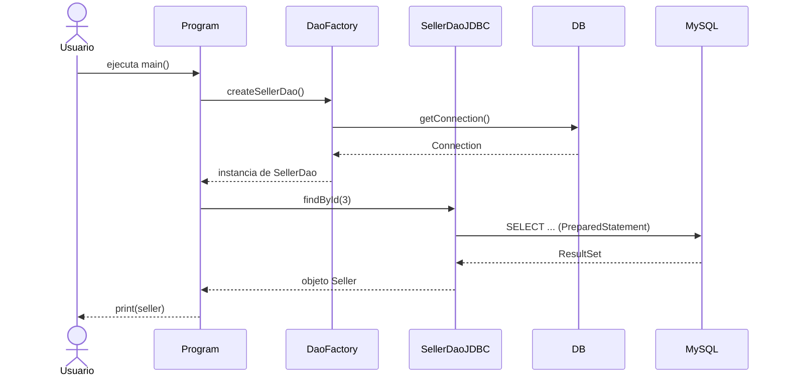

</details>

<details>
<summary><strong>🤝 Diagrama de Comunicación (Colaboración)</strong></summary>

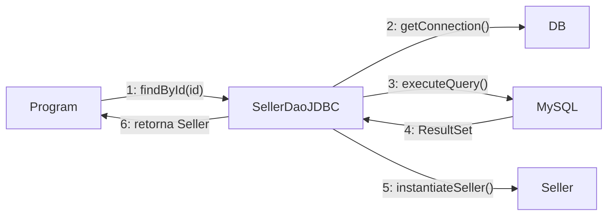

</details>

<details>
<summary><strong>🏃 Diagrama de Actividades — Ejecución del Programa</strong></summary>

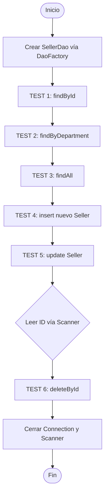

</details>

<details>
<summary><strong>🔁 Diagrama de Máquina de Estados — Ciclo de Vida de la Conexión</strong></summary>

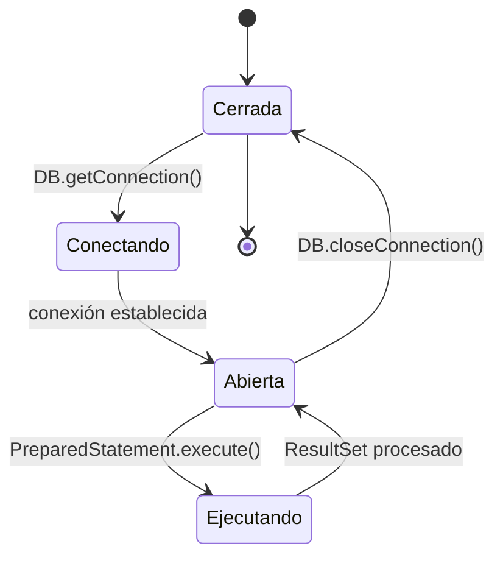

</details>

<details>
<summary><strong>🧩 Diagrama de Componentes</strong></summary>

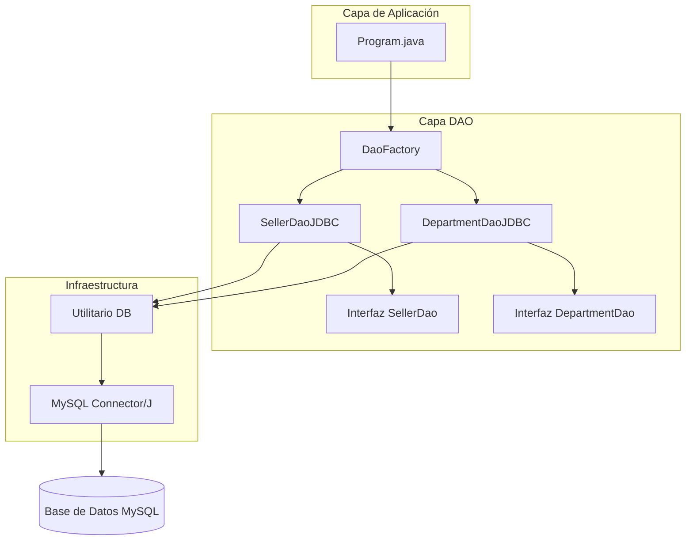

</details>

<details>
<summary><strong>🚀 Diagrama de Despliegue</strong></summary>

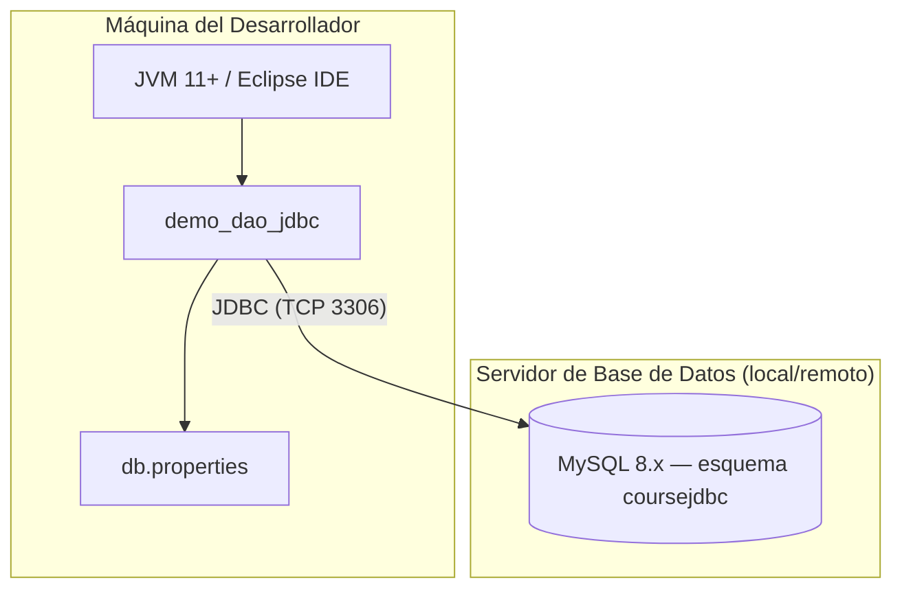

</details>

<details>
<summary><strong>📦 Diagrama de Paquetes</strong></summary>

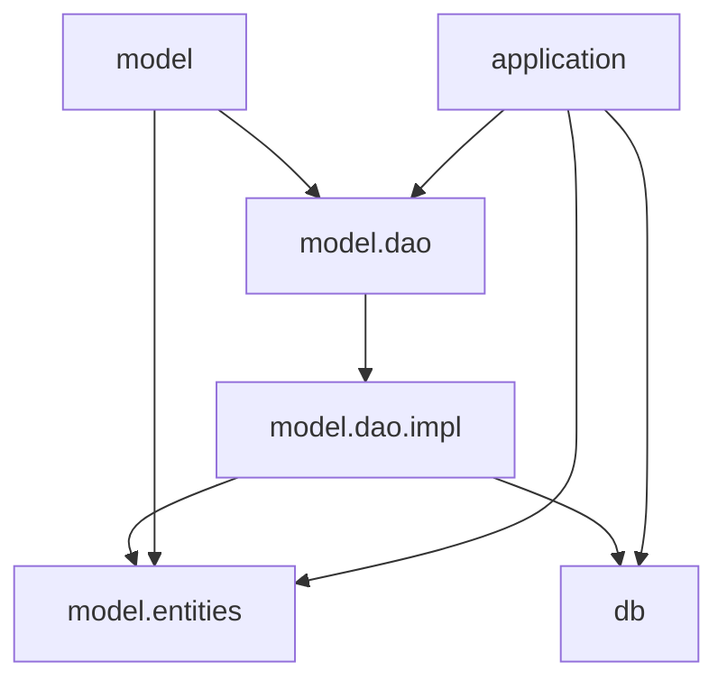

</details>

<details>
<summary><strong>🧬 Diagrama de Estructura Compuesta — SellerDaoJDBC</strong></summary>

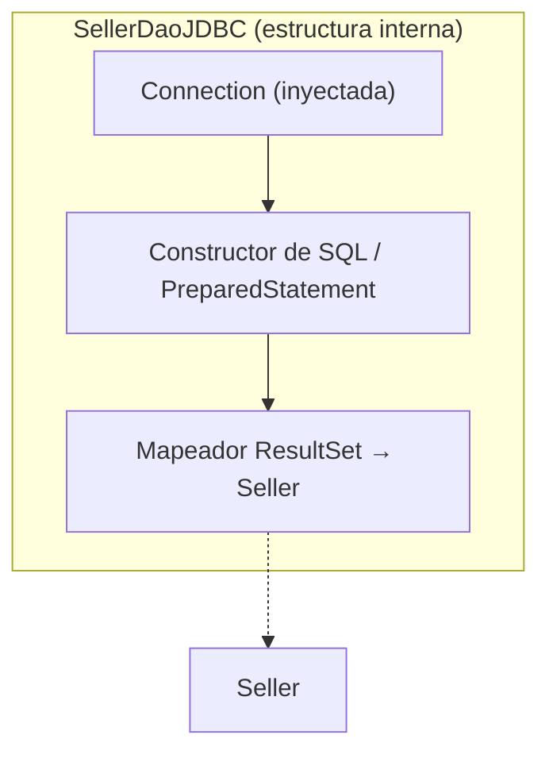

</details>

<details>
<summary><strong>🗺️ Diagrama de Visión General de Interacción</strong></summary>

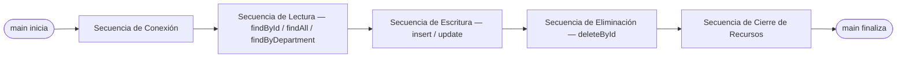

</details>

<details>
<summary><strong>⏱️ Diagrama de Tiempo — Ciclo de Vida de la Conexión durante la Ejecución</strong></summary>

| Tiempo | Estado de la Conexión | Evento |
|:-----|:------------------|:------|
| T + 0 | `Cerrada` → `Abierta` | `DaoFactory.createSellerDao()` llama a `DB.getConnection()`. |
| T + 1 | `Abierta` | Los TESTs 1–5 ejecutan `PreparedStatement`s secuencialmente en la misma conexión. |
| T + 2 | `Abierta` | El TEST 6 se bloquea esperando `Scanner.nextInt()` (entrada del usuario). |
| T + 3 | `Abierta` → `Ejecutando` | `deleteById` ejecuta el `DELETE`. |
| T + 4 | `Ejecutando` → `Cerrada` | La conexión y el `Scanner` se cierran al final del `main()`. |

</details>

### 🗃️ Arquitectura de Datos

<details>
<summary><strong>🔗 Diagrama Entidad-Relación (DER)</strong></summary>

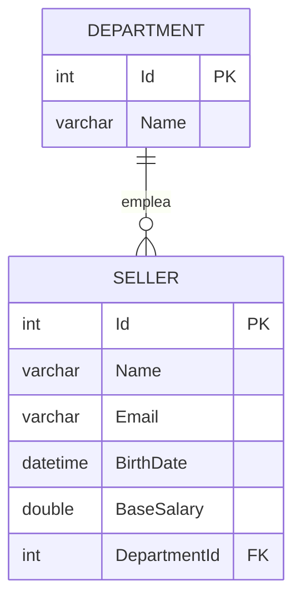

</details>

<details>
<summary><strong>💭 Modelo Conceptual de Datos</strong></summary>

Entidades y relaciones de alto nivel, independientes de la tecnología de base de datos:

- Un **Department** agrupa cero o más **Sellers**.
- Un **Seller** pertenece exactamente a un **Department**.
- Ambas entidades se identifican mediante un `Id` sustituto (clave subrogada).

</details>

<details>
<summary><strong>🧮 Modelo Lógico de Datos</strong></summary>

| Entidad | Atributos Clave | Tipo |
|:-------|:----------------|:-----|
| Department | Id (PK), Name | int, string |
| Seller | Id (PK), Name, Email, BirthDate, BaseSalary, DepartmentId (FK) | int, string, string, datetime, double, int |

</details>

<details>
<summary><strong>💾 Modelo Físico de Datos</strong></summary>

```sql
CREATE TABLE department (
    Id   INT         NOT NULL AUTO_INCREMENT,
    Name VARCHAR(60) NULL,
    PRIMARY KEY (Id)
);

CREATE TABLE seller (
    Id           INT          NOT NULL AUTO_INCREMENT,
    Name         VARCHAR(60)  NOT NULL,
    Email        VARCHAR(100) NOT NULL,
    BirthDate    DATETIME     NOT NULL,
    BaseSalary   DOUBLE       NOT NULL,
    DepartmentId INT          NOT NULL,
    PRIMARY KEY (Id),
    FOREIGN KEY (DepartmentId) REFERENCES department (Id)
);
```

> Motor: **MySQL 8.x**. Esquema creado por el script `database.sql`.

</details>

<details>
<summary><strong>📖 Diccionario de Datos</strong></summary>

| Tabla | Campo | Tipo | Restricciones | Descripción |
|:------|:------|:-----|:------------|:------------|
| department | Id | INT | PK, AUTO_INCREMENT | Identificador único del departamento. |
| department | Name | VARCHAR(60) | NULL | Nombre del departamento. |
| seller | Id | INT | PK, AUTO_INCREMENT | Identificador único del vendedor. |
| seller | Name | VARCHAR(60) | NOT NULL | Nombre completo del vendedor. |
| seller | Email | VARCHAR(100) | NOT NULL | Correo electrónico del vendedor. |
| seller | BirthDate | DATETIME | NOT NULL | Fecha de nacimiento del vendedor. |
| seller | BaseSalary | DOUBLE | NOT NULL | Salario base del vendedor. |
| seller | DepartmentId | INT | NOT NULL, FK → department.Id | Departamento al que pertenece el vendedor. |

</details>

<details>
<summary><strong>🔄 Diagrama de Flujo de Datos (DFD)</strong></summary>

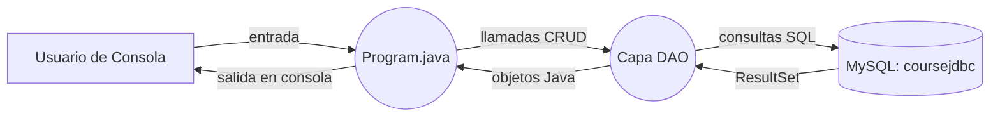

</details>

<details>
<summary><strong>🧬 Diagrama de Linaje de Datos (Data Lineage)</strong></summary>

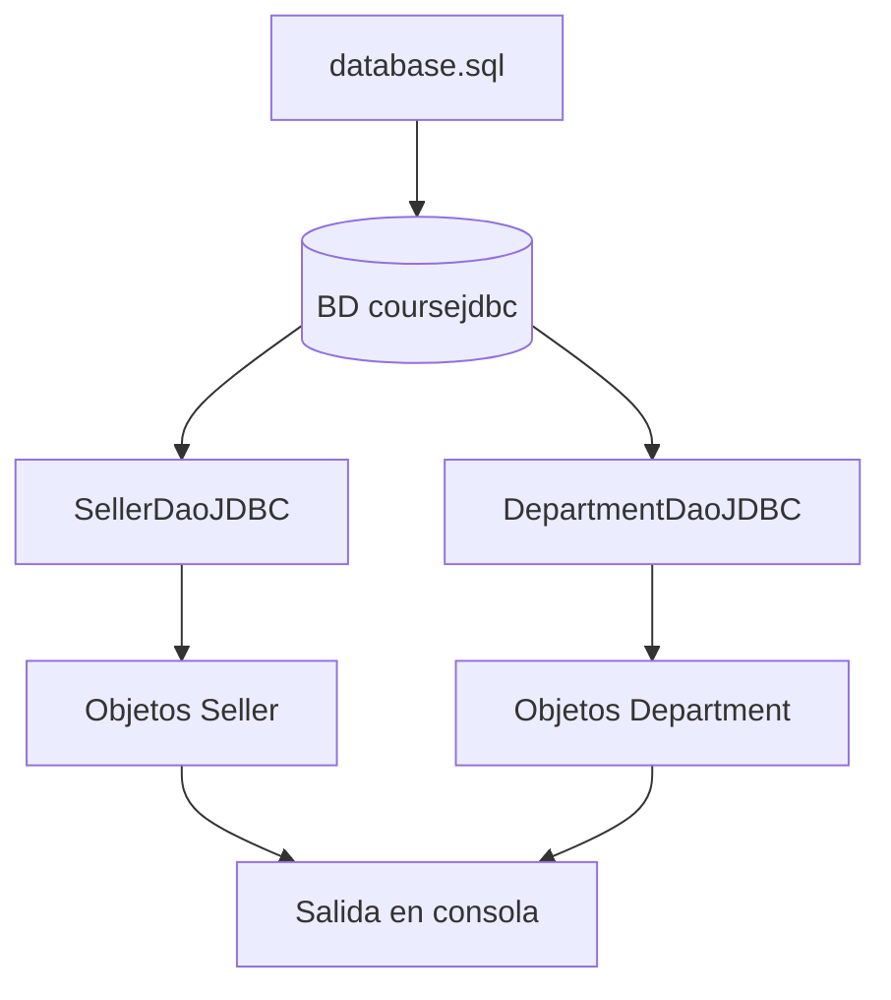

</details>

### 🏗️ Arquitectura y UX

<details>
<summary><strong>🏛️ Diagrama de Arquitectura (Visión General)</strong></summary>

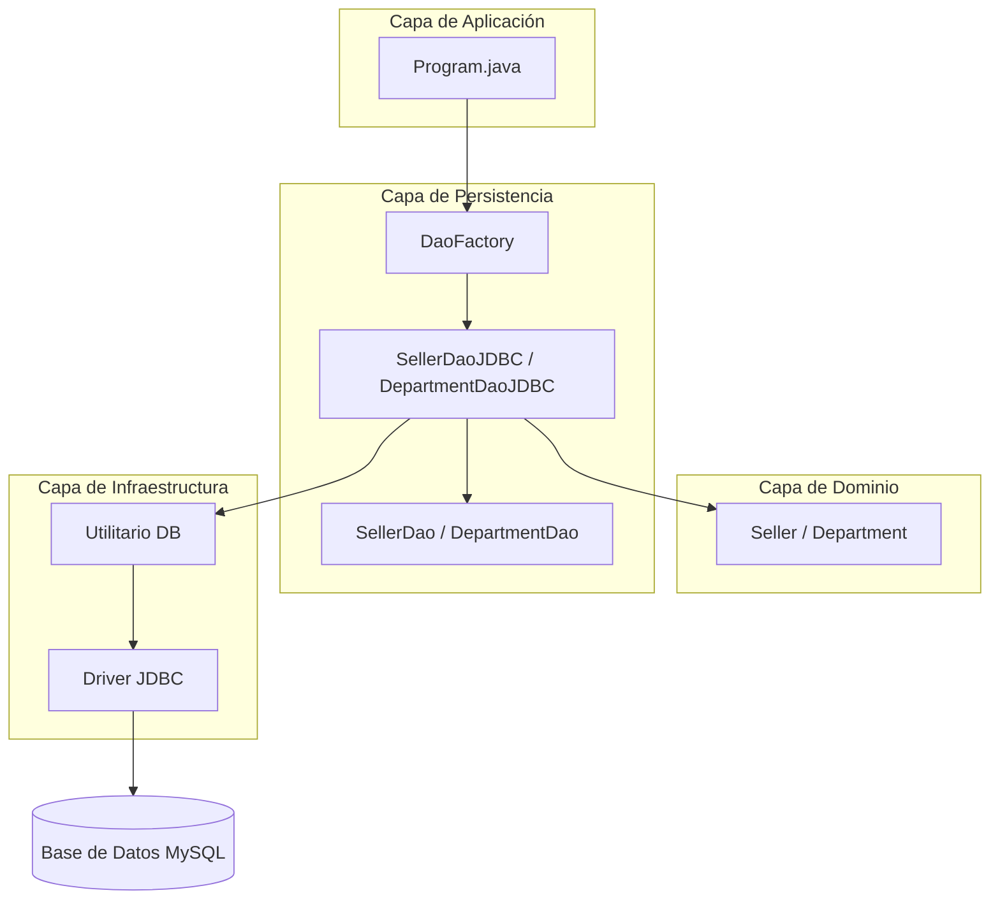

</details>

<details>
<summary><strong>🔀 Diagrama de Flujo — Ejecución del Programa</strong></summary>

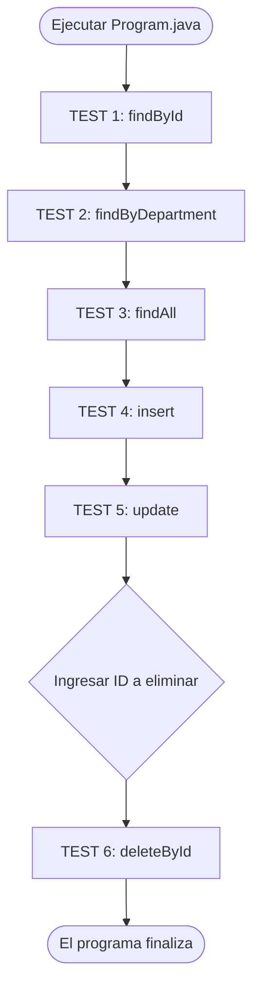

</details>

<details>
<summary><strong>🙋 Personas</strong></summary>

| Persona | Perfil | Objetivos | Puntos de Dolor |
|:--------|:--------|:------|:------------|
| 🎓 **Diego, 22 — Estudiante de TI** | Aprende patrones de persistencia en Java por primera vez. | Entender el patrón DAO sin la "magia" de un ORM que oculta el SQL. | El boilerplate de JDBC, la gestión manual de recursos y el manejo de errores poco claro. |
| 💻 **Camila, 30 — Desarrolladora Backend** | Evalúa el patrón DAO para migrar un sistema heredado. | Desacoplar la persistencia de la lógica de negocio de forma sostenible. | Fuerte acoplamiento con SQL específico de la base de datos en toda la base de código. |

</details>

<details>
<summary><strong>🗺️ Mapa de Viaje del Usuario — "Diego aprende el patrón DAO"</strong></summary>

| Etapa | Acción | Punto de Contacto | Emoción | Oportunidad |
|:------|:-------|:-----------|:--------|:------------|
| Descubrimiento | Clona el repositorio y lee el README | GitHub | 🙂 Curioso | Instrucciones de configuración claras e ilustradas. |
| Configuración | Crea la base de datos `coursejdbc` y configura `db.properties` | MySQL CLI / Eclipse | 😐 Cauteloso | Proporcionar una plantilla de `db.properties` lista para editar. |
| Exploración | Ejecuta `Program.java` y lee la salida numerada de los TESTs | Consola de Eclipse | 🙂 Comprometido | Secciones `TEST n` numeradas, mapeadas directamente a los RF. |
| Comprensión | Lee el código fuente de `SellerDao` / `SellerDaoJDBC` | IDE | 😊 Satisfecho | Diagramas de arquitectura y clases como mapa del código. |
| Extensión | Crea una nueva entidad + DAO siguiendo el mismo patrón | IDE | 😄 Confiado | Diagrama de clases y estructura de paquetes como plantilla reutilizable. |

</details>

<details>
<summary><strong>📐 Wireframe — Salida en Consola</strong></summary>

```text
┌─────────────────────────────────────────────────────────┐
│ === TEST 1: findById ===                                  │
│ Seller [id=3, name=Alex Grey, email=alex@gmail.com, ...]  │
│                                                            │
│ === TEST 2: findByDepartment ===                          │
│ Seller [id=1, name=Bob Brown, ...]                        │
│ Seller [id=2, name=Maria Pink, ...]                       │
│                                                            │
│ === TEST 3: findAll ===                                   │
│ Seller [id=1, ...]                                        │
│ Seller [id=2, ...]                                        │
│ ...                                                       │
│                                                            │
│ === TEST 4: Seller insert ===                             │
│ Inserted! New id = 6                                      │
│                                                            │
│ === TEST 5: Seller update ===                             │
│ Update completed!                                         │
│                                                            │
│ === TEST 6: Seller delete ===                             │
│ Enter id for delete test: _                               │
└─────────────────────────────────────────────────────────┘
```

</details>

<details>
<summary><strong>🎨 Mockup — UI Conceptual de Gestión de Vendedores (extensión futura)</strong></summary>

```text
┌─────────────────────────────────────────────────────┐
│  🗃️ Gestor de Vendedores (UI conceptual)             │
├─────────────────────────────────────────────────────┤
│ Departamento: [ Electronics ▼ ]   [+ Nuevo Vendedor] │
│ ┌─────┬────────────┬──────────────────┬────────────┐│
│ │ ID  │ Nombre      │ Correo            │ Salario    ││
│ ├─────┼────────────┼──────────────────┼────────────┤│
│ │ 1   │ Bob Brown   │ bob@gmail.com     │ 1000.00    ││
│ │ 2   │ Maria Pink  │ maria@gmail.com   │ 3500.00    ││
│ └─────┴────────────┴──────────────────┴────────────┘│
│               [Editar]  [Eliminar]  [Guardar]        │
└─────────────────────────────────────────────────────┘
```

> 💡 Esta interfaz **no está implementada** — ilustra cómo la capa DAO existente podría alimentar una futura interfaz de escritorio/web sin cambios en `model.dao`.

</details>

---

## 🗺️ Roadmap

| Estado | Elemento |
|:------:|:-----|
| 🔲 | Agregar ejemplos de uso de `DepartmentDaoJDBC` en `Program.java`. |
| 🔲 | Agregar pruebas automatizadas (JUnit) que cubran cada método DAO. |
| 🔲 | Proporcionar `db.properties.example` como plantilla. |
| 🔲 | UI de escritorio/web opcional sobre la capa DAO existente. |

---

## 🤝 Cómo Contribuir

> ¡Las contribuciones son muy bienvenidas! Sigue los pasos a continuación para colaborar de forma organizada.

| Paso | Acción | Comando |
|:-----:|:-----|:--------|
| 1️⃣ | **Fork** | Crea un fork del repositorio en tu cuenta. | — |
| 2️⃣ | **Branch** | Crea tu rama de funcionalidad a partir de `main`. | `git checkout -b feature/NuevaFuncionalidad` |
| 3️⃣ | **Commit** | Guarda los cambios con un mensaje claro y semántico. | `git commit -m 'feat: Agrega NuevaFuncionalidad'` |
| 4️⃣ | **Push** | Sube la rama al repositorio remoto. | `git push origin feature/NuevaFuncionalidad` |
| 5️⃣ | **Pull Request** | Abre un PR detallando los cambios realizados. | — |

<div align="center">

<br>

**¡Si este proyecto te fue útil para tus estudios, deja una estrella ⭐️ en el repositorio!**

</div>

---

## 👨‍💻 Autor

<div align="center">

<br>

**Victor H. J. Santiago**

<br>

[](https://github.com/VictorHJesusSantiago)
[](https://www.linkedin.com/in/victor-henrique-de-jesus-santiago/)

</div>

---

## 📄 Licencia

<div align="center">

Este proyecto se distribuye bajo la **Licencia MIT**.
Consulta el archivo [`LICENSE`](./LICENSE) en el repositorio para más información.


</div>

---

<div align="center">

*Hecho con 🗃️ y Java por **Victor H. J. Santiago***

</div>
