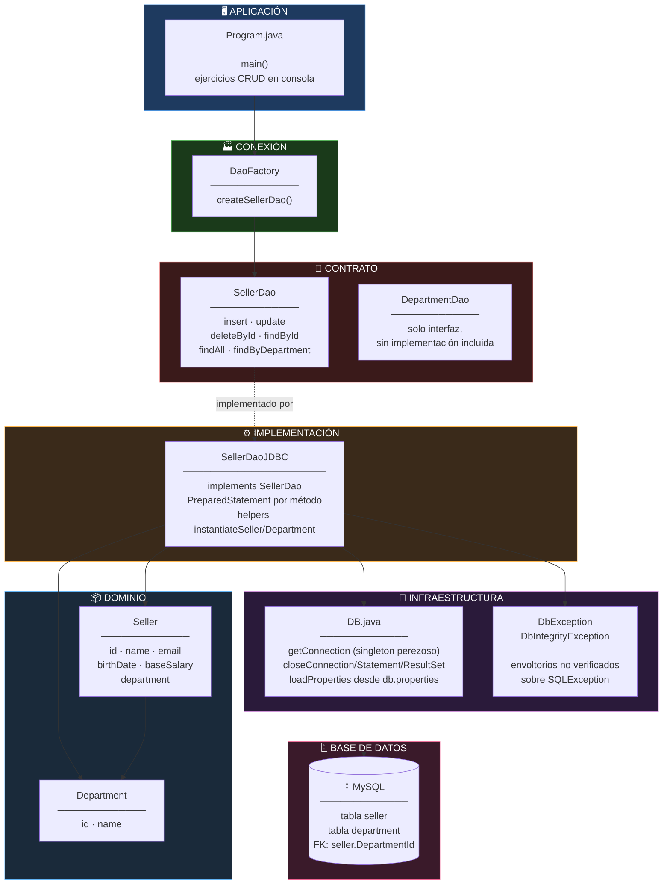
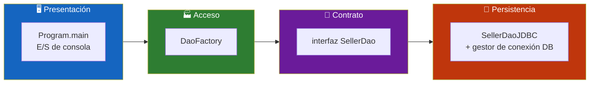
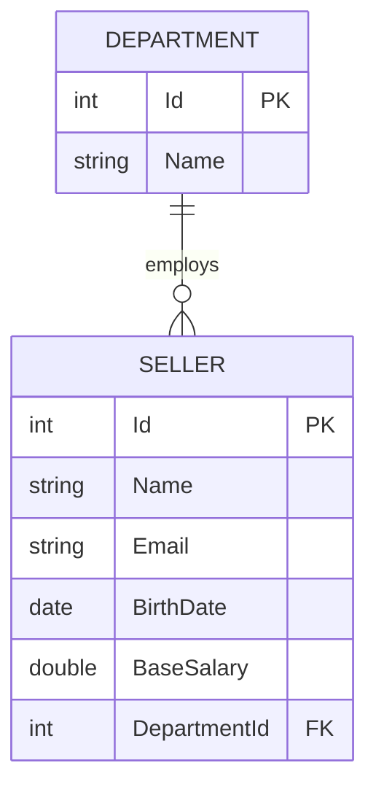
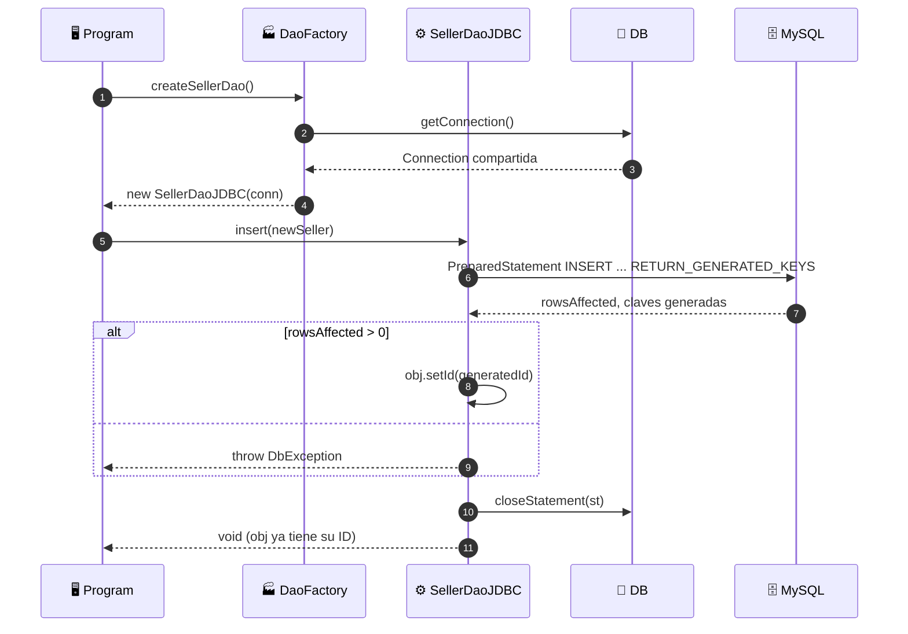
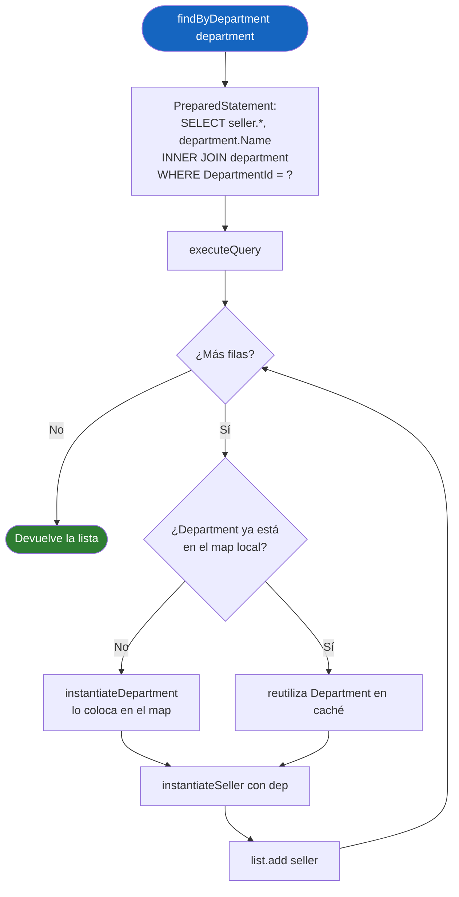
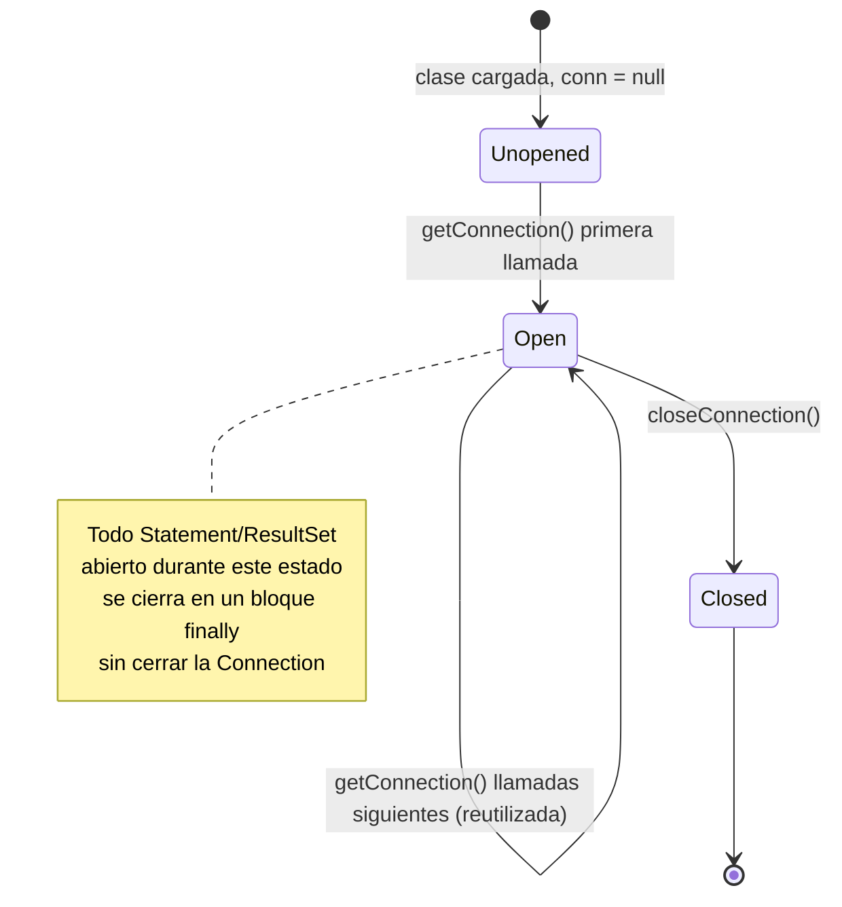

<div align="center">

**🌐 Choose Language / Selecione o Idioma / Elija el Idioma**

[](README.md)&nbsp;&nbsp;&nbsp;[](README_PT.md)&nbsp;&nbsp;&nbsp;[](README_ES.md)

</div>

---

<div align="center">

```
██████╗  █████╗  ██████╗       ██╗██████╗ ██████╗  ██████╗
██╔══██╗██╔══██╗██╔═══██╗      ██║██╔══██╗██╔══██╗██╔════╝
██║  ██║███████║██║   ██║      ██║██║  ██║██████╔╝██║
██║  ██║██╔══██║██║   ██║ ██   ██║██║  ██║██╔══██╗██║
██████╔╝██║  ██║╚██████╔╝ ╚█████╔╝██████╔╝██████╔╝╚██████╗
╚═════╝ ╚═╝  ╚═╝ ╚═════╝   ╚════╝ ╚═════╝ ╚═════╝  ╚═════╝
        El Patrón de Diseño DAO, Implementado a Mano en Java
```

---

[](https://openjdk.org/)
[]()
[](https://www.mysql.com/)
[]()
[]()
[]()
[]()

<br/>

> **Una implementación de manual del patrón Data Access Object**
> usando únicamente el paquete `java.sql` del propio JDK — sin ORM, sin framework, sin inyección de dependencias.

<br/>


-6DB33F?style=flat-square)


</div>

---

## 📑 Tabla de Contenidos

<details>
<summary>▶️ <strong>Haga clic para expandir / contraer esta sección</strong></summary>

<table>
<tr>
<td valign="top" width="50%">

**🏗️ Sistema**
- [Visión General](#-visión-general)
- [Arquitectura del Sistema](#-arquitectura-del-sistema)
- [Stack Tecnológico](#-stack-tecnológico)
- [Patrones de Diseño](#-patrones-de-diseño-aplicados)
- [Estructura del Proyecto](#-estructura-del-proyecto)

**📦 Módulos**
- [Program — Controlador de Consola](#-program--controlador-de-consola)
- [DB — Gestor de Conexión](#-db--gestor-de-conexión)
- [DaoFactory — Proveedor de Instancias](#-daofactory--proveedor-de-instancias)
- [SellerDao / SellerDaoJDBC](#-sellerdao--sellerdaojdbc--implementación-crud)
- [DepartmentDao](#-departmentdao--solo-interfaz)
- [Seller / Department — Entidades](#-seller--department--entidades)
- [Envoltorios de Excepción](#-envoltorios-de-excepción)

</td>
<td valign="top" width="50%">

**💼 Negocio**
- [Reglas de Negocio](#-reglas-de-negocio)
- [Requisitos Funcionales](#-requisitos-funcionales)
- [Requisitos No Funcionales](#-requisitos-no-funcionales)

**📐 Diseño**
- [Modelo de Datos](#-modelo-de-datos)
- [Flujos del Sistema](#-flujos-del-sistema)
- [Flujo de Inserción](#flujo-de-inserción)
- [Flujo de Búsqueda por Departamento](#flujo-de-búsqueda-por-departamento)
- [Ciclo de Vida de la Conexión](#ciclo-de-vida-de-la-conexión)

**🔐 Seguridad y Operaciones**
- [Seguridad](#-seguridad)
- [Instalación y Ejecución](#-instalación--ejecución)
- [Pruebas Automatizadas](#-pruebas-automatizadas)
- [Métricas y Monitoreo](#-métricas--monitoreo)
- [Limitaciones Conocidas](#-limitaciones-conocidas)

</td>
</tr>
</table>

---

</details>

## 🌟 Visión General

<details>
<summary>▶️ <strong>Haga clic para expandir / contraer esta sección</strong></summary>

**demo_dao_jdbc** es un proyecto Java deliberadamente minimalista, construido para demostrar el patrón **Data Access Object (DAO)** sin ninguna capa de abstracción entre el código y el SQL. Modela un dominio clásico de "vendedores pertenecen a departamentos", expone una interfaz `SellerDao` y la implementa una sola vez — `SellerDaoJDBC` — usando `PreparedStatement`s puros contra una base de datos MySQL, a través del propio paquete `java.sql` del JDK.

Una clase utilitaria `DB`, de conexión única, centraliza la creación y el cierre de la conexión, así como el cierre de los handles de `Statement`/`ResultSet`, traduciendo cada `SQLException` verificada en una `DbException` no verificada, de modo que el código que la invoca nunca tiene que escribir `try/catch` alrededor de llamadas JDBC rutinarias. Una `DaoFactory` oculta la `SellerDaoJDBC` concreta detrás de la interfaz `SellerDao`, de forma que un `Program.main` dirigido por consola pueda ejercitar todas las operaciones CRUD sin importar nunca `model.dao.impl`.

> [!NOTE]
> Este repositorio también contiene un proyecto anidado no relacionado, `CoopVale/` — una aplicación de comercio electrónico Flask separada, con su propio repositorio `.git` y sus propios tres READMEs. Comparte esta carpeta externa solo por coincidencia de dónde fue creada; no forma parte de la demo DAO/JDBC documentada aquí.

### 🎯 Objetivos del Sistema

| Objetivo | Descripción |
|-----------|-------------|
| 🏛️ **Demostrar el patrón DAO** | Separar el dominio `Seller`/`Department` del SQL que lo persiste |
| 🔌 **JDBC puro, sin ORM** | Mostrar exactamente lo que automatiza un ORM, escribiendo el código de `PreparedStatement` a mano |
| 🏭 **Conexión basada en factory** | Hacer que el código que la invoca dependa de la interfaz `SellerDao`, nunca de la implementación `SellerDaoJDBC` |
| 🔁 **Cobertura CRUD completa** | Insertar, actualizar, eliminar, buscar por id, buscar todos, buscar por departamento |
| 🧯 **Traducción de checked a unchecked** | Convertir cada `SQLException` en una `DbException`/`DbIntegrityException` en el límite JDBC |
| 🔗 **Mapeo consciente de join** | Reconstruir objetos `Seller` con su `Department` anidado a partir de un único `ResultSet` unido |
| 🖥️ **Ejecución sin dependencias** | Ejecutarse enteramente desde la consola con un único JAR externo (el driver JDBC de MySQL) |

---

</details>

## 🏗️ Arquitectura del Sistema

<details>
<summary>▶️ <strong>Haga clic para expandir / contraer esta sección</strong></summary>

### Diagrama de Módulos



### Capas de Arquitectura



---

</details>

## 🛠️ Stack Tecnológico

<details>
<summary>▶️ <strong>Haga clic para expandir / contraer esta sección</strong></summary>

<table>
<thead>
<tr>
<th>Capa</th>
<th>Tecnología</th>
<th>Versión</th>
<th>Propósito</th>
</tr>
</thead>
<tbody>
<tr>
<td><strong>🧠 Lenguaje</strong></td>
<td>Java</td>
<td>8+ (usa <code>module-info.java</code>)</td>
<td>Implementación completa, 10 archivos fuente</td>
</tr>
<tr>
<td><strong>🔌 Acceso a Datos</strong></td>
<td>JDBC</td>
<td><code>java.sql</code> (incluido en el JDK)</td>
<td><code>PreparedStatement</code>, <code>ResultSet</code>, <code>Connection</code> — sin ORM</td>
</tr>
<tr>
<td><strong>🗄️ Base de Datos</strong></td>
<td>MySQL</td>
<td>cualquier 5.x/8.x</td>
<td>Almacenamiento de las tablas <code>seller</code> y <code>department</code></td>
</tr>
<tr>
<td><strong>📦 Driver</strong></td>
<td>MySQL Connector/J</td>
<td>no versionado en el repositorio</td>
<td>El único JAR externo requerido en el classpath</td>
</tr>
<tr>
<td><strong>⚙️ Configuración</strong></td>
<td><code>db.properties</code></td>
<td>formato Java <code>Properties</code></td>
<td>Externaliza <code>dburl</code> y las credenciales del driver fuera del código fuente</td>
</tr>
<tr>
<td><strong>📐 Modularidad</strong></td>
<td>Java Platform Module System</td>
<td>—</td>
<td><code>module-info.java</code> declara el límite del módulo</td>
</tr>
</tbody>
</table>

---

</details>

## 🎨 Patrones de Diseño Aplicados

<details>
<summary>▶️ <strong>Haga clic para expandir / contraer esta sección</strong></summary>

| Patrón | Dónde | Justificación |
|---------|-------|-----------|
| 🏛️ **Data Access Object** | `SellerDao` (contrato) + `SellerDaoJDBC` (implementación) | Aísla cada sentencia SQL detrás de una interfaz indiferente a la persistencia |
| 🏭 **Simple Factory** | `DaoFactory.createSellerDao()` | Los llamadores dependen únicamente de la interfaz `SellerDao`; cambiar la implementación JDBC por otra afecta una sola línea |
| 🔂 **Singleton Perezoso** | `DB.getConnection()` | Una única `Connection` compartida durante todo el ciclo de vida del proceso, creada en el primer uso |
| 🧯 **Traducción de Excepciones** | `DbException`, `DbIntegrityException` envolviendo `SQLException` | Convierte una excepción verificada en una no verificada en el límite JDBC, manteniendo limpias las firmas de los métodos DAO |
| 🧱 **Reconstrucción de Objetos a partir de Join** | `instantiateSeller` / `instantiateDepartment` en `SellerDaoJDBC` | Reconstruye dos objetos de dominio relacionados a partir de una única fila de `ResultSet` unida |
| 🗺️ **Identity Map (local)** | `Map<Integer, Department>` dentro de `findAll`/`findByDepartment` | Evita construir un objeto `Department` duplicado para cada fila de vendedor del mismo departamento |
| 📐 **Programación hacia una Interfaz** | `Program.java` solo referencia a `SellerDao` | El controlador de consola nunca importa `model.dao.impl` |

---

</details>

## 📁 Estructura del Proyecto

<details>
<summary>▶️ <strong>Haga clic para expandir / contraer esta sección</strong></summary>

```
demo_dao_jdbc/
│
└── 📂 src/
    ├── 📂 application/
    │   └── 📄 Program.java              # ★ Punto de entrada de consola — ejercita todos los métodos DAO
    │
    ├── 📂 db/
    │   ├── 📄 DB.java                   # ★ Ciclo de vida de la conexión + cierre de Statement/ResultSet
    │   ├── 📄 DbException.java          # Envoltorio no verificado sobre SQLException
    │   └── 📄 DbIntegrityException.java # Envoltorio no verificado para violaciones de FK/constraint
    │
    ├── 📂 model/
    │   ├── 📂 dao/
    │   │   ├── 📄 DaoFactory.java       # ★ Método factory createSellerDao()
    │   │   ├── 📄 SellerDao.java        # ★ El contrato DAO — 6 métodos CRUD
    │   │   ├── 📄 DepartmentDao.java    # Interfaz declarada, sin implementación incluida
    │   │   └── 📂 impl/
    │   │       └── 📄 SellerDaoJDBC.java # ★ El único DAO concreto — SQL de PreparedStatement puro
    │   │
    │   └── 📂 entities/
    │       ├── 📄 Seller.java           # id, name, email, birthDate, baseSalary, department
    │       └── 📄 Department.java       # id, name
    │
    └── 📄 module-info.java              # Declaración del módulo Java
│
├── 📂 CoopVale/                          # ⚠️ Proyecto anidado no relacionado — .git propio, READMEs propios
│
├── 📄 README.md                          # 🇺🇸 Inglés (principal, este archivo)
├── 📄 README_PT.md                       # 🇧🇷 Portugués
└── 📄 README_ES.md                       # 🇪🇸 Español
```

---

</details>

## 📦 Módulos del Sistema

<details>
<summary>▶️ <strong>Haga clic para expandir / contraer esta sección</strong></summary>

### 🏛️ Program — Controlador de Consola

`Program.main` es el único punto de entrada de la aplicación. Utiliza `DaoFactory.createSellerDao()` para obtener un `SellerDao`, y luego recorre cada operación CRUD en secuencia — insertar un nuevo vendedor, actualizar uno, buscar uno por id, listar todos, listar por departamento y eliminar uno — imprimiendo los resultados con `System.out`. Nunca accede a `SellerDaoJDBC` directamente.

---

### 🔌 DB — Gestor de Conexión

| Método | Responsabilidad |
|--------|-----------------|
| `getConnection()` | Abre de forma perezosa la `Connection` compartida a partir de `db.properties`, reutilizándola en las llamadas siguientes |
| `closeConnection()` | Cierra la conexión compartida, envolviendo `SQLException` en `DbException` |
| `loadProperties()` | Lee `db.properties` del directorio de trabajo mediante `FileInputStream` |
| `closeStatement(Statement)` | Cierre de statement seguro ante nulos |
| `closeResultSet(ResultSet)` | Cierre de result set seguro ante nulos |

Todo método DAO que abre un `Statement`/`ResultSet` lo cierra en un bloque `finally` llamando a `DB`, de modo que ningún recurso JDBC se filtra jamás, ya sea en el camino exitoso o en el de excepción.

---

### 🏭 DaoFactory — Proveedor de Instancias

```java
public static SellerDao createSellerDao() {
    return new SellerDaoJDBC(DB.getConnection());
}
```

La clase entera es un único método estático. Es el único punto del código fuente que importa `SellerDaoJDBC` — en todo el resto solo se ve `SellerDao`.

---

### 📐 SellerDao / SellerDaoJDBC — Implementación CRUD

| Método | Sentencia SQL | Notas |
|--------|---------------|-------|
| `insert(Seller)` | `INSERT INTO seller (...) VALUES (...)` con `RETURN_GENERATED_KEYS` | Lee el ID generado de vuelta en `obj.setId(...)` |
| `update(Seller)` | `UPDATE seller SET ... WHERE id=?` | No requiere manejo de clave generada |
| `deleteById(Integer)` | `DELETE FROM seller WHERE Id = ?` | Lanza `DbException` si `executeUpdate()` afecta cero filas |
| `findById(Integer)` | `SELECT seller.*, department.Name AS DepName ... INNER JOIN department` | Devuelve `null` cuando ninguna fila coincide |
| `findAll()` | Mismo join, sin `WHERE`, `ORDER BY Name` | Deduplica objetos `Department` mediante un `Map` local |
| `findByDepartment(Department)` | Mismo join, filtrado por `DepartmentId`, `ORDER BY Name` | Misma deduplicación con map local |

`instantiateSeller(ResultSet, Department)` e `instantiateDepartment(ResultSet)` son helpers privados compartidos por todos los métodos de lectura, de modo que el mapeo columna-a-campo existe en exactamente un lugar.

---

### 📐 DepartmentDao — Solo Interfaz

`DepartmentDao` se declara en `model/dao/` junto a `SellerDao`, pero **ninguna implementación `DepartmentDaoJDBC` se incluye en este repositorio**. Documenta la simetría prevista del patrón — cada entidad tendría su propia interfaz DAO e implementación JDBC — sin que la demo necesite duplicar la misma forma CRUD dos veces.

---

### 📦 Seller / Department — Entidades

Ambas son POJOs `Serializable` simples, con `equals`/`hashCode` basados en el `id` (dos objetos son iguales si sus `id`s coinciden, sin importar los valores de los demás campos) y un `toString()` con todos los campos. `Seller` mantiene una referencia a `Department`, reflejando la clave foránea `DepartmentId` de la base de datos.

---

### 🧯 Envoltorios de Excepción

| Clase | Extiende | Lanzada cuando |
|-------|---------|-------------|
| `DbException` | `RuntimeException` | Cualquier `SQLException` surge de `DB` o `SellerDaoJDBC` |
| `DbIntegrityException` | `RuntimeException` | Reservada para violaciones de constraint/clave foránea (declarada por simetría con `DbException`) |

Ambas son no verificadas, por lo que las firmas de los métodos DAO en `SellerDao` nunca declaran `throws SQLException` — los llamadores eligen manejar los fallos en lugar de verse forzados a ello.

---

</details>

## 💼 Reglas de Negocio

<details>
<summary>▶️ <strong>Haga clic para expandir / contraer esta sección</strong></summary>

### 🗄️ Reglas de Persistencia

| # | Regla | Aplicación |
|---|------|-------------|
| RN-01 | Todo vendedor debe pertenecer a exactamente un departamento | `Seller.department` es no nulo en la práctica; `DepartmentId` es una columna FK obligatoria |
| RN-02 | El ID generado de un nuevo vendedor se escribe de vuelta en el objeto en memoria | `insert()` lee `Statement.RETURN_GENERATED_KEYS` y llama a `obj.setId(id)` |
| RN-03 | Eliminar un ID inexistente se trata como un error, no como un no-op silencioso | `deleteById` lanza `DbException` cuando `rowsAffected == 0` |
| RN-04 | Las lecturas siempre unen `seller` con `department` en una sola consulta | Cada `SELECT` en `SellerDaoJDBC` incluye el `INNER JOIN` |
| RN-05 | Un objeto `Department` se construye como máximo una vez por consulta, incluso entre varios vendedores | `Map<Integer, Department>` local en `findAll`/`findByDepartment` |
| RN-06 | Los resultados siempre se devuelven ordenados por el nombre del vendedor | `ORDER BY Name` en ambas consultas que devuelven listas |

### 🔌 Reglas de Conexión

| # | Regla | Aplicación |
|---|------|-------------|
| RN-07 | La aplicación usa exactamente una conexión JDBC durante todo su ciclo de vida | Campo `conn` de singleton perezoso en `DB.getConnection()` |
| RN-08 | Los parámetros de conexión viven fuera del código fuente | `db.properties`, cargado por `DB.loadProperties()` |
| RN-09 | Todo `Statement` y `ResultSet` se cierra independientemente del éxito o del fallo | Bloques `finally` en todo método DAO que llama a `DB.closeStatement`/`closeResultSet` |

---

</details>

## ✅ Requisitos Funcionales

<details>
<summary>▶️ <strong>Haga clic para expandir / contraer esta sección</strong></summary>

| ID | Requisito | Prioridad | Estado |
|----|-------------|----------|--------|
| **RF-01** | El sistema debe insertar un nuevo vendedor y reportar su ID generado | 🔴 Alta | ✅ Implementado |
| **RF-02** | El sistema debe actualizar los datos de un vendedor existente | 🔴 Alta | ✅ Implementado |
| **RF-03** | El sistema debe eliminar un vendedor por ID | 🔴 Alta | ✅ Implementado |
| **RF-04** | El sistema debe buscar un único vendedor por ID, incluyendo su departamento | 🔴 Alta | ✅ Implementado |
| **RF-05** | El sistema debe listar todos los vendedores, ordenados por nombre, con sus departamentos | 🔴 Alta | ✅ Implementado |
| **RF-06** | El sistema debe listar todos los vendedores que pertenecen a un departamento dado | 🔴 Alta | ✅ Implementado |
| **RF-07** | El sistema debe cargar los parámetros de conexión de la base de datos desde un archivo externo | 🟡 Media | ✅ Implementado |
| **RF-08** | El sistema debe traducir las excepciones SQL en excepciones de aplicación no verificadas | 🟡 Media | ✅ Implementado |
| **RF-09** | El sistema debe reportar un error al eliminar un vendedor inexistente | 🟡 Media | ✅ Implementado |

---

</details>

## ⚡ Requisitos No Funcionales

<details>
<summary>▶️ <strong>Haga clic para expandir / contraer esta sección</strong></summary>

| ID | Categoría | Requisito | Objetivo |
|----|----------|-------------|--------|
| **RNF-01** | 🧱 Mantenibilidad | Cero frameworks de terceros más allá del driver JDBC | 1 JAR externo |
| **RNF-02** | 📐 Claridad de diseño | El código que llama nunca importa una clase de implementación DAO | Reforzado por convención (`Program` solo importa `SellerDao`) |
| **RNF-03** | 🔌 Seguridad de recursos | Ninguna fuga de recursos JDBC en cualquier ruta de código | Cierre en bloque `finally` en todas partes |
| **RNF-04** | 📖 Legibilidad | Cada método DAO se corresponde con exactamente una sentencia SQL | Mapeo 1:1 método-a-sentencia |
| **RNF-05** | 🔁 Reusabilidad | La lógica de mapeo fila-a-objeto existe en un único lugar por entidad | Helpers `instantiateSeller`/`instantiateDepartment` |
| **RNF-06** | 🖥️ Portabilidad | Funciona en cualquier JDK 8+ con un driver compatible con MySQL en el classpath | Sin código específico del sistema operativo |

---

</details>

## 🗄️ Modelo de Datos

<details>
<summary>▶️ <strong>Haga clic para expandir / contraer esta sección</strong></summary>

### Diagrama Entidad-Relación



### Especificación de Tablas

| Tabla | Columna | Campo Java | Notas |
|-------|--------|------------|-------|
| `department` | `Id` | `Department.id` | Clave primaria |
| `department` | `Name` | `Department.name` | |
| `seller` | `Id` | `Seller.id` | Clave primaria, generada automáticamente en la inserción |
| `seller` | `Name` | `Seller.name` | |
| `seller` | `Email` | `Seller.email` | |
| `seller` | `BirthDate` | `Seller.birthDate` | Mapeada mediante `java.sql.Date` |
| `seller` | `BaseSalary` | `Seller.baseSalary` | |
| `seller` | `DepartmentId` | `Seller.department.id` | Clave foránea hacia `department.Id` |

### Contrato de `db.properties`

| Clave | Significado |
|-----|---------|
| `dburl` | URL de conexión JDBC, p. ej. `jdbc:mysql://localhost:3306/coursedb` |
| (claves específicas del driver) | Pasadas directamente a `DriverManager.getConnection(url, props)` — típicamente `user` y `password` |

---

</details>

## 🔄 Flujos del Sistema

<details>
<summary>▶️ <strong>Haga clic para expandir / contraer esta sección</strong></summary>

### Flujo de Inserción



### Flujo de Búsqueda por Departamento



### Ciclo de Vida de la Conexión



---

</details>

## 🔐 Seguridad

<details>
<summary>▶️ <strong>Haga clic para expandir / contraer esta sección</strong></summary>

### Controles Implementados

| Control | Implementación | Efecto |
|---------|---------------|--------|
| 🛡️ **Consultas parametrizadas en todas partes** | Todo método DAO usa `PreparedStatement` con marcadores `?` | Ningún SQL se construye jamás mediante concatenación de cadenas con datos del usuario |
| ⚙️ **Credenciales externalizadas** | La URL/credenciales de conexión viven en `db.properties`, no en el código fuente | Las credenciales no están fijadas ni versionadas como literales en archivos `.java` |
| 🧯 **Las excepciones nunca filtran detalles internos JDBC crudos de forma inesperada** | `SQLException` siempre se captura y se reenvuelve | Tipos de excepción consistentes a nivel de aplicación (`DbException`) |

### Limitaciones de Seguridad Conocidas

> [!WARNING]
> Esta es una demo educativa, no una capa de acceso a datos de producción.

| Limitación | Riesgo | Camino de mitigación |
|------------|------|-----------------|
| 🔓 **`db.properties` está en texto plano** | Las credenciales de ese archivo quedan sin cifrar si se versionan | Manténgalo fuera del control de versiones, o muévalo a variables de entorno / un gestor de secretos |
| 🌊 **Sin pool de conexiones** | Una única `Connection` compartida no puede atender operaciones concurrentes de forma segura | Introduzca un pool (HikariCP, etc.) antes de cualquier uso multihilo |
| 🧵 **`DB.conn` no es thread-safe** | Los llamadores concurrentes competirían por el campo estático | Aceptable para esta demo de consola de un solo hilo; inseguro tal cual para un servidor |
| 🪵 **Sin registro/auditoría de acceso a datos** | Ningún rastro de quién cambió qué y cuándo | Añada una tabla de auditoría o una capa de logging si se adopta más allá de una demo |

---

</details>

## 🚀 Instalación & Ejecución

<details>
<summary>▶️ <strong>Haga clic para expandir / contraer esta sección</strong></summary>

### Requisitos Previos

```bash
java -version          # JDK 8+
# Una instancia de MySQL en ejecución con las tablas 'seller' y 'department'
# El JAR de MySQL Connector/J en el classpath
```

Cree `db.properties` en el directorio de trabajo:

```properties
dburl=jdbc:mysql://localhost:3306/coursedb?useSSL=false&serverTimezone=UTC
user=your_user
password=your_password
```

### Compilación

```bash
javac -d bin -cp "lib/mysql-connector-j.jar" $(find src -name "*.java")
```

### Ejecución

```bash
java -cp "bin;lib/mysql-connector-j.jar" application.Program
```

`Program.main` recorre una secuencia de llamadas de inserción/actualización/búsqueda/eliminación contra las tablas `seller`/`department`, imprimiendo cada resultado en la consola.

---

</details>

## 🧪 Pruebas Automatizadas

<details>
<summary>▶️ <strong>Haga clic para expandir / contraer esta sección</strong></summary>

> [!IMPORTANT]
> No hay una suite de pruebas automatizadas en este repositorio — el propio `Program.main` es el mecanismo de verificación manual.

### Lista de Verificación de Aceptación Manual

| # | Escenario | Resultado esperado |
|---|----------|-----------------|
| 1 | `insert()` de un nuevo vendedor | El `id` del objeto en memoria se completa después de la llamada |
| 2 | `findById()` del vendedor insertado | Los campos del objeto devuelto, incluyendo el `Department` anidado, coinciden con lo insertado |
| 3 | `update()` del salario del vendedor | Un `findById()` posterior refleja el nuevo valor |
| 4 | `findAll()` | Los resultados están ordenados por nombre; cada objeto `Department` se comparte entre vendedores del mismo departamento |
| 5 | `findByDepartment()` | Devuelve solo los vendedores cuyo `DepartmentId` coincide |
| 6 | `deleteById()` con un ID existente | Fila eliminada, sin excepción |
| 7 | `deleteById()` con un ID inexistente | Se lanza `DbException` |

---

</details>

## 📊 Métricas & Monitoreo

<details>
<summary>▶️ <strong>Haga clic para expandir / contraer esta sección</strong></summary>

| Métrica | Valor |
|--------|-------|
| Archivos fuente Java | 10 |
| Interfaces DAO | 2 (`SellerDao`, `DepartmentDao`) |
| Implementaciones DAO | 1 (`SellerDaoJDBC`) |
| Entidades de dominio | 2 (`Seller`, `Department`) |
| Clases de excepción | 2 (`DbException`, `DbIntegrityException`) |
| Sentencias SQL (en `SellerDaoJDBC`) | 6 |
| Dependencias externas | 1 (driver JDBC) |

---

</details>

## ⚠️ Limitaciones Conocidas

<details>
<summary>▶️ <strong>Haga clic para expandir / contraer esta sección</strong></summary>

> [!IMPORTANT]
> Construido específicamente para enseñar el patrón DAO y JDBC puro — no pretende ser una biblioteca reutilizable de acceso a datos.

| Categoría | Problema | Estado |
|----------|-------|--------|
| 🏛️ **Sin DepartmentDaoJDBC** | `DepartmentDao` se declara pero nunca se implementa | ➕ Intencional — la demo se enfoca en una única porción vertical completa |
| 🌊 **Sin pool de conexiones** | Conexión única compartida, no segura bajo concurrencia | ⚠️ Pendiente |
| 🧵 **No thread-safe** | El campo estático `DB.conn` no tiene sincronización | ⚠️ Pendiente — aceptable para una demo de consola de un solo hilo |
| 🧪 **Sin pruebas automatizadas** | La verificación es manual, mediante la salida de `Program.main` | ⚠️ Pendiente |
| 🔓 **Archivo de credenciales en texto plano** | `db.properties` no está cifrado | ⚠️ Pendiente — mantener fuera del control de versiones |
| 📁 **Proyecto anidado no relacionado que comparte esta carpeta** | `CoopVale/` es una aplicación Flask separada con su propio repositorio | ➕ Documentado, no es un defecto |

</details>

---

<div align="center">

---

### 🗃️ demo_dao_jdbc

*Una interfaz, una implementación, cero magia*

[](https://openjdk.org/)
[]()
[]()

<br/>

```
"Antes de recurrir a un ORM, escribe el SQL a mano una vez —
 es la única forma de saber qué estás abstrayendo."
```

</div>
