<div align="center">


# 🗃️ Demo DAO JDBC — Padrão DAO com Java + MySQL

**Implementação completa do padrão de projeto DAO (Data Access Object) em Java,**
**utilizando JDBC para comunicação direta com banco de dados MySQL.**

<br>

[](README.md)
[](README_PT.md)
[](README_ES.md)

<br>


</div>

---

## 📚 Tabela de Conteúdos

> Navegue rapidamente pelas seções do projeto.

| # | Seção |
|:-:|:------|
| 1 | [📖 Sobre o Projeto](#-sobre-o-projeto) |
| 2 | [🏛️ O Padrão DAO](#️-o-padrão-dao) |
| 3 | [✨ Funcionalidades (CRUD)](#-funcionalidades-crud) |
| 4 | [🛠️ Pilha de Tecnologias](#️-pilha-de-tecnologias) |
| 5 | [📦 Arquitetura e Pacotes](#-arquitetura-e-pacotes) |
| 6 | [🗃️ Banco de Dados](#️-banco-de-dados) |
| 7 | [📂 Estrutura do Projeto](#-estrutura-do-projeto) |
| 8 | [🚀 Como Executar](#-como-executar) |
| 9 | [📋 Requisitos e Documentação de Engenharia de Software](#-requisitos-e-documentação-de-engenharia-de-software) |
| 10 | [🗺️ Roadmap](#️-roadmap) |
| 11 | [🤝 Como Contribuir](#-como-contribuir) |
| 12 | [👨‍💻 Autor](#-autor) |
| 13 | [📄 Licença](#-licença) |

---

## 📖 Sobre o Projeto

> **Demo DAO JDBC** é uma implementação prática e completa do padrão de projeto **DAO (Data Access Object)** em Java puro, utilizando **JDBC** para interagir diretamente com um banco de dados **MySQL** — sem o uso de ORMs como Hibernate ou JPA.

O projeto consiste em um sistema de gerenciamento de **Vendedores (Seller)** e **Departamentos (Department)**, demonstrando como organizar a camada de persistência de dados de forma limpa, desacoplada e reutilizável, separando completamente o acesso a dados da lógica de negócio.

---

## 🏛️ O Padrão DAO

> O **Data Access Object (DAO)** é um padrão de projeto estrutural que isola a camada de acesso a dados do restante da aplicação, permitindo que a lógica de negócio seja independente do banco de dados utilizado.

```
┌─────────────────────────────────────────────────────┐
│                   APPLICATION LAYER                  │
│           Program.java / Classes Demo               │
└──────────────────────┬──────────────────────────────┘
                        │ usa
┌───────────────────────▼──────────────────────────────┐
│                  DAO INTERFACES                       │
│         SellerDao          DepartmentDao              │
└──────────┬────────────────────────┬──────────────────┘
           │ implementa             │ implementa
┌──────────▼──────────┐  ┌──────────▼──────────────────┐
│  SellerDaoJDBC       │  │  DepartmentDaoJDBC          │
│  (SQL + ResultSet)   │  │  (SQL + ResultSet)          │
└──────────┬───────────┘  └──────────┬──────────────────┘
           │                         │
┌──────────▼─────────────────────────▼──────────────────┐
│                 DB (Utility Class)                     │
│         Gerencia Connection, PreparedStatement         │
└─────────────────────────┬───────────────────────────────┘
                           │
┌──────────────────────────▼─────────────────────────────┐
│               MySQL Database                            │
│         coursejdbc · seller · department                │
└──────────────────────────────────────────────────────────┘
```

### 🔑 Benefícios do Padrão DAO

| Benefício | Descrição |
|:----------|:----------|
| 🧩 **Desacoplamento** | A lógica de negócio não conhece detalhes de SQL ou JDBC. |
| 🔄 **Substituição** | Trocar MySQL por PostgreSQL exige alterar apenas a implementação DAO. |
| 🧪 **Testabilidade** | Interfaces DAO permitem mockar dependências de banco nos testes. |
| 📐 **Responsabilidade Única** | Cada classe tem uma função clara e bem definida. |

---

## ✨ Funcionalidades (CRUD)

### 👤 Seller (Vendedor)

| Operação | Método | Descrição |
|:---------|:------:|:----------|
| 🔍 **Buscar por ID** | `findById(Integer id)` | Retorna um vendedor pelo seu identificador único. |
| 📋 **Buscar Todos** | `findAll()` | Retorna a lista completa de todos os vendedores. |
| 🏢 **Buscar por Departamento** | `findByDepartment(Department dep)` | Retorna todos os vendedores de um departamento específico. |
| ➕ **Inserir** | `insert(Seller obj)` | Cadastra um novo vendedor no banco de dados. |
| ✏️ **Atualizar** | `update(Seller obj)` | Atualiza os dados de um vendedor existente. |
| 🗑️ **Deletar** | `deleteById(Integer id)` | Remove um vendedor pelo seu ID. |

### 🏢 Department (Departamento)

| Operação | Método | Descrição |
|:---------|:------:|:----------|
| 🔍 **Buscar por ID** | `findById(Integer id)` | Retorna um departamento pelo seu identificador. |
| 📋 **Buscar Todos** | `findAll()` | Retorna a lista completa de todos os departamentos. |
| ➕ **Inserir** | `insert(Department obj)` | Cadastra um novo departamento. |
| ✏️ **Atualizar** | `update(Department obj)` | Atualiza os dados de um departamento. |
| 🗑️ **Deletar** | `deleteById(Integer id)` | Remove um departamento pelo seu ID. |

---

## 🛠️ Pilha de Tecnologias

| Tecnologia | Função no Projeto |
|:-----------|:------------------|
| **Java** | Linguagem principal — toda a lógica de negócio e padrões de projeto. |
| **JDBC** | API Java para comunicação nativa com o banco de dados MySQL (sem ORM). |
| **MySQL** | Banco de dados relacional para persistência dos dados de Vendedores e Departamentos. |
| **MySQL Connector/J** | Driver JDBC para estabelecer a conexão Java ↔ MySQL. |
| **Eclipse IDE** | IDE utilizada no desenvolvimento (arquivos `.classpath` e `.project` incluídos). |

---

## 📦 Arquitetura e Pacotes

> O projeto segue uma organização em pacotes com separação clara de responsabilidades.

| Pacote | Classe | Responsabilidade |
|:-------|:------:|:-----------------|
| `model.entities` | `Seller.java` | Entidade Vendedor com atributos: nome, email, salário, data de nascimento e departamento. |
| `model.entities` | `Department.java` | Entidade Departamento com atributos: id e nome. |
| `model.dao` | `SellerDao.java` | **Interface** que define o contrato CRUD para Vendedores. |
| `model.dao` | `DepartmentDao.java` | **Interface** que define o contrato CRUD para Departamentos. |
| `model.dao.impl` | `SellerDaoJDBC.java` | **Implementação** concreta do SellerDao usando JDBC e SQL. |
| `model.dao.impl` | `DepartmentDaoJDBC.java` | **Implementação** concreta do DepartmentDao usando JDBC e SQL. |
| `db` | `DB.java` | Classe utilitária para abertura/fechamento de `Connection`, `Statement` e `ResultSet`. |
| `db` | `DbException.java` | Exceção customizada para erros de banco de dados (runtime). |
| `db` | `DbIntegrityException.java` | Exceção para violações de integridade referencial (FK constraints). |
| `application` | `DaoFactory.java` | **Factory** para instanciar os DAOs — desacopla a criação das implementações. |
| `application` | `Program.java` | Classe de demonstração com exemplos de uso de todas as operações CRUD. |

---

## 🗃️ Banco de Dados

### ⚙️ Configuração — `db.properties`

```properties
# ─────────────────────────────────────────
# Configuração de Conexão com MySQL
# ─────────────────────────────────────────
dburl=jdbc:mysql://localhost:3306/coursejdbc
user=seu_usuario
password=sua_senha
useSSL=false
```

> ⚠️ **Nunca** versione o `db.properties` com credenciais reais. Adicione-o ao `.gitignore` em projetos de produção.

---

### 📄 Script SQL — `database.sql`

```sql
-- ─────────────────────────────────────────
-- Criação do Banco de Dados
-- ─────────────────────────────────────────
CREATE DATABASE IF NOT EXISTS coursejdbc;
USE coursejdbc;

-- ─────────────────────────────────────────
-- Tabela: Department
-- ─────────────────────────────────────────
CREATE TABLE department (
    Id   INT         NOT NULL AUTO_INCREMENT,
    Name VARCHAR(60) NULL,
    PRIMARY KEY (Id)
);

-- ─────────────────────────────────────────
-- Tabela: Seller (referencia Department)
-- ─────────────────────────────────────────
CREATE TABLE seller (
    Id           INT          NOT NULL AUTO_INCREMENT,
    Name         VARCHAR(60)  NOT NULL,
    Email        VARCHAR(100) NOT NULL,
    BirthDate    DATETIME     NOT NULL,
    BaseSalary   DOUBLE       NOT NULL,
    DepartmentId INT          NOT NULL,
    PRIMARY KEY (Id),
    FOREIGN KEY (DepartmentId) REFERENCES department (Id)
);

-- ─────────────────────────────────────────
-- Dados de Exemplo
-- ─────────────────────────────────────────
INSERT INTO department (Name) VALUES
    ('Computers'), ('Electronics'), ('Fashion'), ('Books');

INSERT INTO seller (Name, Email, BirthDate, BaseSalary, DepartmentId) VALUES
    ('Bob Brown',   'bob@gmail.com',   '1998-04-21 00:00:00', 1000.0, 1),
    ('Maria Pink',  'maria@gmail.com', '1979-10-31 00:00:00', 3500.0, 1),
    ('Alex Grey',   'alex@gmail.com',  '1988-01-15 00:00:00', 2200.0, 2),
    ('Ana Lima',    'ana@gmail.com',   '1995-09-13 00:00:00', 1700.5, 4),
    ('John White',  'john@gmail.com',  '1991-11-21 00:00:00', 3000.0, 4);
```

### 📊 Relacionamento das Entidades

```
┌──────────────────┐         ┌─────────────────────────────┐
│    department     │         │           seller             │
│───────────────────│         │───────────────────────────────│
│ Id          PK    │◄────────│ DepartmentId       FK         │
│ Name              │  1   N  │ Id                 PK         │
└────────────────────┘         │ Name                          │
                               │ Email                         │
                               │ BirthDate                     │
                               │ BaseSalary                    │
                               └─────────────────────────────────┘
```

---

## 📂 Estrutura do Projeto

```plaintext
demo_dao_jdbc/
│
├── 📄 database.sql                            # 🗃️  Script de criação do BD e dados de exemplo
├── 📄 db.properties                           # ⚙️  Credenciais de conexão MySQL ← NÃO versionar
├── 📄 .classpath                              # ⚙️  Configuração do classpath (Eclipse)
├── 📄 .project                                # ⚙️  Configuração do projeto (Eclipse)
│
└── 📁 src/
    ├── 📁 model/
    │   ├── 📁 entities/
    │   │   ├── 📄 Department.java             # 🏛️  Entidade Departamento
    │   │   └── 📄 Seller.java                 # 🏛️  Entidade Vendedor
    │   │
    │   └── 📁 dao/
    │       ├── 📄 DepartmentDao.java          # 📋 Interface DAO — Departamento
    │       ├── 📄 SellerDao.java              # 📋 Interface DAO — Vendedor
    │       │
    │       └── 📁 impl/
    │           ├── 📄 DepartmentDaoJDBC.java  # ⚙️  Implementação JDBC — Departamento ← CORE
    │           └── 📄 SellerDaoJDBC.java      # ⚙️  Implementação JDBC — Vendedor ← CORE
    │
    ├── 📁 db/
    │   ├── 📄 DB.java                         # 🔌 Utilitário de conexão JDBC
    │   ├── 📄 DbException.java                # 🚨 Exceção de banco de dados
    │   └── 📄 DbIntegrityException.java       # 🚨 Exceção de integridade referencial
    │
    └── 📁 application/
        ├── 📄 DaoFactory.java                 # 🏭 Factory de instâncias DAO
        └── 📄 Program.java                    # ▶️  Demonstração de todas as operações CRUD
```

---

## 🚀 Como Executar

### 📋 Pré-requisitos

| Requisito | Detalhe |
|:----------|:--------|
| **JDK** | Versão **11 ou superior** instalada e configurada no `PATH`. |
| **MySQL Server** | Versão **8.x** rodando localmente (porta padrão `3306`). |
| **MySQL Connector/J** | Driver JDBC adicionado ao classpath do projeto. |
| **Eclipse IDE** | Recomendado — arquivos de configuração já incluídos no repositório. |
| **Git** | Para clonar o repositório. |

---

### 🔧 Passo a Passo

**1. Clone o repositório:**

```bash
git clone https://github.com/VictorHJesusSantiago/demo_dao_jdbc.git
cd demo_dao_jdbc
```

**2. Crie o banco de dados e as tabelas:**

```bash
mysql -u root -p < database.sql
```

**3. Configure as credenciais no `db.properties`:**

```properties
dburl=jdbc:mysql://localhost:3306/coursejdbc
user=root
password=sua_senha_aqui
useSSL=false
```

**4. Abra no Eclipse IDE:**

```
File → Import → Existing Projects into Workspace
→ Selecione a pasta 'demo_dao_jdbc'
→ Finish
```

**5. Adicione o MySQL Connector/J ao Build Path:**

```
Clique direito no projeto → Build Path → Add External Archives
→ Selecione o arquivo mysql-connector-j-X.X.X.jar
```

**6. Execute o programa:**

```
Clique direito em src/application/Program.java
→ Run As → Java Application
```

---

### 🖥️ Exemplo de Saída no Console

```
=== TEST 1: findById ===
Seller{id=3, name=Alex Grey, email=alex@gmail.com, ...}

=== TEST 2: findByDepartment ===
Seller{id=1, name=Bob Brown, email=bob@gmail.com, ...}
Seller{id=2, name=Maria Pink, email=maria@gmail.com, ...}

=== TEST 3: findAll ===
[lista completa de vendedores]

=== TEST 4: Seller insert ===
Inserted! New id = 6

=== TEST 5: Seller update ===
Update completed!

=== TEST 6: Seller delete ===
Done! Deleted!
```

---

## 📋 Requisitos e Documentação de Engenharia de Software

> Clique em cada item abaixo para expandir/recolher. Todos os requisitos estão no contexto do domínio `demo_dao_jdbc` (padrão DAO, persistência de Seller/Department via JDBC + MySQL).

### 🎯 Requisitos

<details>
<summary><strong>✅ Requisitos Funcionais (RF)</strong></summary>

| ID | Requisito |
|:---|:------------|
| RF-01 | O sistema deve buscar um `Seller` pelo seu `id`. |
| RF-02 | O sistema deve listar todos os `Seller`, incluindo os dados do departamento. |
| RF-03 | O sistema deve listar todos os `Seller` pertencentes a um determinado `Department`. |
| RF-04 | O sistema deve inserir um novo `Seller`, retornando o `id` gerado automaticamente. |
| RF-05 | O sistema deve atualizar os dados de um `Seller` existente. |
| RF-06 | O sistema deve remover um `Seller` pelo seu `id`. |
| RF-07 | O sistema deve buscar um `Department` pelo seu `id`. |
| RF-08 | O sistema deve listar todos os `Department`. |
| RF-09 | O sistema deve inserir um novo `Department`. |
| RF-10 | O sistema deve atualizar os dados de um `Department` existente. |
| RF-11 | O sistema deve remover um `Department` pelo seu `id`. |
| RF-12 | O sistema deve lançar `DbIntegrityException` ao tentar remover um `Department` referenciado por `Seller`s existentes. |
| RF-13 | O sistema deve fornecer instâncias DAO através do `DaoFactory`, desacoplando a aplicação das implementações concretas. |

</details>

<details>
<summary><strong>⚙️ Requisitos Não Funcionais (RNF)</strong></summary>

| ID | Requisito |
|:---|:------------|
| RNF-01 | **Segurança:** as credenciais do banco ficam em `db.properties`, externalizadas do código-fonte e fora do controle de versão. |
| RNF-02 | **Portabilidade:** executa em qualquer SO com JDK 11+ e driver compatível com MySQL. |
| RNF-03 | **Manutenibilidade:** o padrão DAO desacopla a persistência da lógica de negócio; trocar de banco altera apenas as classes `*DaoJDBC`. |
| RNF-04 | **Confiabilidade:** `DB.java` centraliza abertura/fechamento de `Connection`, `Statement` e `ResultSet`, evitando vazamento de recursos. |
| RNF-05 | **Performance e Segurança:** todas as consultas usam `PreparedStatement`, prevenindo SQL injection e permitindo reuso de statements. |
| RNF-06 | **Testabilidade:** as interfaces DAO (`SellerDao`, `DepartmentDao`) permitem mockar a persistência em testes unitários. |
| RNF-07 | **Usabilidade:** as entidades sobrescrevem `toString()` para uma saída de console legível. |

</details>

<details>
<summary><strong>📏 Regras de Negócio (RN)</strong></summary>

| ID | Regra |
|:---|:-----|
| RN-01 | Todo `Seller` deve pertencer a exatamente um `Department` (`DepartmentId` é FK `NOT NULL`). |
| RN-02 | Um `Department` não pode ser removido enquanto possuir `Seller`s associados (garantido pela FK, exposto como `DbIntegrityException`). |
| RN-03 | `Seller.Name`, `Email`, `BirthDate` e `BaseSalary` são obrigatórios (`NOT NULL`). |
| RN-04 | Novos `id`s de `Seller`/`Department` são gerados por `AUTO_INCREMENT` do MySQL e devolvidos ao objeto Java após o `insert()`. |
| RN-05 | Duas instâncias de `Seller` ou `Department` são consideradas iguais se e somente se possuírem o mesmo `id` (`equals`/`hashCode`). |
| RN-06 | `Connection`, `Statement` e `ResultSet` devem sempre ser fechados após uma operação DAO, com sucesso ou falha. |

</details>

<details>
<summary><strong>🌐 Requisitos de Domínio</strong></summary>

- Pertence ao domínio de **Gestão Comercial / RH**: uma empresa organizada em **departamentos** que empregam **vendedores**.
- O esquema do banco (`coursejdbc`, tabelas `department` e `seller`) segue o esquema clássico usado em cursos didáticos de DAO/JDBC.
- Nenhum ORM (Hibernate/JPA) é utilizado — todas as instruções SQL são escritas explicitamente dentro das classes `*DaoJDBC`.
- O projeto é direcionado a aplicações **Java SE** de console (`Program.java` como ponto de entrada), servindo como camada de persistência reutilizável para futuras extensões de UI ou web.

</details>

<details>
<summary><strong>🗄️ Requisitos de Dados</strong></summary>

- Todas as entidades persistentes ficam em tabelas relacionais do **MySQL** (`department`, `seller`).
- Integridade referencial garantida via `FOREIGN KEY (seller.DepartmentId) REFERENCES department(Id)`.
- `BirthDate` é armazenado como `DATETIME`; `BaseSalary` como `DOUBLE`.
- Chaves primárias (`Id`) são `INT AUTO_INCREMENT`.
- Todo `ResultSet`, `Statement` e `Connection` aberto por um DAO deve ser liberado via `DB.closeResultSet()` / `DB.closeStatement()` / `DB.closeConnection()`.

</details>

<details>
<summary><strong>🖱️ Requisitos de Interface</strong></summary>

- **Interface de console (CLI):** `java.util.Scanner` lê a entrada do usuário (ex.: o ID a deletar em `Program.java`).
- **Interface JDBC:** `java.sql.Connection` / `PreparedStatement` / `ResultSet` para comunicação com o MySQL.
- **Interfaces DAO:** `SellerDao` e `DepartmentDao` definem o contrato entre a aplicação e a camada de persistência.
- **Interface de Factory:** `DaoFactory` é o ponto único de obtenção das instâncias DAO.

</details>

<details>
<summary><strong>🎭 Casos de Uso</strong></summary>

| ID | Caso de Uso | Ator Principal | Resumo |
|:---|:---------|:---------------|:--------|
| UC-01 | Buscar Vendedor por ID | Usuário | Recupera um único registro de vendedor pelo ID. |
| UC-02 | Listar Todos os Vendedores | Usuário | Recupera todos os vendedores, incluindo dados do departamento. |
| UC-03 | Listar Vendedores por Departamento | Usuário | Recupera vendedores filtrados por um departamento. |
| UC-04 | Cadastrar Vendedor | Usuário | Insere um novo vendedor e recupera o ID gerado. |
| UC-05 | Atualizar Vendedor | Usuário | Persiste alterações em um vendedor existente. |
| UC-06 | Remover Vendedor | Usuário | Remove um vendedor pelo ID. |
| UC-07 | Buscar Departamento por ID | Usuário | Recupera um único departamento pelo ID. |
| UC-08 | Listar Todos os Departamentos | Usuário | Recupera todos os departamentos. |
| UC-09 | Cadastrar Departamento | Usuário | Insere um novo departamento. |
| UC-10 | Atualizar Departamento | Usuário | Persiste alterações em um departamento existente. |
| UC-11 | Remover Departamento | Usuário | Remove um departamento; bloqueado se ainda houver vendedores vinculados. |

</details>

<details>
<summary><strong>🔗 Matriz de Rastreabilidade de Requisitos</strong></summary>

| Requisito | Caso de Uso | Classe / Método | Referência |
|:------------|:---------|:----------------|:----------|
| RF-01 | UC-01 | `SellerDaoJDBC.findById` | `Program.java` — TEST 1 |
| RF-02 | UC-02 | `SellerDaoJDBC.findAll` | `Program.java` — TEST 3 |
| RF-03 | UC-03 | `SellerDaoJDBC.findByDepartment` | `Program.java` — TEST 2 |
| RF-04 | UC-04 | `SellerDaoJDBC.insert` | `Program.java` — TEST 4 |
| RF-05 | UC-05 | `SellerDaoJDBC.update` | `Program.java` — TEST 5 |
| RF-06 | UC-06 | `SellerDaoJDBC.deleteById` | `Program.java` — TEST 6 |
| RF-07 – RF-11 | UC-07 – UC-10 | `DepartmentDaoJDBC.*` | análogo ao Seller, exposto via `DepartmentDao` |
| RF-12 | UC-11 | `DepartmentDaoJDBC.deleteById` → `DbIntegrityException` | `db/DbIntegrityException.java` |
| RF-13 | todos | `DaoFactory.createSellerDao` / `createDepartmentDao` | `application/DaoFactory.java` |

</details>

<details>
<summary><strong>📄 Documento de Especificação de Requisitos (SRS) — Resumo (estilo IEEE 830)</strong></summary>

1. **Introdução** — Propósito: documentar o escopo funcional e não funcional do projeto educacional `demo_dao_jdbc`. Público: estudantes e desenvolvedores que estudam o padrão DAO.
2. **Descrição Geral** — Aplicação Java de console que demonstra o padrão de projeto DAO para persistência de `Seller`/`Department` via JDBC e MySQL, sem uso de ORM.
3. **Requisitos Específicos** — Ver itens **RF**, **RNF** e **RN** acima.
4. **Interfaces Externas** — Ver **Requisitos de Interface** acima e a seção [Banco de Dados](#️-banco-de-dados) para o contrato de conexão JDBC/MySQL.
5. **Requisitos de Dados** — Ver grupo **Arquitetura de Dados** abaixo (DER, modelos lógico/físico, dicionário de dados).
6. **Restrições** — MySQL 8.x, Java 11+, MySQL Connector/J no classpath, sem frameworks ORM.
7. **Critérios de Aceite** — Cada RF mapeia para um bloco `TEST n` em `Program.java`, que deve executar de ponta a ponta no esquema `coursejdbc` sem exceções.

</details>

### 🧩 Diagramas UML

<details>
<summary><strong>🎭 Diagrama de Casos de Uso</strong></summary>

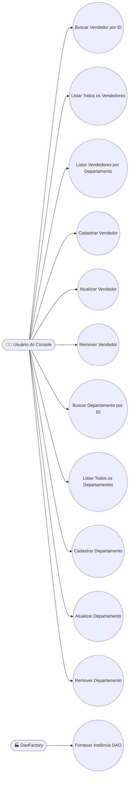

</details>

<details>
<summary><strong>🏛️ Diagrama de Classes</strong></summary>

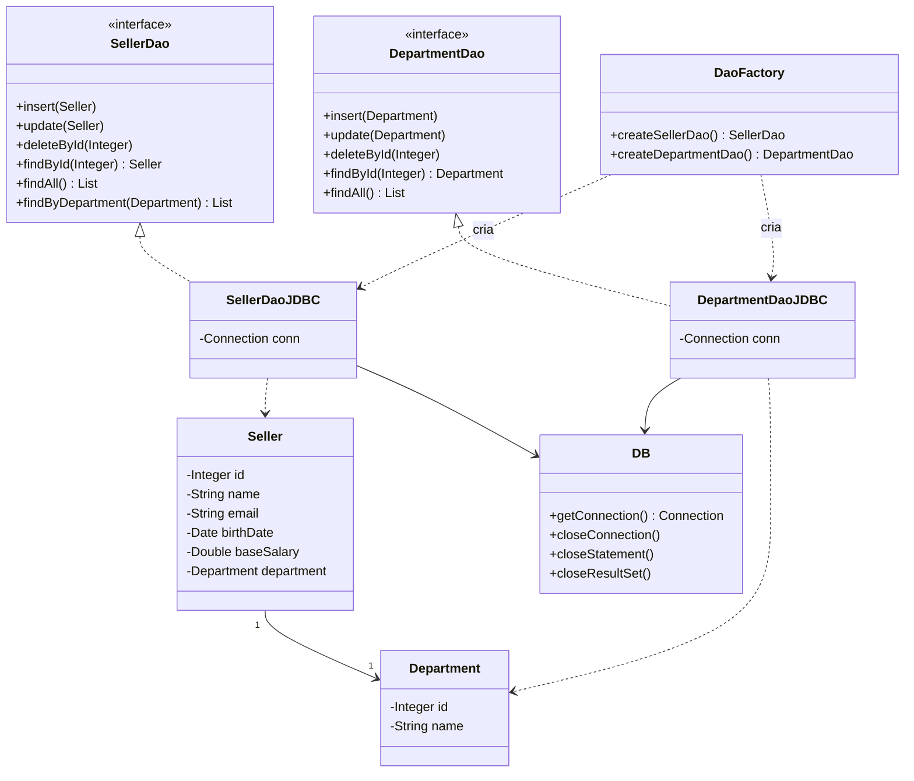

</details>

<details>
<summary><strong>🧱 Diagrama de Objetos</strong></summary>

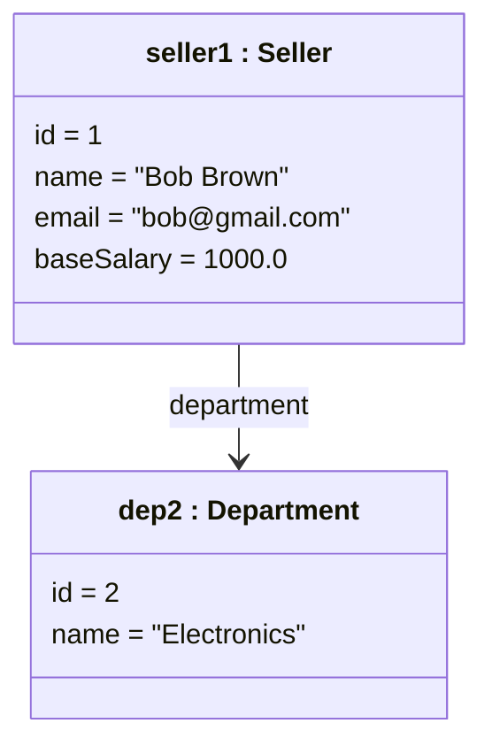

</details>

<details>
<summary><strong>🔄 Diagrama de Sequência — findById</strong></summary>

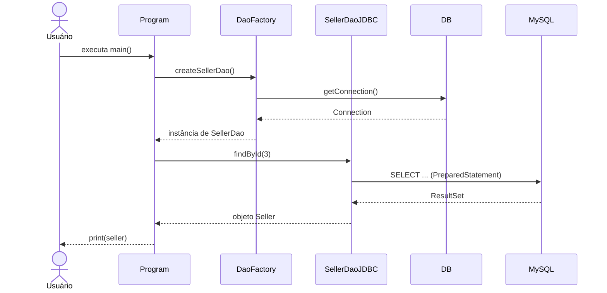

</details>

<details>
<summary><strong>🤝 Diagrama de Comunicação (Colaboração)</strong></summary>

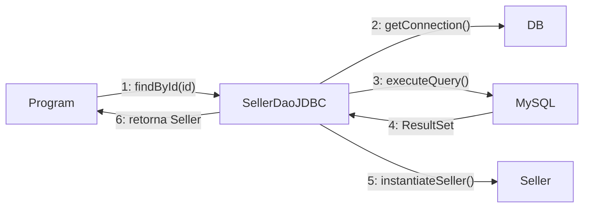

</details>

<details>
<summary><strong>🏃 Diagrama de Atividades — Execução do Programa</strong></summary>

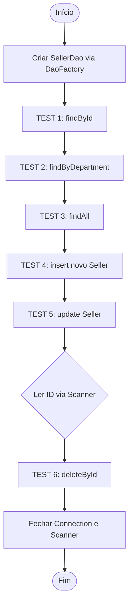

</details>

<details>
<summary><strong>🔁 Diagrama de Máquina de Estados — Ciclo de Vida da Conexão</strong></summary>

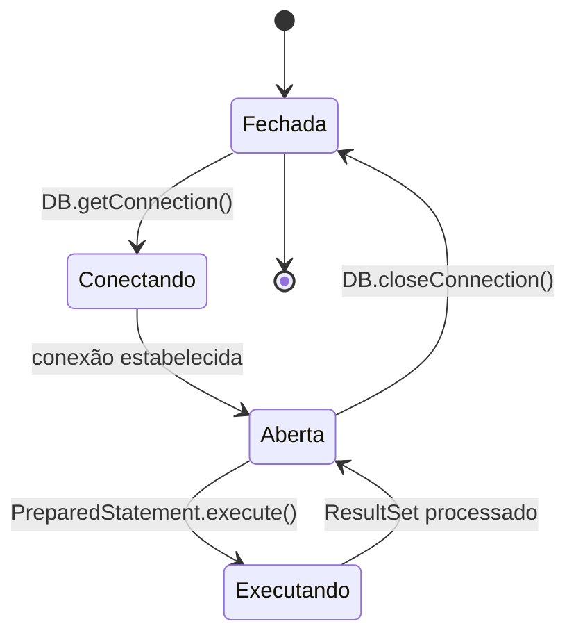

</details>

<details>
<summary><strong>🧩 Diagrama de Componentes</strong></summary>

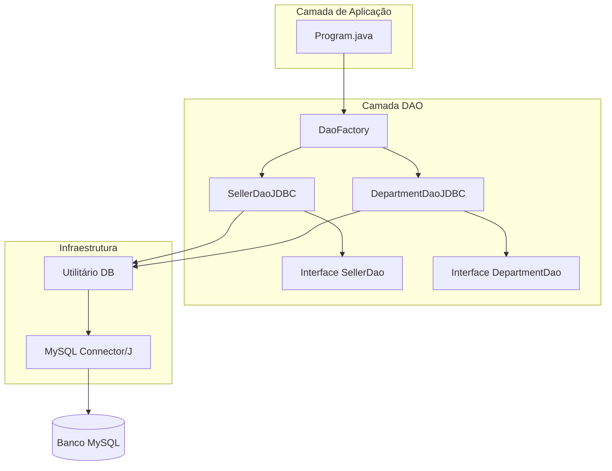

</details>

<details>
<summary><strong>🚀 Diagrama de Implantação</strong></summary>

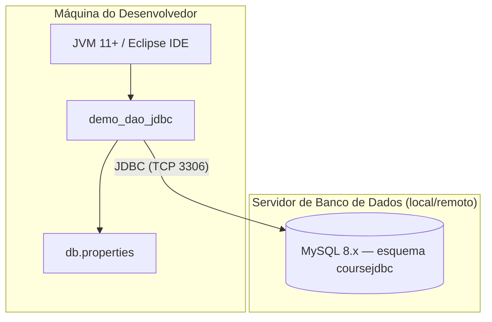

</details>

<details>
<summary><strong>📦 Diagrama de Pacotes</strong></summary>

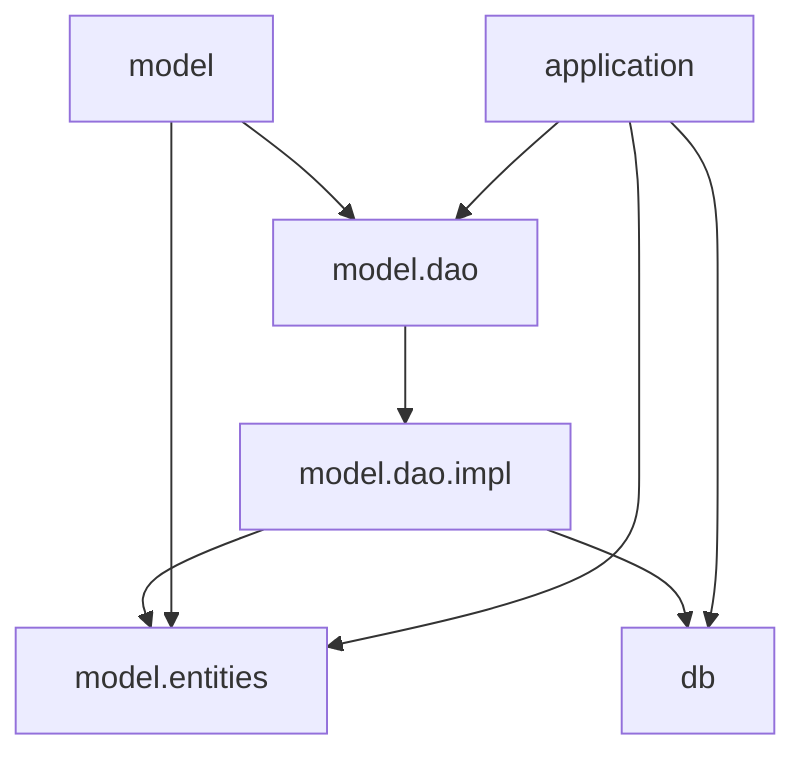

</details>

<details>
<summary><strong>🧬 Diagrama de Estrutura Composta — SellerDaoJDBC</strong></summary>

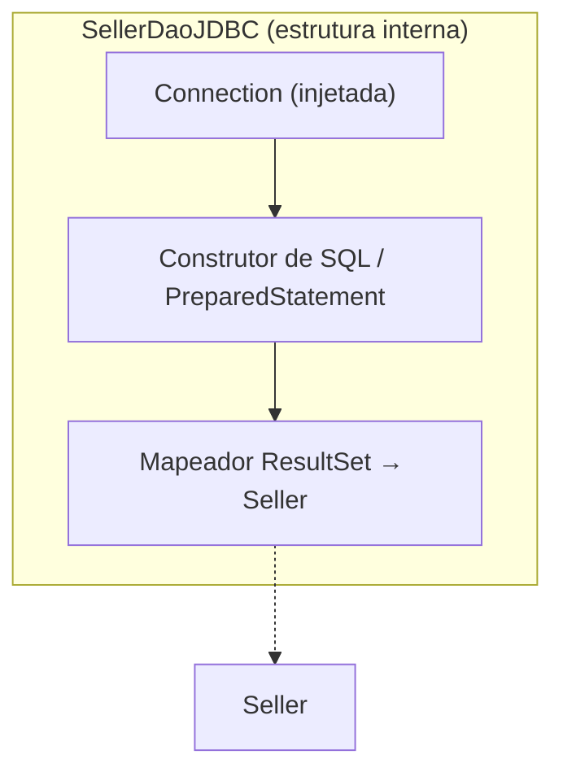

</details>

<details>
<summary><strong>🗺️ Diagrama de Visão Geral de Interação</strong></summary>

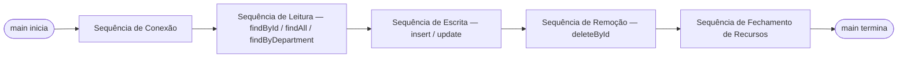

</details>

<details>
<summary><strong>⏱️ Diagrama de Tempo — Ciclo de Vida da Conexão durante a Execução</strong></summary>

| Tempo | Estado da Conexão | Evento |
|:-----|:------------------|:------|
| T + 0 | `Fechada` → `Aberta` | `DaoFactory.createSellerDao()` chama `DB.getConnection()`. |
| T + 1 | `Aberta` | Os TESTs 1–5 executam `PreparedStatement`s sequencialmente na mesma conexão. |
| T + 2 | `Aberta` | O TEST 6 bloqueia esperando `Scanner.nextInt()` (entrada do usuário). |
| T + 3 | `Aberta` → `Executando` | `deleteById` executa o `DELETE`. |
| T + 4 | `Executando` → `Fechada` | Conexão e `Scanner` são fechados ao final do `main()`. |

</details>

### 🗃️ Arquitetura de Dados

<details>
<summary><strong>🔗 Diagrama Entidade-Relacionamento (DER)</strong></summary>

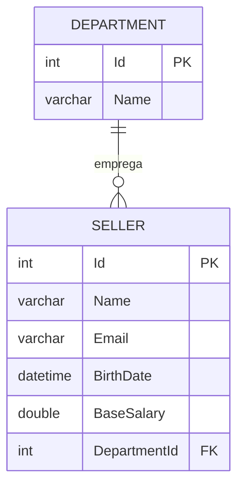

</details>

<details>
<summary><strong>💭 Modelo Conceitual de Dados</strong></summary>

Entidades e relacionamentos de alto nível, independentes da tecnologia de banco:

- Um **Department** agrupa zero ou mais **Sellers**.
- Um **Seller** pertence a exatamente um **Department**.
- Ambas as entidades são identificadas por um `Id` substituto (surrogate key).

</details>

<details>
<summary><strong>🧮 Modelo Lógico de Dados</strong></summary>

| Entidade | Atributos-chave | Tipo |
|:-------|:----------------|:-----|
| Department | Id (PK), Name | int, string |
| Seller | Id (PK), Name, Email, BirthDate, BaseSalary, DepartmentId (FK) | int, string, string, datetime, double, int |

</details>

<details>
<summary><strong>💾 Modelo Físico de Dados</strong></summary>

```sql
CREATE TABLE department (
    Id   INT         NOT NULL AUTO_INCREMENT,
    Name VARCHAR(60) NULL,
    PRIMARY KEY (Id)
);

CREATE TABLE seller (
    Id           INT          NOT NULL AUTO_INCREMENT,
    Name         VARCHAR(60)  NOT NULL,
    Email        VARCHAR(100) NOT NULL,
    BirthDate    DATETIME     NOT NULL,
    BaseSalary   DOUBLE       NOT NULL,
    DepartmentId INT          NOT NULL,
    PRIMARY KEY (Id),
    FOREIGN KEY (DepartmentId) REFERENCES department (Id)
);
```

> Engine: **MySQL 8.x**. Esquema criado pelo script `database.sql`.

</details>

<details>
<summary><strong>📖 Dicionário de Dados</strong></summary>

| Tabela | Campo | Tipo | Restrições | Descrição |
|:------|:------|:-----|:------------|:------------|
| department | Id | INT | PK, AUTO_INCREMENT | Identificador único do departamento. |
| department | Name | VARCHAR(60) | NULL | Nome do departamento. |
| seller | Id | INT | PK, AUTO_INCREMENT | Identificador único do vendedor. |
| seller | Name | VARCHAR(60) | NOT NULL | Nome completo do vendedor. |
| seller | Email | VARCHAR(100) | NOT NULL | E-mail do vendedor. |
| seller | BirthDate | DATETIME | NOT NULL | Data de nascimento do vendedor. |
| seller | BaseSalary | DOUBLE | NOT NULL | Salário-base do vendedor. |
| seller | DepartmentId | INT | NOT NULL, FK → department.Id | Departamento ao qual o vendedor pertence. |

</details>

<details>
<summary><strong>🔄 Diagrama de Fluxo de Dados (DFD)</strong></summary>

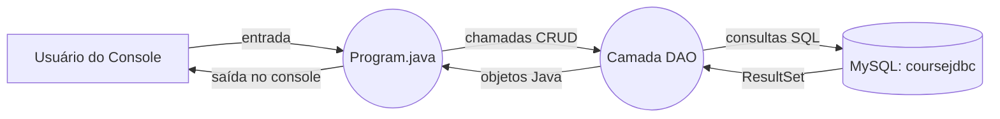

</details>

<details>
<summary><strong>🧬 Diagrama de Linhagem de Dados (Data Lineage)</strong></summary>

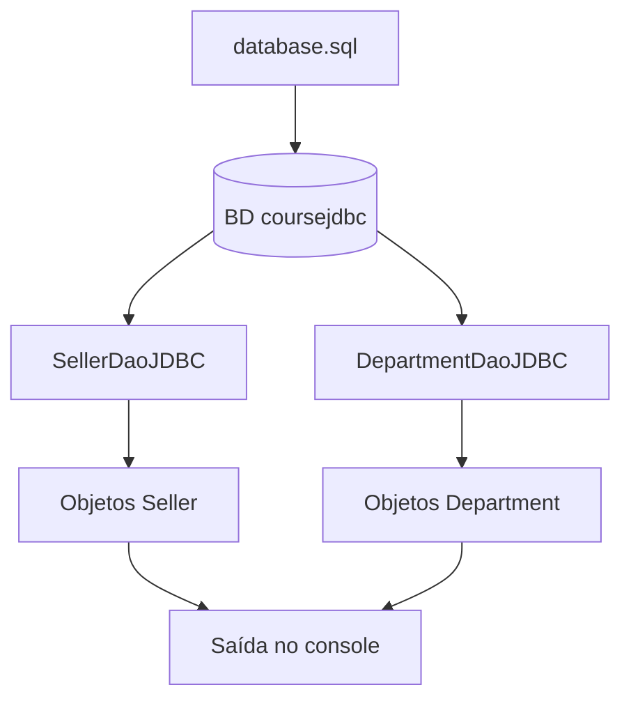

</details>

### 🏗️ Arquitetura e UX

<details>
<summary><strong>🏛️ Diagrama de Arquitetura (Visão Geral)</strong></summary>

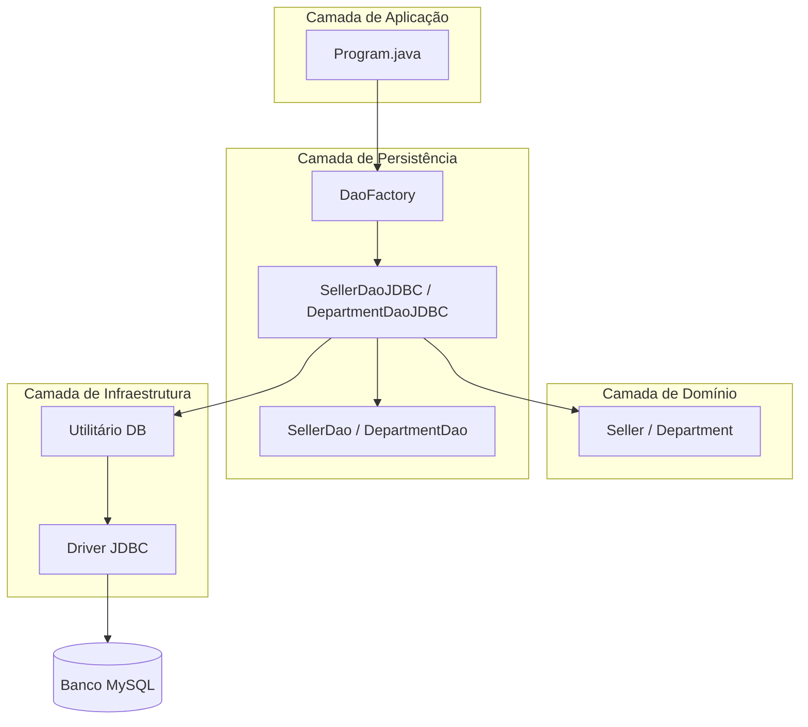

</details>

<details>
<summary><strong>🔀 Fluxograma — Execução do Programa</strong></summary>

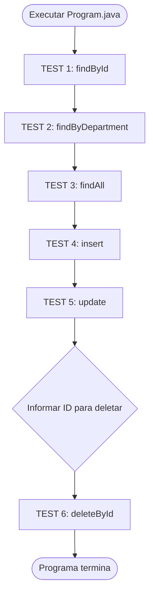

</details>

<details>
<summary><strong>🙋 Personas</strong></summary>

| Persona | Perfil | Objetivos | Pontos de Dor |
|:--------|:--------|:------|:------------|
| 🎓 **Diego, 22 — Estudante de TI** | Aprendendo padrões de persistência em Java pela primeira vez. | Entender o padrão DAO sem a "mágica" de um ORM escondendo o SQL. | Boilerplate do JDBC, gerenciamento manual de recursos, tratamento de erros pouco claro. |
| 💻 **Camila, 30 — Desenvolvedora Backend** | Avaliando o padrão DAO para migração de um sistema legado. | Desacoplar a persistência da lógica de negócio de forma sustentável. | Forte acoplamento com SQL específico do banco em toda a base de código. |

</details>

<details>
<summary><strong>🗺️ Mapa de Jornada do Usuário — "Diego aprende o padrão DAO"</strong></summary>

| Etapa | Ação | Touchpoint | Emoção | Oportunidade |
|:------|:-------|:-----------|:--------|:------------|
| Descoberta | Clona o repositório e lê o README | GitHub | 🙂 Curioso | Instruções de configuração claras e ilustradas. |
| Configuração | Cria o banco `coursejdbc` e configura `db.properties` | MySQL CLI / Eclipse | 😐 Cauteloso | Disponibilizar um template de `db.properties` pronto para editar. |
| Exploração | Executa `Program.java` e lê a saída numerada dos TESTs | Console do Eclipse | 🙂 Engajado | Seções `TEST n` numeradas, mapeadas diretamente aos RFs. |
| Compreensão | Lê o código-fonte de `SellerDao` / `SellerDaoJDBC` | IDE | 😊 Satisfeito | Diagramas de arquitetura e classes como mapa do código. |
| Extensão | Cria uma nova entidade + DAO seguindo o mesmo padrão | IDE | 😄 Confiante | Diagrama de classes e estrutura de pacotes como template reutilizável. |

</details>

<details>
<summary><strong>📐 Wireframe — Saída no Console</strong></summary>

```text
┌─────────────────────────────────────────────────────────┐
│ === TEST 1: findById ===                                  │
│ Seller [id=3, name=Alex Grey, email=alex@gmail.com, ...]  │
│                                                            │
│ === TEST 2: findByDepartment ===                          │
│ Seller [id=1, name=Bob Brown, ...]                        │
│ Seller [id=2, name=Maria Pink, ...]                       │
│                                                            │
│ === TEST 3: findAll ===                                   │
│ Seller [id=1, ...]                                        │
│ Seller [id=2, ...]                                        │
│ ...                                                       │
│                                                            │
│ === TEST 4: Seller insert ===                             │
│ Inserted! New id = 6                                      │
│                                                            │
│ === TEST 5: Seller update ===                             │
│ Update completed!                                         │
│                                                            │
│ === TEST 6: Seller delete ===                             │
│ Enter id for delete test: _                               │
└─────────────────────────────────────────────────────────┘
```

</details>

<details>
<summary><strong>🎨 Mockup — UI Conceitual de Gestão de Vendedores (extensão futura)</strong></summary>

```text
┌─────────────────────────────────────────────────────┐
│  🗃️ Gestor de Vendedores (UI conceitual)             │
├─────────────────────────────────────────────────────┤
│ Departamento: [ Electronics ▼ ]   [+ Novo Vendedor]  │
│ ┌─────┬────────────┬──────────────────┬────────────┐│
│ │ ID  │ Nome        │ E-mail            │ Salário    ││
│ ├─────┼────────────┼──────────────────┼────────────┤│
│ │ 1   │ Bob Brown   │ bob@gmail.com     │ 1000.00    ││
│ │ 2   │ Maria Pink  │ maria@gmail.com   │ 3500.00    ││
│ └─────┴────────────┴──────────────────┴────────────┘│
│               [Editar]  [Excluir]  [Salvar]          │
└─────────────────────────────────────────────────────┘
```

> 💡 Essa interface **não está implementada** — ilustra como a camada DAO existente poderia alimentar uma futura interface desktop/web sem alterações em `model.dao`.

</details>

---

## 🗺️ Roadmap

| Status | Item |
|:------:|:-----|
| 🔲 | Adicionar exemplos de uso do `DepartmentDaoJDBC` em `Program.java`. |
| 🔲 | Adicionar testes automatizados (JUnit) cobrindo cada método DAO. |
| 🔲 | Disponibilizar `db.properties.example` como template. |
| 🔲 | UI desktop/web opcional sobre a camada DAO existente. |

---

## 🤝 Como Contribuir

> Contribuições são muito bem-vindas! Siga as etapas abaixo para colaborar de forma organizada.

| Passo | Ação | Comando |
|:-----:|:-----|:--------|
| 1️⃣ | **Fork** | Crie um fork do repositório para a sua conta. | — |
| 2️⃣ | **Branch** | Crie sua feature branch a partir da `main`. | `git checkout -b feature/NovaFeature` |
| 3️⃣ | **Commit** | Salve as alterações com mensagem clara e semântica. | `git commit -m 'feat: Adiciona NovaFeature'` |
| 4️⃣ | **Push** | Envie a branch para o repositório remoto. | `git push origin feature/NovaFeature` |
| 5️⃣ | **Pull Request** | Abra um PR detalhando as mudanças realizadas. | — |

<div align="center">

<br>

**Se este projeto foi útil para os seus estudos, deixe uma estrela ⭐️ no repositório!**

</div>

---

## 👨‍💻 Autor

<div align="center">

<br>

**Victor H. J. Santiago**

<br>

[](https://github.com/VictorHJesusSantiago)
[](https://www.linkedin.com/in/victor-henrique-de-jesus-santiago/)

</div>

---

## 📄 Licença

<div align="center">

Este projeto está distribuído sob a **Licença MIT**.
Consulte o arquivo [`LICENSE`](./LICENSE) no repositório para mais informações.


</div>

---

<div align="center">

*Feito com 🗃️ e Java por **Victor H. J. Santiago***

</div>
