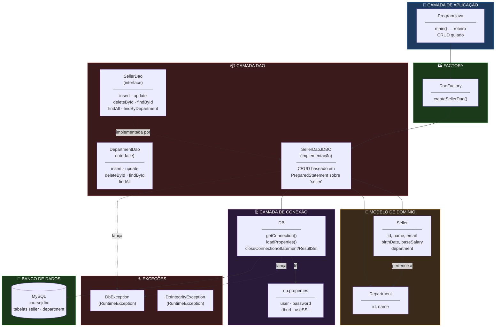
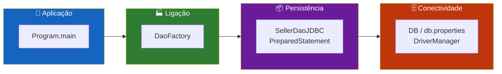
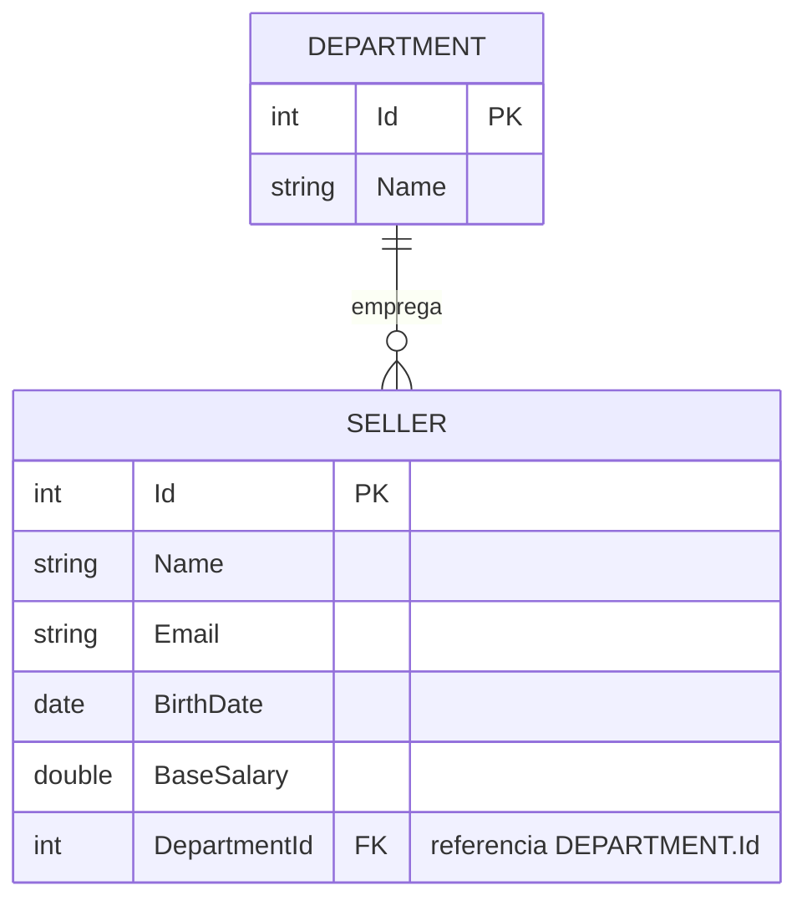
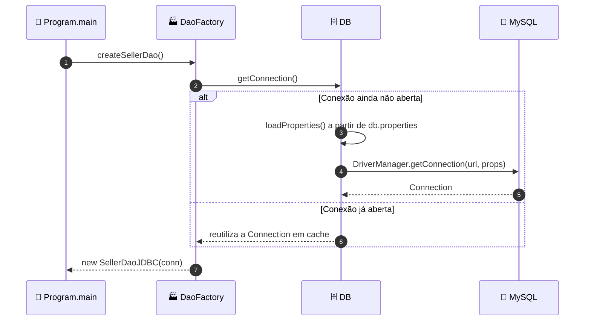
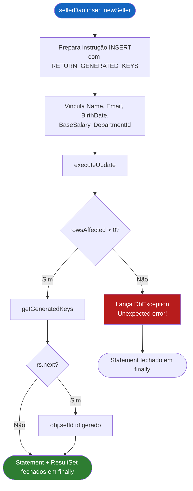
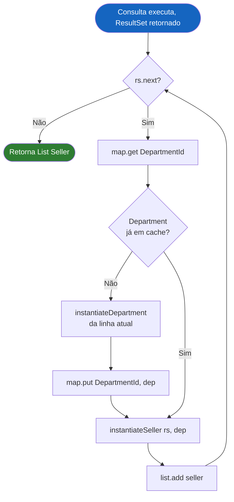
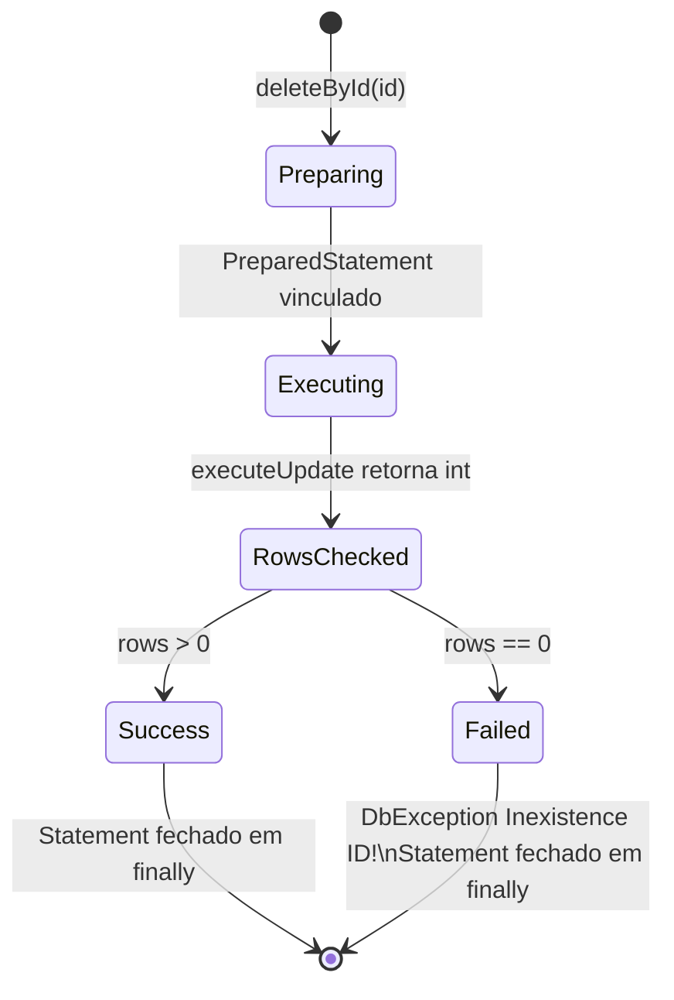
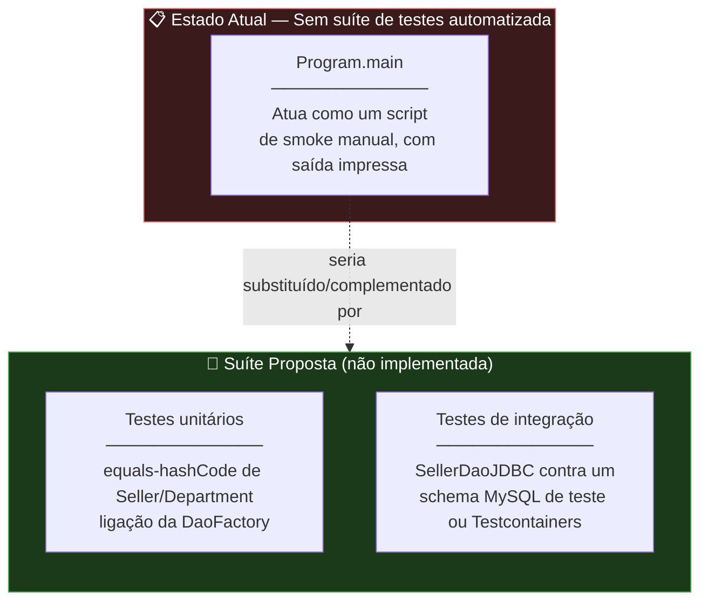

<div align="center">

**🌐 Choose Language / Selecione o Idioma / Elija el Idioma**

[](README.md)&nbsp;&nbsp;&nbsp;[](README_PT.md)&nbsp;&nbsp;&nbsp;[](README_ES.md)

</div>

---

<div align="center">

```
██████╗ ███████╗███╗   ███╗ ██████╗
██╔══██╗██╔════╝████╗ ████║██╔═══██╗
██║  ██║█████╗  ██╔████╔██║██║   ██║
██║  ██║██╔══╝  ██║╚██╔╝██║██║   ██║
██████╔╝███████╗██║ ╚═╝ ██║╚██████╔╝
╚═════╝ ╚══════╝╚═╝     ╚═╝ ╚═════╝
   DAO_JDBC — Padrão Data Access Object com JDBC puro em Java
```

---

[](https://openjdk.org/)
[](https://docs.oracle.com/javase/tutorial/jdbc/)
[](https://dev.mysql.com/downloads/connector/j/)
[](https://www.eclipse.org/)
[]()
[]()

<br/>

> **Um programa Java mínimo, sem framework, demonstrando o padrão DAO (Data Access Object)**
> sobre JDBC puro contra um banco de dados MySQL, sem um ORM no caminho.

<br/>


</div>

---

## 📑 Índice

<details>
<summary>▶️ <strong>Clique para expandir / recolher esta seção</strong></summary>

<table>
<tr>
<td valign="top" width="50%">

**🏗️ Sistema**
- [Visão Geral](#-visão-geral)
- [Arquitetura do Sistema](#-arquitetura-do-sistema)
- [Stack Tecnológica](#-stack-tecnológica)
- [Padrões de Projeto](#-padrões-de-projeto-aplicados)
- [Estrutura do Projeto](#-estrutura-do-projeto)

**📦 Módulos**
- [Program — Ponto de Entrada](#-program--ponto-de-entrada)
- [DB — Gerenciador de Conexão](#-db--gerenciador-de-conexão)
- [DaoFactory](#-daofactory)
- [SellerDao / SellerDaoJDBC](#-sellerdao--sellerdaojdbc)
- [DepartmentDao](#-departmentdao)
- [Entidades de Domínio](#-entidades-de-domínio)
- [Exceções](#-exceções)

</td>
<td valign="top" width="50%">

**💼 Negócio**
- [Regras de Negócio](#-regras-de-negócio)
- [Requisitos Funcionais](#-requisitos-funcionais)
- [Requisitos Não Funcionais](#-requisitos-não-funcionais)

**📐 Design**
- [Modelo de Dados](#-modelo-de-dados)
- [Fluxos do Sistema](#-fluxos-do-sistema)

**🔐 Segurança & Ops**
- [Segurança](#-segurança)
- [Instalação & Execução](#-instalação--execução)
- [Testes Automatizados](#-testes-automatizados)
- [Métricas & Monitoramento](#-métricas--monitoramento)
- [Limitações Conhecidas](#-limitações-conhecidas)

</td>
</tr>
</table>

---

</details>

## 🌟 Visão Geral

<details>
<summary>▶️ <strong>Clique para expandir / recolher esta seção</strong></summary>

**demo_dao_jdbc** é um programa Java compacto e de propósito único, construído para demonstrar o padrão de projeto **DAO (Data Access Object)** implementado diretamente sobre **JDBC puro** (`java.sql`), sem ORM, sem framework e sem container de injeção de dependência pelo meio. Ele modela um domínio clássico de "departamento de vendas": um `Department` tem muitos `Seller`s, e o programa exercita o ciclo de vida CRUD completo para vendedores contra um banco de dados MySQL chamado `coursejdbc`.

O projeto é deliberadamente pequeno: nove arquivos-fonte Java sob `src/`, um único ponto de entrada `Program.java` que executa uma sequência roteirizada de operações (`findById`, `findByDepartment`, `findAll`, `insert`, `update`, `deleteById`) contra a implementação `SellerDaoJDBC`, e um arquivo `db.properties` guardando a URL de conexão JDBC e as credenciais, carregadas em tempo de execução em vez de hardcoded.

Seu propósito é educacional: mostra como escrever à mão um singleton de conexão JDBC (`DB`), como uma `DaoFactory` desacopla os chamadores das implementações concretas, como `PreparedStatement` previne injeção de SQL ao mesmo tempo em que permite `Statement.RETURN_GENERATED_KEYS` para recuperação de auto-incremento, e como os recursos JDBC (`Connection`, `Statement`, `ResultSet`) devem ser fechados defensivamente em blocos `finally`. Existe um projeto relacionado, mas totalmente separado, `CoopVale/`, que vive em um subdiretório deste repositório; é um sistema completo de cooperativa de crédito em Flask com seu próprio conjunto de três READMEs e não faz parte deste demo de DAO.

### 🎯 Objetivos do Sistema

| Objetivo | Descrição |
|-----------|-------------|
| 🧱 **Demonstrar o Padrão DAO** | Separar a lógica de persistência (`SellerDaoJDBC`) das entidades de domínio (`Seller`, `Department`) e do chamador (`Program`) |
| 🔌 **JDBC Puro, Sem ORM** | Usar `java.sql.*` diretamente para mostrar o que um ORM como Hibernate normalmente esconde |
| 🏭 **Ligação Baseada em Factory** | `DaoFactory.createSellerDao()` centraliza como um `SellerDaoJDBC` é construído e conectado a uma `Connection` |
| 🔐 **Consultas Seguras contra Injeção** | Toda instrução SQL usa `PreparedStatement` com placeholders `?`, nunca concatenação de strings |
| 🆔 **Recuperação de Chave Auto-Gerada** | `insert()` usa `Statement.RETURN_GENERATED_KEYS` para ler de volta o novo id do `Seller` |
| 🗺️ **Prevenção de N+1 via Mapa de Cache** | `findAll()` e `findByDepartment()` fazem cache de objetos `Department` já instanciados em um `Map<Integer, Department>` para evitar objetos duplicados para a mesma linha de join |
| ♻️ **Limpeza Determinística de Recursos** | `DB.closeStatement()` / `DB.closeResultSet()` / `DB.closeConnection()` são chamados a partir de blocos `finally` em torno de toda operação |
| 📚 **Script Executável de Ensino** | `Program.main` se lê como um script narrado (`TEST 1`… `TEST 6`) em vez de uma suíte de testes, pensado para ser lido de cima a baixo |

---

</details>

## 🏗️ Arquitetura do Sistema

<details>
<summary>▶️ <strong>Clique para expandir / recolher esta seção</strong></summary>

### Diagrama de Módulos



### Camadas da Arquitetura



---

</details>

## 🛠️ Stack Tecnológica

<details>
<summary>▶️ <strong>Clique para expandir / recolher esta seção</strong></summary>

<table>
<thead>
<tr>
<th>Camada</th>
<th>Tecnologia</th>
<th>Versão</th>
<th>Finalidade</th>
</tr>
</thead>
<tbody>
<tr>
<td rowspan="2"><strong>🧠 Linguagem / Runtime</strong></td>
<td>Java</td>
<td>module-info direcionado ao JavaSE-10; o `.classpath` do Eclipse usa o container JRE padrão</td>
<td>Linguagem-fonte da aplicação, compilada como um módulo Java (`module demo_dao_jdbc`)</td>
</tr>
<tr>
<td>Java Platform Module System</td>
<td>`module-info.java`</td>
<td>Declara `requires java.sql;` — a única dependência de módulo</td>
</tr>
<tr>
<td rowspan="2"><strong>🔌 Acesso a Dados</strong></td>
<td>JDBC (`java.sql`)</td>
<td>Biblioteca padrão</td>
<td>`Connection`, `PreparedStatement`, `ResultSet`, `DriverManager`, `Statement`</td>
</tr>
<tr>
<td>MySQL Connector/J</td>
<td>8.3.0 (conforme `.classpath`); `classpath.txt` mostra uma entrada mais antiga de biblioteca `MySQLConnector`</td>
<td>Driver JDBC usado para alcançar o servidor MySQL</td>
</tr>
<tr>
<td><strong>🗄️ Banco de Dados</strong></td>
<td>MySQL</td>
<td>Nome do banco `coursejdbc` (ver `db.properties`)</td>
<td>Sistema de registro para as tabelas `seller` e `department`</td>
</tr>
<tr>
<td rowspan="2"><strong>🔧 Build / IDE</strong></td>
<td>Eclipse IDE</td>
<td>`.project`, `.settings/`, `.classpath`</td>
<td>O projeto é estruturado como um projeto Java clássico do Eclipse, não um build Maven/Gradle</td>
</tr>
<tr>
<td>Nenhuma ferramenta de build</td>
<td>—</td>
<td>Sem `pom.xml` ou `build.gradle` — compilado/executado diretamente via `javac`/`java` ou a IDE</td>
</tr>
</tbody>
</table>

---

</details>

## 🎨 Padrões de Projeto Aplicados

<details>
<summary>▶️ <strong>Clique para expandir / recolher esta seção</strong></summary>

| Padrão | Onde | Justificativa |
|---------|-------|-----------|
| 🧱 **Data Access Object (DAO)** | `SellerDao` (interface) + `SellerDaoJDBC` (implementação) | Isola os detalhes de SQL/JDBC do resto da aplicação |
| 🏭 **Factory Method** | `DaoFactory.createSellerDao()` | Centraliza como um `SellerDaoJDBC` é instanciado e conectado a uma `Connection`, para que chamadores nunca façam `new` diretamente |
| 🔌 **Singleton (holder de conexão)** | `DB.getConnection()` protegendo um `Connection conn` estático privado | Uma única conexão JDBC é criada de forma preguiçosa e reutilizada durante o tempo de vida do processo |
| 🧭 **Strategy (separação interface/implementação)** | Interface `SellerDao` vs. `SellerDaoJDBC` | Um futuro `SellerDaoMemory` ou `SellerDaoJPA` poderia substituir a implementação JDBC sem tocar em `Program` |
| 🚧 **Guard Clause / Fail Fast** | `deleteById` lançando `DbException("Inexistence ID!")` quando `rows == 0` | Converte um delete silencioso sem efeito em uma falha explícita |
| 🗺️ **Identity Map (local, por chamada)** | `Map<Integer, Department> map` dentro de `findAll()`/`findByDepartment()` | Evita construir um objeto `Department` duplicado para cada linha de `Seller` que compartilha o mesmo departamento |
| 🎁 **Exceção Empacotada/Não Verificada** | `DbException extends RuntimeException` envolvendo `SQLException` | Converte a `SQLException` verificada em uma exceção não verificada para manter as assinaturas dos métodos DAO limpas |
| 🧹 **Limpeza de Recursos via Try/Finally** | Todo método DAO: `finally { DB.closeStatement(st); DB.closeResultSet(rs); }` | Recursos JDBC são fechados manualmente e defensivamente, em estilo pré-try-with-resources |

---

</details>

## 📁 Estrutura do Projeto

<details>
<summary>▶️ <strong>Clique para expandir / recolher esta seção</strong></summary>

```
demo_dao_jdbc/
│
├── 📄 .classpath                       # Classpath do Eclipse — container JRE + mysql-connector-j-8.3.0.jar
├── 📄 .project                         # Descritor de projeto do Eclipse (nome: demo_dao_jdbc, natureza Java)
├── 📄 .gitignore                       # Ignora classes compiladas, segredos, arquivos de IDE, dumps locais de BD
├── 📄 classpath.txt                    # Cópia legada/backup do classpath (JavaSE-10 + lib MySQLConnector)
├── 📄 project.txt                      # Cópia legada/backup do descritor de projeto
├── 📄 db.properties                    # Config de conexão JDBC: user, password, dburl, useSSL (NÃO deve ser commitado com segredos reais)
│
├── 📂 src/
│   ├── 📄 module-info.java             # Descritor de módulo Java — requer java.sql
│   │
│   ├── 📂 application/
│   │   └── 📄 Program.java             # ★ Ponto de entrada — roteiro CRUD guiado (TEST 1..6)
│   │
│   ├── 📂 db/
│   │   ├── 📄 DB.java                  # Holder de conexão: getConnection/closeConnection/closeStatement/closeResultSet
│   │   ├── 📄 DbException.java         # Wrapper não verificado para SQLException e erros de IO
│   │   └── 📄 DbIntegrityException.java # Exceção não verificada reservada para violações de FK/integridade (atualmente não usada)
│   │
│   └── 📂 model/
│       ├── 📂 dao/
│       │   ├── 📄 DaoFactory.java      # Factory Method — constrói um SellerDaoJDBC conectado
│       │   ├── 📄 SellerDao.java       # Interface DAO para CRUD de Seller + findByDepartment
│       │   ├── 📄 DepartmentDao.java   # Interface DAO para CRUD de Department (sem implementação presente)
│       │   └── 📂 impl/
│       │       └── 📄 SellerDaoJDBC.java # ★ O único DAO concreto — implementação JDBC baseada em PreparedStatement
│       │
│       └── 📂 entities/
│           ├── 📄 Seller.java          # Entidade de domínio: id, name, email, birthDate, baseSalary, department
│           └── 📄 Department.java      # Entidade de domínio: id, name
│
├── 📂 CoopVale/                        # Projeto aninhado não relacionado (sistema de cooperativa em Flask, com seus próprios 3 READMEs)
│
├── 📄 README.md                        # 🇺🇸 Inglês (primário)
├── 📄 README_PT.md                     # 🇧🇷 Português
└── 📄 README_ES.md                     # 🇪🇸 Español
```

---

</details>

## 📦 Program — Ponto de Entrada

<details>
<summary>▶️ <strong>Clique para expandir / recolher esta seção</strong></summary>

`application.Program` é o único método `main()` do projeto. É escrito como um script linear e narrado, em vez de um menu interativo ou um harness de testes.

| Passo | Rótulo na saída | Operação | Chamada DAO |
|------|------------------|-----------|----------|
| 1 | `TEST 1: seller findById` | Busca um único vendedor por um id fixo (`3`) | `sellerDao.findById(3)` |
| 2 | `TEST 2: seller findByDepartment` | Lista vendedores pertencentes a um departamento construído inline (`id=2`) | `sellerDao.findByDepartment(department)` |
| 3 | `TEST 3: seller findAll` | Lista todos os vendedores, unidos com o nome do departamento | `sellerDao.findAll()` |
| 4 | `TEST 4: seller INSERT` | Insere um novo vendedor (`Greg`) e imprime o id gerado | `sellerDao.insert(newSeller)` |
| 5 | `TEST 5: seller update` | Recarrega o vendedor `1`, renomeia-o e persiste a mudança | `sellerDao.findById(1)` depois `sellerDao.update(seller)` |
| 6 | `TEST 6: seller delete` | Lê um id de `System.in` via `Scanner` e apaga aquela linha | `sellerDao.deleteById(id)` |

O `Scanner` usado no passo 6 é explicitamente fechado no fim de `main`, mas a `Connection` JDBC obtida via `DaoFactory`/`DB` nunca é explicitamente fechada por `Program` — depende do encerramento do processo (ver [Limitações Conhecidas](#-limitações-conhecidas)).

---

## 🗄️ DB — Gerenciador de Conexão

`db.DB` é uma pequena classe utilitária estática que possui o ciclo de vida da conexão JDBC para todo o programa.

| Método | Responsabilidade |
|--------|-----------------|
| `getConnection()` | Cria preguiçosamente uma única `Connection` via `DriverManager.getConnection(url, props)`, reutilizando-a se já estiver aberta |
| `closeConnection()` | Fecha a conexão mantida se não for nula |
| `loadProperties()` (privado) | Abre `db.properties` do diretório de trabalho via `FileInputStream`, carrega em um `java.util.Properties` |
| `closeStatement(Statement st)` | Fecho null-safe para qualquer `Statement`/`PreparedStatement` |
| `closeResultSet(ResultSet rs)` | Fecho null-safe para qualquer `ResultSet` |

Toda `SQLException` ou `IOException` verificada encontrada dentro de `DB` é relançada como uma `DbException` não verificada, então chamadores nunca precisam de um `try/catch` em torno da configuração da conexão.

---

## 🏭 DaoFactory

`model.dao.DaoFactory` expõe exatamente um método factory estático:

```java
public static SellerDao createSellerDao() {
    return new SellerDaoJDBC(DB.getConnection());
}
```

Esta é a única costura no código onde uma implementação DAO concreta é escolhida e conectada a uma `Connection` viva. Ainda não existe um método `createDepartmentDao()` equivalente, mesmo que `DepartmentDao` exista como interface (ver [Limitações Conhecidas](#-limitações-conhecidas)).

---

## 🔌 SellerDao / SellerDaoJDBC

`model.dao.SellerDao` declara o contrato; `model.dao.impl.SellerDaoJDBC` é a única implementação.

| Método | Instrução SQL | Notas |
|--------|---------------|-------|
| `insert(Seller obj)` | `INSERT INTO seller (Name, Email, BirthDate, BaseSalary, DepartmentId) VALUES (?, ?, ?, ?, ?)` | Usa `Statement.RETURN_GENERATED_KEYS` e lê o novo id de volta via `getGeneratedKeys()` |
| `update(Seller obj)` | `UPDATE seller SET Name=?, Email=?, BirthDate=?, BaseSalary=?, DepartmentId=? WHERE id=?` | Sem verificação de existência antes de atualizar |
| `deleteById(Integer id)` | `DELETE FROM seller WHERE Id = ?` | Lança `DbException("Inexistence ID!")` quando `executeUpdate()` reporta 0 linhas afetadas |
| `findById(Integer id)` | `SELECT seller.*, department.Name as DepName FROM seller INNER JOIN department ON seller.DepartmentId = department.Id WHERE seller.Id = ?` | Retorna `null` quando nenhuma linha corresponde |
| `findAll()` | Mesmo join, `ORDER BY Name`, sem `WHERE` | Usa um `Map<Integer, Department>` local para deduplicar instâncias de `Department` entre linhas |
| `findByDepartment(Department department)` | Mesmo join filtrado `WHERE DepartmentId = ?`, `ORDER BY Name` | Mesmo padrão de mapa de deduplicação de `findAll()` |

Dois auxiliares privados, `instantiateSeller(ResultSet, Department)` e `instantiateDepartment(ResultSet)`, centralizam o mapeamento de linha para objeto e são reutilizados pelos três métodos de leitura.

---

## 🗂️ DepartmentDao

`model.dao.DepartmentDao` declara um contrato CRUD completo (`insert`, `update`, `deleteById`, `findById`, `findAll`) espelhando a forma de `SellerDao`, mas **nenhuma classe implementadora existe no código** — não há `DepartmentDaoJDBC`, e `DaoFactory` não tem método `createDepartmentDao()`. A interface documenta a superfície pretendida para uma futura implementação; ver [Limitações Conhecidas](#-limitações-conhecidas).

---

## 🧬 Entidades de Domínio

Ambas as entidades vivem em `model.entities` e implementam `Serializable`, sobrescrevem `equals()`/`hashCode()` apenas por `id`, e sobrescrevem `toString()`.

| Entidade | Campos | Notas |
|--------|--------|-------|
| `Seller` | `id`, `name`, `email`, `birthDate` (`java.util.Date`), `baseSalary` (`Double`), `department` (`Department`) | Dois construtores: sem argumentos e com todos os argumentos |
| `Department` | `id`, `name` | Dois construtores: sem argumentos e com todos os argumentos |

---

## ⚠️ Exceções

Ambas as exceções vivem em `db` e estendem `RuntimeException` diretamente (não verificadas).

| Exceção | Lançada por | Propósito |
|-----------|-----------|---------|
| `DbException` | `DB` (falhas de SQL/IO), `SellerDaoJDBC` (todas as `SQLException`s, mais as falhas de negócio "Inexistence ID!" e "Unexpected error! No rows affected!") | Wrapper de propósito geral para que os chamadores DAO não precisem capturar exceções verificadas |
| `DbIntegrityException` | Em nenhum lugar do código atual | Declarada para uso futuro em torno de violações de integridade referencial (ex.: apagar um `Department` que ainda tem `Seller`s), mas ainda não lançada em nenhum lugar |

---

</details>

## 💼 Regras de Negócio

<details>
<summary>▶️ <strong>Clique para expandir / recolher esta seção</strong></summary>

### 🧾 Regras de Persistência de Vendedor

| # | Regra | Aplicação |
|---|------|-------------|
| RN-01 | Um vendedor recém-inserido deve receber de volta seu id gerado pelo banco no objeto em memória | `insert()` lê `getGeneratedKeys()` e chama `obj.setId(id)` |
| RN-02 | Um insert que afeta zero linhas é tratado como falha inesperada | `insert()` lança `DbException("Unexpected error!No rows affected!")` |
| RN-03 | Apagar um id de vendedor inexistente deve falhar ruidosamente, não silenciosamente | `deleteById()` lança `DbException("Inexistence ID!")` quando `rows == 0` |
| RN-04 | Toda leitura de vendedor é sempre unida com o nome de seu departamento | `findById`, `findAll`, `findByDepartment` sempre fazem `INNER JOIN department` |
| RN-05 | Os resultados de `findAll()` e `findByDepartment()` são ordenados alfabeticamente pelo nome do vendedor | `ORDER BY Name` em ambas as consultas |
| RN-06 | O mesmo objeto `Department` é reutilizado para toda linha de vendedor que compartilha aquele departamento dentro de uma chamada | Cache local `Map<Integer, Department>` em `findAll()`/`findByDepartment()` |

### 🔌 Regras de Conectividade

| # | Regra | Aplicação |
|---|------|-------------|
| RN-07 | Credenciais de banco de dados nunca devem ser hardcoded no código-fonte Java | Carregadas em tempo de execução a partir de `db.properties` via `DB.loadProperties()` |
| RN-08 | Existe apenas uma `Connection` JDBC por processo | `DB.getConnection()` inicializa preguiçosamente e reutiliza uma única `Connection` estática |
| RN-09 | Todo recurso JDBC adquirido em um método DAO deve ser liberado, com sucesso ou falha | `finally { DB.closeStatement(st); DB.closeResultSet(rs); }` em todo método |

---

</details>

## ✅ Requisitos Funcionais

<details>
<summary>▶️ <strong>Clique para expandir / recolher esta seção</strong></summary>

| ID | Requisito | Prioridade | Status |
|----|-------------|----------|--------|
| **RF-01** | O sistema deve conectar-se a um banco MySQL usando credenciais configuradas externamente | 🔴 Alta | ✅ Implementado |
| **RF-02** | O sistema deve encontrar um único vendedor por id, unido com o nome do departamento | 🔴 Alta | ✅ Implementado |
| **RF-03** | O sistema deve listar todos os vendedores pertencentes a um determinado departamento | 🔴 Alta | ✅ Implementado |
| **RF-04** | O sistema deve listar todos os vendedores no banco, ordenados por nome | 🔴 Alta | ✅ Implementado |
| **RF-05** | O sistema deve inserir um novo vendedor e retornar seu id gerado | 🔴 Alta | ✅ Implementado |
| **RF-06** | O sistema deve atualizar os dados de um vendedor existente | 🔴 Alta | ✅ Implementado |
| **RF-07** | O sistema deve apagar um vendedor por id e falhar se o id não existir | 🔴 Alta | ✅ Implementado |
| **RF-08** | O sistema deve prevenir injeção de SQL em toda consulta DAO | 🔴 Alta | ✅ Implementado |
| **RF-09** | O sistema deve evitar objetos `Department` duplicados ao ler múltiplos vendedores | 🟡 Média | ✅ Implementado |
| **RF-10** | O sistema deve expor uma interface `DepartmentDao` para CRUD de departamentos | 🟡 Média | ⚠️ Parcial (apenas interface, sem implementação equivalente a `SellerDaoJDBC`) |
| **RF-11** | O sistema deve conectar implementações DAO através de uma factory em vez de instanciação direta | 🟡 Média | ✅ Implementado |
| **RF-12** | O sistema deve demonstrar toda operação CRUD via um script executável | 🔴 Alta | ✅ Implementado |
| **RF-13** | O sistema deve ler interativamente um id alvo de exclusão da entrada padrão | 🟢 Baixa | ✅ Implementado |
| **RF-14** | O sistema deve reportar erros claros para violações de integridade (ex.: apagar um departamento em uso) | 🟢 Baixa | ⬜ Planejado (`DbIntegrityException` declarada mas nunca lançada) |

---

</details>

## ⚡ Requisitos Não Funcionais

<details>
<summary>▶️ <strong>Clique para expandir / recolher esta seção</strong></summary>

| ID | Categoria | Requisito | Alvo |
|----|----------|-------------|--------|
| **RNF-01** | 🔐 Segurança | Instruções SQL devem ser parametrizadas, nunca concatenadas como string | 100% das consultas DAO usam `PreparedStatement` com placeholders `?` |
| **RNF-02** | 🔐 Configuração | Credenciais devem viver fora do código-fonte | `db.properties`, carregado via `FileInputStream` em tempo de execução |
| **RNF-03** | 🧱 Manutenibilidade | Lógica de persistência deve ser isolada atrás de interfaces | Interfaces `SellerDao`/`DepartmentDao`, subpacote `impl` para classes concretas |
| **RNF-04** | 🧹 Gestão de Recursos | Todo `Statement`/`ResultSet` aberto deve ser fechado | Blocos `finally` chamando `DB.closeStatement`/`DB.closeResultSet` em todo método DAO |
| **RNF-05** | 📦 Footprint | Nenhuma dependência externa de framework ou ORM | Apenas `java.sql` (biblioteca padrão do JDK) mais o driver JDBC do MySQL |
| **RNF-06** | 🧩 Portabilidade | O projeto deve compilar como um módulo Java | `module-info.java` declara `requires java.sql` |
| **RNF-07** | 🎓 Legibilidade | O script de demonstração deve ser legível de cima a baixo sem documentação externa | `Program.main` imprime um banner `=== TEST n: ... ===` antes de cada passo |
| **RNF-08** | 🔁 Leituras Idempotentes | Chamadas repetidas de `findById`/`findAll`/`findByDepartment` não devem mutar estado | As três são consultas `SELECT` puras |

---

</details>

## 🗄️ Modelo de Dados

<details>
<summary>▶️ <strong>Clique para expandir / recolher esta seção</strong></summary>

### Diagrama Entidade-Relacionamento



O grafo de objetos Java espelha isso diretamente: `Seller.department` mantém uma referência completa a `Department` (não apenas um id), populada por `instantiateDepartment(ResultSet)` em cada leitura.

### Tabela `seller` (Inferida do SQL em `SellerDaoJDBC`)

| Coluna | Tipo (inferido) | Notas |
|--------|------------------|-------|
| `Id` | `INT`, chave primária, auto-incremento | Lida de volta via `Statement.RETURN_GENERATED_KEYS` no insert |
| `Name` | `VARCHAR` | Mapeada para `Seller.name` |
| `Email` | `VARCHAR` | Mapeada para `Seller.email` |
| `BirthDate` | `DATE` | Mapeada para `Seller.birthDate` via `java.sql.Date` |
| `BaseSalary` | `DOUBLE`/`DECIMAL` | Mapeada para `Seller.baseSalary` |
| `DepartmentId` | `INT`, chave estrangeira → `department.Id` | Mapeada para `Seller.department.id` |

### Tabela `department` (Inferida do SQL em `SellerDaoJDBC`)

| Coluna | Tipo (inferido) | Notas |
|--------|------------------|-------|
| `Id` | `INT`, chave primária | Apelidada como `DepartmentId` nas consultas de join com seller |
| `Name` | `VARCHAR` | Apelidada como `DepName` nas consultas de join com seller para evitar colisão com `seller.Name` |

### Chaves de Configuração de `db.properties`

| Chave | Valor de exemplo no repo | Finalidade |
|-----|------------------------|---------|
| `user` | `root` | Nome de usuário MySQL |
| `password` | `adm2004` | Senha MySQL (presente no arquivo versionado — ver [Segurança](#-segurança)) |
| `dburl` | `jdbc:mysql://localhost:3306/coursejdbc` | URL de conexão JDBC completa, incluindo o schema alvo |
| `useSSL` | `false` | Repassado ao driver via `Properties`, desabilitando SSL para desenvolvimento local |

---

</details>

## 🔄 Fluxos do Sistema

<details>
<summary>▶️ <strong>Clique para expandir / recolher esta seção</strong></summary>

### Fluxo de Inicialização e Conexão do Programa



### Fluxo de Inserção



### Fluxo de Deduplicação de findAll / findByDepartment



### Fluxo de Exclusão



---

</details>

## 🔐 Segurança

<details>
<summary>▶️ <strong>Clique para expandir / recolher esta seção</strong></summary>

### Controles Implementados

| Controle | Implementação | Efeito |
|---------|---------------|--------|
| 🛡️ **Consultas parametrizadas em todo lugar** | Todo método DAO usa `PreparedStatement` com placeholders `?` | Elimina injeção de SQL em todas as seis operações DAO |
| 🔑 **Credenciais externalizadas** | `db.properties` carregado via `FileInputStream`, não hardcoded em arquivos `.java` | Código-fonte não contém strings de senha embutidas |
| 🧯 **Exceções verificadas convertidas em não verificadas** | `DbException` envolve toda `SQLException` | Previne o vazamento de stack traces JDBC crus através das assinaturas dos métodos |
| ♻️ **Fecho defensivo de recursos** | Blocos `finally` em torno de todo `Statement`/`ResultSet` | Reduz a chance de vazamentos de conexão/cursor em condições de erro |

### Limitações de Segurança Conhecidas

> [!WARNING]
> Este projeto é um demo didático, não código endurecido para produção. As seguintes são lacunas reais e atuais.

| Limitação | Risco | Caminho de mitigação |
|------------|------|-----------------|
| 🔓 **`db.properties` é commitado com uma senha de aparência real** (`adm2004`) | Qualquer pessoa com acesso ao repositório vê uma credencial que pode ser reutilizada em outro lugar | Mover para variáveis de ambiente ou um arquivo estilo `.env` não versionado; rotacionar a senha se ela chegou a ser real |
| 🌐 **`useSSL=false`** | O tráfego do banco de dados (incluindo a senha na conexão) trafega sem criptografia | Definir `useSSL=true` e configurar um certificado confiável para qualquer banco fora de localhost |
| 🕳️ **Sem usuário de banco com privilégio mínimo** | `db.properties` usa `user=root`, concedendo privilégios totais da instância a um app de demonstração | Criar um usuário MySQL dedicado, restrito a `SELECT/INSERT/UPDATE/DELETE` apenas em `coursejdbc` |
| 🧵 **`Connection` única compartilhada, sem pool de conexões** | Sob uso concorrente, isso é um gargalo e um ponto único de falha | Introduzir um pool (HikariCP, Apache DBCP) se o demo algum dia precisar de acesso multithread |
| 🚫 **Sem validação de entrada em `Scanner.nextInt()` de `Program`** | Uma entrada não numérica lança uma `InputMismatchException` não capturada e derruba o programa | Envolver a leitura em um loop validado ou `try/catch` |

---

</details>

## 🚀 Instalação & Execução

<details>
<summary>▶️ <strong>Clique para expandir / recolher esta seção</strong></summary>

### Pré-requisitos

```bash
# JDK 10 ou mais recente (module-info.java direciona ao JavaSE-10)
java -version

# Um servidor MySQL em execução, acessível na URL configurada em db.properties
mysql --version

# MySQL Connector/J no classpath (mysql-connector-j-8.3.0.jar conforme .classpath)
# Baixe em https://dev.mysql.com/downloads/connector/j/ se não estiver usando a biblioteca gerenciada do Eclipse
```

Crie o schema `coursejdbc` e as tabelas `department`/`seller` antes de rodar o programa (as colunas são inferidas em [Modelo de Dados](#-modelo-de-dados); nenhum script `.sql` de seed acompanha este repositório — ver [Limitações Conhecidas](#-limitações-conhecidas)):

```sql
CREATE DATABASE IF NOT EXISTS coursejdbc;
USE coursejdbc;

CREATE TABLE department (
    Id INT AUTO_INCREMENT PRIMARY KEY,
    Name VARCHAR(60) NOT NULL
);

CREATE TABLE seller (
    Id INT AUTO_INCREMENT PRIMARY KEY,
    Name VARCHAR(60) NOT NULL,
    Email VARCHAR(100) NOT NULL,
    BirthDate DATE NOT NULL,
    BaseSalary DOUBLE NOT NULL,
    DepartmentId INT NOT NULL,
    FOREIGN KEY (DepartmentId) REFERENCES department (Id)
);
```

Edite `db.properties` na raiz do projeto com credenciais reais e locais:

```properties
user=seu_usuario_mysql
password=sua_senha_mysql
dburl=jdbc:mysql://localhost:3306/coursejdbc
useSSL=false
```

### Build

```bash
# A partir da raiz do projeto, compila cada arquivo-fonte em ./bin
javac -d bin --module-path . -m demo_dao_jdbc

# Ou, sem resolução de módulo (mais simples para este projeto pequeno):
javac -d bin -cp "caminho/para/mysql-connector-j-8.3.0.jar" $(find src -name "*.java")
```

No Eclipse: importe como um projeto existente (`.project` e `.classpath` já são fornecidos), garanta que a biblioteca `mysql-connector-j-8.3.0.jar` resolva, e construa automaticamente via a IDE.

### Execução

```bash
# Execute a partir da raiz do projeto para que db.properties (caminho relativo) seja encontrado
java -cp "bin;caminho/para/mysql-connector-j-8.3.0.jar" application.Program
# No Linux/macOS use dois-pontos como separador em vez de ponto e vírgula:
# java -cp "bin:caminho/para/mysql-connector-j-8.3.0.jar" application.Program
```

**Passo interativo esperado**

Quando `TEST 6: seller delete` for impresso, o programa bloqueia em `Scanner.nextInt()` — digite um id de vendedor válido da sua tabela `seller` e pressione Enter para completar a execução.

### Seções de Saída do Programa

| Rótulo da seção | O que exercita |
|--------|---------|
| `TEST 1: seller findById` | `findById(3)` |
| `TEST 2: seller findByDepartment` | `findByDepartment(new Department(2, null))` |
| `TEST 3: seller findAll` | `findAll()` |
| `TEST 4: seller INSERT` | `insert(new Seller(...))` para um vendedor chamado `Greg` |
| `TEST 5: seller update` | `findById(1)` depois `update(seller)`, renomeando para `Martha Waine` |
| `TEST 6: seller delete` | `deleteById(id)` interativo |

### Configuração de Build

| Configuração | Valor | Declarado em |
|---------|-------|-------------|
| Nome do projeto | `demo_dao_jdbc` | `.project` |
| Nome do módulo Java | `demo_dao_jdbc` | `src/module-info.java` |
| Dependência de módulo | `java.sql` | `src/module-info.java` |
| Pasta de fontes | `src` | `.classpath`, `classpath.txt` |
| Pasta de saída | `bin` | `.classpath`, `classpath.txt` |
| Biblioteca do driver JDBC | `mysql-connector-j-8.3.0.jar` (atual), `MySQLConnector` (legado, conforme `classpath.txt`) | `.classpath` / `classpath.txt` |

---

</details>

## 🧪 Testes Automatizados

<details>
<summary>▶️ <strong>Clique para expandir / recolher esta seção</strong></summary>

### Arquitetura de Testes



Não há **nenhum framework de teste automatizado** neste repositório: sem dependência de JUnit, sem diretório `src/test`, e sem configuração de test runner (não há `pom.xml`/`build.gradle` onde declarar um). A garantia de qualidade hoje é inteiramente manual, via a saída impressa de `Program.main`.

### Executando a Verificação Existente

```bash
# O único "teste" disponível é rodar o próprio programa e ler a saída do console
java -cp "bin;caminho/para/mysql-connector-j-8.3.0.jar" application.Program
```

### Checklist de Aceitação Manual

| # | Cenário | Resultado esperado |
|---|----------|-----------------|
| 1 | Rodar `Program.main` contra um banco semeado | Todas as seis seções `TEST` imprimem sem uma exceção não capturada |
| 2 | `TEST 1` encontra o vendedor id `3` | O console imprime um `Seller` com `department` não nulo |
| 3 | `TEST 2` encontra vendedores do departamento id `2` | Todo vendedor impresso pertence ao departamento `2` |
| 4 | `TEST 3` lista todos os vendedores | A lista está ordenada alfabeticamente por nome |
| 5 | `TEST 4` insere "Greg" | O console imprime `Inserted! New id = <inteiro positivo>` |
| 6 | `TEST 5` renomeia o vendedor `1` para "Martha Waine" | Um `findById(1)` subsequente (fora do script) reflete o novo nome |
| 7 | `TEST 6` apaga um id existente | O console imprime `Delete Completed!` |
| 8 | `TEST 6` apaga um id inexistente | Uma `DbException("Inexistence ID!")` é lançada e impressa como stack trace |
| 9 | `db.properties` aponta para um host inalcançável | `DB.getConnection()` lança `DbException` com a mensagem da `SQLException` subjacente |

---

</details>

## 📊 Métricas & Monitoramento

<details>
<summary>▶️ <strong>Clique para expandir / recolher esta seção</strong></summary>

### Métricas do Código-Base

| Métrica | Valor |
|--------|-------|
| Arquivos-fonte Java | 9 |
| Classes de entidade de domínio | 2 (`Seller`, `Department`) |
| Interfaces DAO | 2 (`SellerDao`, `DepartmentDao`) |
| Implementações DAO | 1 (`SellerDaoJDBC`) — `DepartmentDao` não tem nenhuma |
| Classes de exceção | 2 (`DbException`, `DbIntegrityException`) |
| Métodos DAO públicos exercitados por `Program` | 6 de 6 declarados em `SellerDao` |
| Dependências de runtime externas | 1 (MySQL Connector/J) |
| Dependências de módulo (`module-info.java`) | 1 (`java.sql`) |

### Sinais em Tempo de Execução

| Sinal | Origem | Onde observar |
|--------|--------|-------------------|
| Conexão de BD bem-sucedida | `DB.getConnection()` retornando sem exceção | Sem log explícito — ausência de uma `DbException` lançada na inicialização |
| Sucesso de consulta/atualização | Valores de retorno de `executeQuery`/`executeUpdate` | Saída de console impressa por `Program` após cada seção `TEST` |
| Falha | Qualquer `DbException` propagando para fora de `main` | Stack trace de exceção não capturada no stderr |

### Comandos de Diagnóstico Úteis

```bash
# Confirmar que o MySQL está escutando na porta esperada
mysqladmin -h localhost -P 3306 -u root -p ping

# Inspecionar as tabelas seller/department diretamente
mysql -u root -p -e "SELECT * FROM coursejdbc.seller;"
mysql -u root -p -e "SELECT * FROM coursejdbc.department;"

# Observar stdout/stderr da JVM ao rodar o programa
java -cp "bin;mysql-connector-j-8.3.0.jar" application.Program 2>&1 | tee run.log
```

### Comportamento de Exceção Padronizado

| Situação | Exceção lançada | Mensagem |
|------|----------|---------|
| Falha de conexão ou IO | `DbException` | Mensagem da `SQLException`/`IOException` subjacente |
| `insert()` afeta zero linhas | `DbException` | `"Unexpected error!No rows affected!"` |
| `deleteById()` mira um id ausente | `DbException` | `"Inexistence ID!"` |
| Qualquer outra `SQLException` em um método DAO | `DbException` | Mensagem da `SQLException` subjacente |
| Violação de integridade referencial (reservado, ainda não lançado) | `DbIntegrityException` | Ainda não usado no código |

---

</details>

## ⚠️ Limitações Conhecidas

<details>
<summary>▶️ <strong>Clique para expandir / recolher esta seção</strong></summary>

> [!IMPORTANT]
> Este projeto é uma referência educacional para o padrão DAO sobre JDBC, não uma aplicação de produção. As limitações abaixo são lacunas reais observadas diretamente no código-fonte.

| Categoria | Problema | Status |
|----------|-------|--------|
| 🗂️ **Sem `DepartmentDaoJDBC`** | A interface `DepartmentDao` existe mas tem zero implementações, e `DaoFactory` não tem `createDepartmentDao()` | ⚠️ Aberto |
| ⚠️ **`DbIntegrityException` é código morto** | Declarada mas nunca lançada em nenhum lugar de `src/` | ⚠️ Aberto — conectá-la em `deleteById` para `SQLException`s de violação de FK (código de erro MySQL 1451) |
| 🔓 **Credenciais de aparência real commitadas** | `db.properties` vem com `user=root`, `password=adm2004` | ⚠️ Aberto — ver [Segurança](#-segurança) |
| 🧵 **Conexão nunca fechada por `Program`** | `DB.closeConnection()` existe mas nunca é chamado a partir de `main` | ⚠️ Aberto — depende do encerramento da JVM para liberar o socket |
| 🧪 **Sem testes automatizados** | Sem JUnit, sem `src/test`, sem configuração de CI | ⚠️ Aberto — ver [Testes Automatizados](#-testes-automatizados) |
| 🚫 **Sem validação de entrada no prompt de id de exclusão** | `sc.nextInt()` lança `InputMismatchException` não capturada em entrada não numérica | ⚠️ Aberto |
| 🏗️ **Sem ferramenta de build (Maven/Gradle)** | O projeto depende inteiramente do `.classpath`/`.project` do Eclipse e invocações manuais de `javac`/`java` | ➕ Intencional — mantido mínimo para um demo didático |
| 📄 **Sem script de schema/seed SQL versionado** | A estrutura das tabelas `department`/`seller` deve ser inferida das strings SQL do DAO | ⚠️ Aberto — adicionar um `schema.sql`/`seed.sql` |
| 🔁 **`update()` não verifica se a linha existe primeiro** | Um update mirando um id ausente sucede silenciosamente com 0 linhas afetadas, sem exceção levantada | ⚠️ Aberto — diferente de `deleteById`, `update` não verifica o valor de retorno de `executeUpdate()` |
| 🌱 **Descritores de projeto duplicados** | `classpath.txt`/`project.txt` são cópias obsoletas de `.classpath`/`.project` (versões diferentes de JDK/biblioteca) | ➕ Parece um backup intencional, mas está desatualizado — vale remover ou ressincronizar |

> [!TIP]
> A melhoria de maior valor é implementar `DepartmentDaoJDBC` e conectar `DaoFactory.createDepartmentDao()`, já que a interface, a entidade de domínio, e as consultas de join que já leem dados de departamento estão todas no lugar — apenas a implementação CRUD em si está faltando.

</details>

---

<div align="center">

---

### 🧱 demo_dao_jdbc

*JDBC puro, explicado de forma simples.*

[](https://openjdk.org/)
[]()
[](https://www.mysql.com/)
[]()

<br/>

```
"Antes que o ORM esconda o SQL de você,
 escreva o DAO à mão uma vez — para saber exatamente o que ele esconde."
```

</div>
